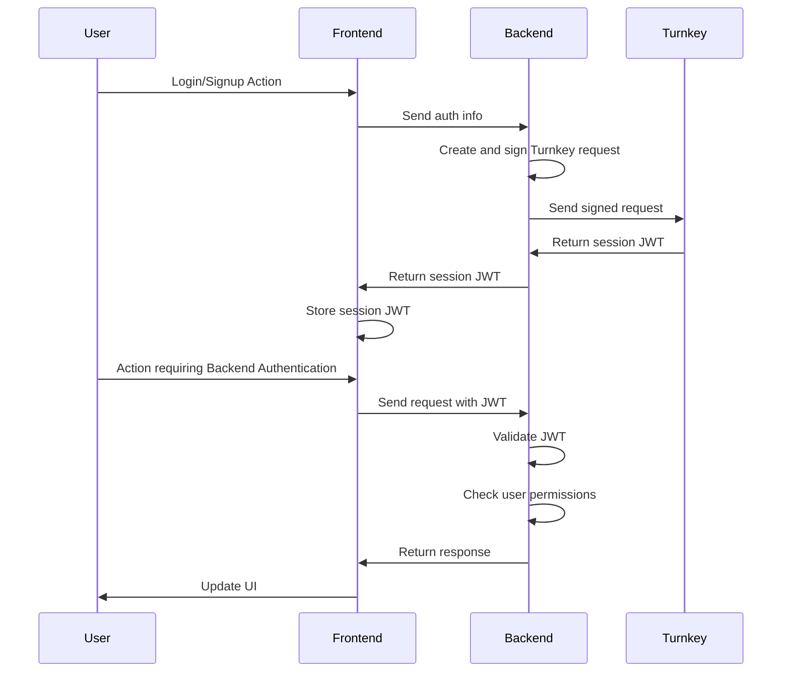
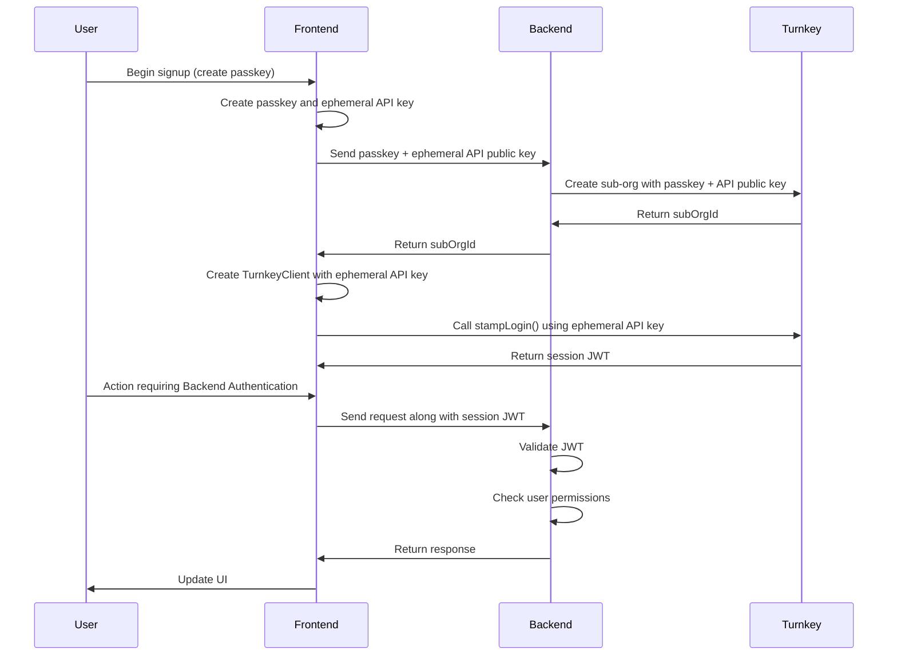
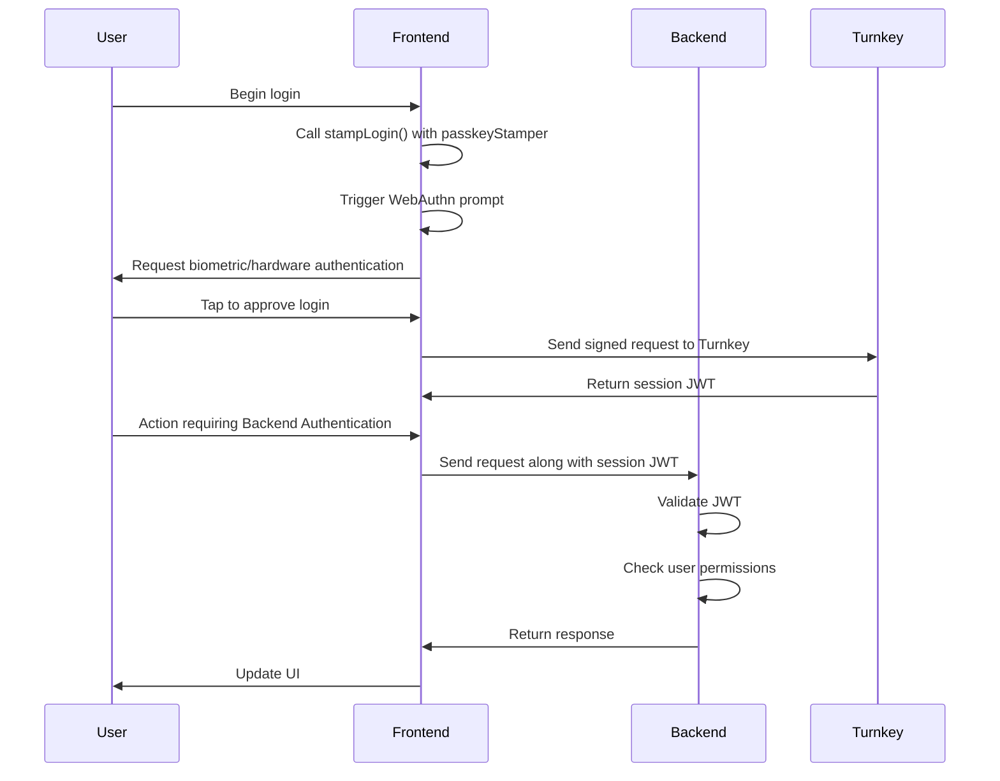
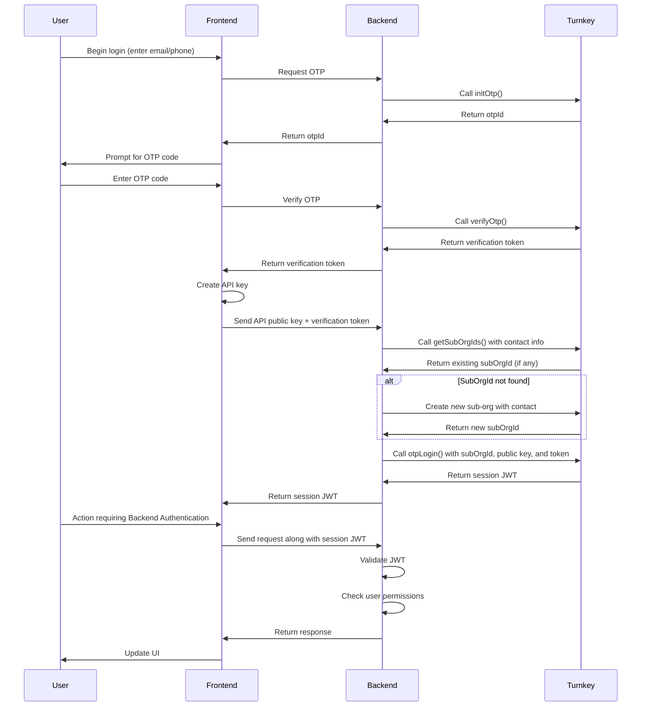

## Introduction

This guide shows you how to use Turnkey as the foundation for your own backend authentication system. You’ll learn how to issue, send, and validate session JWTs, and enforce access controls in your backend.

## Why Use Backend Authentication?

There are several benefits to enforcing authenticated requests to your backend:
1. **User data**: Store and retrieve user data associated with Turnkey sub-organizations
2. **Metrics and monitoring**: Add custom validations, rate limiting, and logging
3. **Co-signing capabilities**: Enable 2/2 signing patterns where your application is a co-signer

## JWT Authentication Flow

JSON Web Tokens (JWTs) provide a secure, stateless way to authenticate requests between your frontend and backend. Here's how to implement a JWT-based flow with Turnkey:

### Architecture Overview



### High-Level Flow
The overall pattern is similar, but may differ slightly depending on the auth method. Generally:
- The user authenticates (via passkey, OTP, etc.)
- A session is created with Turnkey, returning a session JWT
- That session JWT is used to make authenticated requests to your backend

## Getting the Session JWT
Turnkey supports multiple authentication methods, each of which results in a session JWT that proves the user's identity. This section covers the two most common flows: passkey authentication and OTP (One-Time Passcode) authentication. It explains how each method ultimately produces a session JWT that your frontend can use to make authenticated requests to your backend.

### Passkey Authentication
Turnkey supports passkey authentication, which allows users to log in using their device’s biometric system or a hardware security key. In this guide, we’ll separate login and signup flows, since most apps handle them independently and the implementation details differ slightly.

#### Signup Flow



<Steps>
  <Step title="Start the Signup Process">
  The user begins the signup flow by tapping a button like “Sign up with Passkey” on the frontend.
  </Step>

  <Step title="Generate Passkey and Temporary API Key">
  The frontend creates a passkey using WebAuthn, prompting the user for biometric or hardware authentication. At the same time, it silently generates a temporary API key in the background, which is used to stamp requests during the signup process.

  **Note:** We use a temporary API key during signup to avoid prompting the user twice for a passkey tap. Without it, we’d need to use the passkey to stamp the `stampLogin()` request later in the flow, which would trigger a second prompt right after creating the passkey. Using the API key instead allows us to create the session in the background with just a single tap.
  </Step>

  <Step title="Create a Turnkey Sub-organization">
  The frontend sends the passkey and API public key to the backend. The backend then uses the Turnkey API to create a new sub-organization and register both credentials as authenticators.
  </Step>

  <Step title="Create a Session">
  The frontend initializes a `TurnkeyClient` using the temporary API key and calls `stampLogin()`. Turnkey returns a session JWT representing the authenticated user session.
  </Step>

  <Step title="You're Now Authenticated">
  Your frontend can now make requests to your backend and attach the session JWT. The backend will validate the token on each request and verify that the user has permission to perform the requested action.
  </Step>
</Steps>

#### Login Flow



<Steps>
  <Step title="Start the Login Process">
  The user begins the login flow by tapping a button like “Log in with Passkey” on the frontend.
  </Step>

  <Step title="Use Passkey to Authenticate">
  The frontend initializes a `TurnkeyClient` with a `passkeyStamper` and calls `stampLogin()`. This triggers a WebAuthn prompt, prompting the user to approve the login request using their passkey.
  </Step>

  <Step title="Create a Session">
  Once the user approves the request, the signed login is sent to Turnkey. Turnkey then returns a session JWT representing the authenticated user session.
  </Step>

  <Step title="You're Now Authenticated">
  Your frontend can now make requests to your backend and attach the session JWT. The backend will validate the token on each request and verify that the user has permission to perform the requested action.
  </Step>
</Steps>

### OTP Authentication
Turnkey also supports SMS and email-based One-Time Passcode (OTP) authentication, allowing users to log in by entering a code sent to their email or phone number. We’ll cover OTP login and signup together, since the flows are similar and most apps handle them in a unified way.



<Steps>
  <Step title="Start the Login Process">
  The user begins the login flow by entering their email or phone number on the frontend.
  </Step>

  <Step title="Request and Verify OTP">
  The frontend sends the contact info to your backend, which requests an OTP from Turnkey. Once the user receives and enters the code, your backend verifies it with Turnkey and receives a verification token.
  </Step>

  <Step title="Get or Create a Turnkey Sub-organization">
  The frontend generates an API key, then sends the API public key and verification token to the backend. The backend checks with Turnkey whether a sub-organization already exists for the contact. If not, it creates a new one.
  </Step>

  <Step title="Create a Session">
  The backend calls `otpLogin()` with the subOrgId, public key, and verification token. Turnkey returns a session JWT representing the authenticated user session, which the backend then returns to the frontend.
  </Step>

  <Step title="You're Now Authenticated">
  Your frontend can now make requests to your backend and attach the session JWT. The backend will validate the token on each request and verify that the user has permission to perform the requested action.
  </Step>
</Steps>

## Sending the JWT from the Frontend
After a user completes Turnkey authentication and a session is created (via passkey, OTP, or another supported method), your backend returns a session JWT to the frontend. This token proves the user’s identity and is the frontend’s responsibility to store and include in all future authenticated requests to your backend.

The session JWT should be attached to each request using the `Authorization` header. This allows your backend to identify the authenticated user and enforce any necessary access control based on the `user_id` or `organization_id`.

**Note:** These requests are sent to your own backend endpoints and may contain any application-specific payload, such as a form submission, a database mutation, or a business action. They are not necessarily related to Turnkey.

Here’s an example of how the frontend might send the JWT:
```typescript
const response = await fetch("/api/your-backend-endpoint", {
  method: "POST",
  headers: {
    "Content-Type": "application/json",
    "Authorization": `Bearer ${sessionJwt}`,
  },
  body: JSON.stringify({ /* your request payload */ }),
});
```
This adds the following header to your HTTP request:
```http
Authorization: Bearer <session JWT>
```

## Validating the JWT in Your Backend
After a user completes Turnkey authentication and a session is created (via passkey, OTP, or another supported method), your backend returns a session JWT to the frontend. This token proves the user's identity and is the frontend’s responsibility to store and include in all future authenticated requests.

### What Does the Session JWT Contain?
Before diving into how to verify the session JWT, it’s helpful to understand what’s actually inside it. The JWT includes information that identifies the authenticated user and the organization they belong to, as well as metadata like expiration time and session type. Here’s an example of a decoded session JWT:
```typescript
  {
    "exp": <timestamp>,
    "public_key": "<compressed public key>",
    "session_type": "SESSION_TYPE_READ_WRITE",
    "user_id": "<user UUID>",
    "organization_id": "<organization UUID>"
  }
```

### Validating the JWT
To validate the session JWT:

<Steps>
  <Step title="Verify the Signature">
  Use the helper function `verifySessionJwtSignature` from [`@turnkey/crypto`](https://github.com/tkhq/sdk/blob/e10342cd111fbb9b1d168ff386b5dc263e3a5ce3/packages/crypto/src/turnkey.ts#L409-L466) to confirm that the JWT was signed by Turnkey and hasn’t been modified.

  ```typescript
    import { verifySessionJwtSignature } from "@turnkey/crypto";

    const isValid = await verifySessionJwtSignature(sessionJwt);
    if (!isValid) {
      throw new Error("Invalid JWT: failed signature verification");
    }
  ```
  </Step>

  <Step title="Decode the Session JWT">
  Before verifying expiration or enforcing access controls, you’ll need to decode the JWT payload to access fields like `user_id`, `organization_id`, and `exp`.
  
  Here’s an example helper you can define to decode and extract the session fields from the payload:
  ```typescript
    export function decodeSessionJwt(token: string): {
      sessionType: string;
      userId: string;
      organizationId: string;
      expiry: number;
      publicKey: string;
    } {
      const [, payload] = token.split(".");
      if (!payload) {
        throw new Error("Invalid JWT: Missing payload");
      }

      const decoded = JSON.parse(atob(payload));
      const {
        exp,
        public_key: publicKey,
        session_type: sessionType,
        user_id: userId,
        organization_id: organizationId,
      } = decoded;

      if (!exp || !publicKey || !sessionType || !userId || !organizationId) {
        throw new Error("JWT payload missing required fields");
      }

      return {
        sessionType,
        userId,
        organizationId,
        expiry: exp,
        publicKey,
      };
    }
  ```
  </Step>

  <Step title="Check the Expiration">
  Ensure that the token has not expired by validating the exp (expiration) claim.

  ```typescript
    if (decodedJwt.exp * 1000 < Date.now()) {
      throw new Error("Token has expired");
    }
  ```
  </Step>

  <Step title="Extract and Enforce Access Controls">
  Once the token is verified and decoded, use the `userId` and `organizationId` to enforce access control in your application.

  This step is application-specific and depends on how your backend maps users to organizations. For example, you might:

  - Look up the user in your database by `userId`
  - Confirm that the request targets the correct `organizationId`
  - Reject the request if the user is not linked to that organization

  This ensures that even with a valid JWT, a user can only access resources associated with their own Turnkey sub-organization.
  </Step>
</Steps>

## Advanced Topics

<Card
  title="Co-signing Transactions"
  icon="file-signature"
  href="../company-wallets/co-signing-transactions"
>
  Learn about advanced patterns like multi-signature setups requiring approvals
  from both the user and the backend.
</Card>
