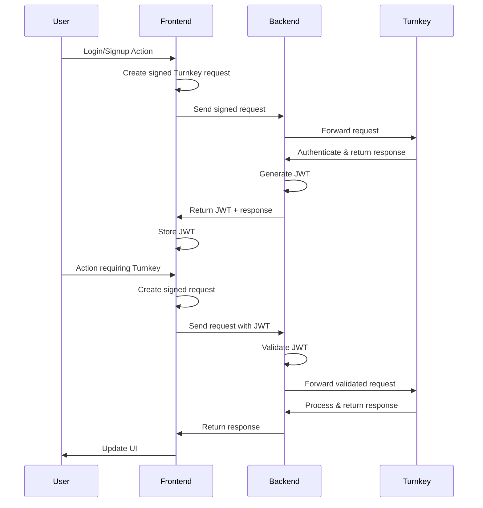
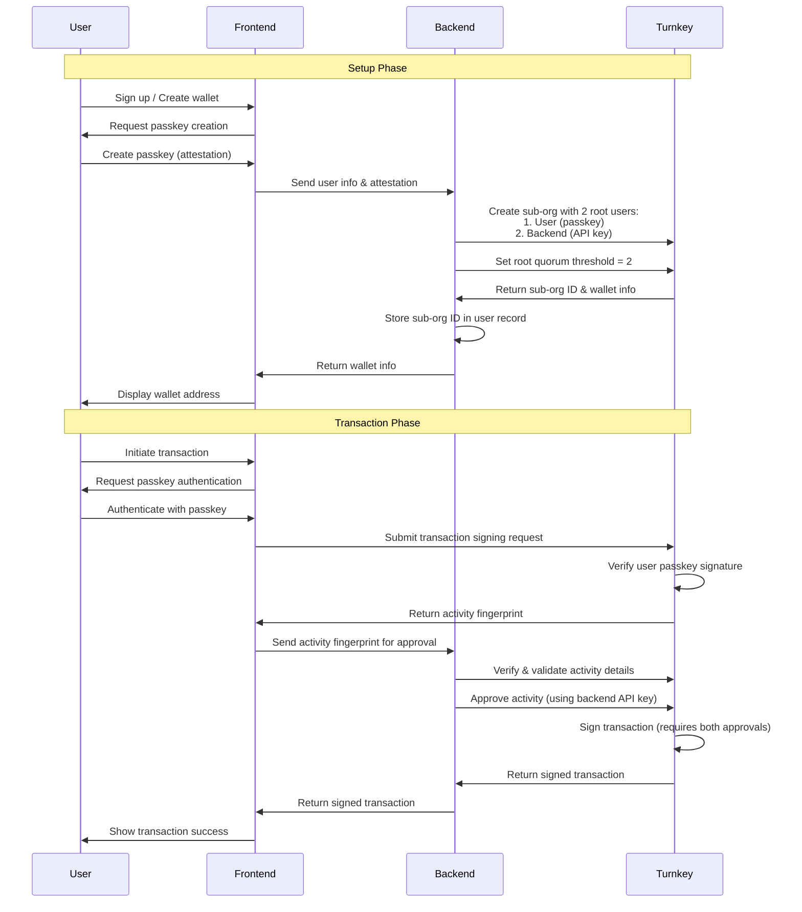

## Introduction

When integrating Turnkey into an application with an existing authentication system, you'll need to establish a secure communication pattern between your frontend, backend, and the Turnkey API.
This guide explains how to implement a backend proxy pattern that leverages your existing user authentication while enabling Turnkey operations.

## Why Use a Backend Proxy?

There are several benefits to proxying Turnkey requests through your own backend:

1. **User data**: Store and retrieve user data associated with Turnkey sub-organizations
2. **Metrics and monitoring**: Add custom validations, rate limiting, and logging
3. **Co-signing capabilities**: Enable 2/2 signing patterns where your application is a co-signer

## JWT Authentication Flow

JSON Web Tokens (JWTs) provide a secure, stateless way to authenticate requests between your frontend and backend. Here's how to implement a JWT-based flow with Turnkey:

### Architecture Overview



### Login and Sign Up Flows

The first step in integrating Turnkey with JWT authentication is handling user login and signup. Both processes follow similar patterns but differ in how they establish the user's identity with Turnkey.

#### Getting the User's Sub-organization ID

Before you can authenticate a user with Turnkey, you need their sub-organization ID. There are multiple ways to obtain this:

1. **Database Lookup**: Query your database using the user's email or ID

   ```typescript
   const user = await db.users.findUnique({
     where: { email: userEmail },
     select: { turnkeySubOrgId: true },
   });
   ```

2. **Turnkey API Lookup**: Query Turnkey directly for sub-organizations associated with an email

<CodeGroup>

```typescript app.ts
import { turnkeyServer } from "./turnkey";

const { organizationIds } = await turnkeyServer.getSubOrgIds({
  // The parent organization ID
  organizationId: process.env.TURNKEY_ORGANIZATION_ID,
  filterType: "EMAIL",
  filterValue: userEmail,
});

const subOrgId = organizationIds[0]; // First matching sub-org
```

```typescript turnkey.ts
import { Turnkey } from "@turnkey/sdk-server";

// Initialize server-side client
export const turnkeyServer = new Turnkey({
  apiBaseUrl: "https://api.turnkey.com",
  apiPrivateKey: process.env.TURNKEY_API_PRIVATE_KEY,
  apiPublicKey: process.env.TURNKEY_API_PUBLIC_KEY,
  defaultOrganizationId: process.env.TURNKEY_ORGANIZATION_ID,
}).apiClient();
```

</CodeGroup>

3. **JWT Cookie**: Extract the sub-organization ID from an existing JWT in cookies (for returning users)

```typescript
const token = req.cookies.authToken;
const decoded = jwt.verify(token, JWT_SECRET);
const subOrgId = decoded.subOrgId;
```

#### Login Flow

<Steps>
  <Step title="Client-side">
  Generate a signed Turnkey request

  <CodeGroup> 
    ```typescript app.ts
    import { turnkeyClient } from "./turnkey";

    // This will require passkey authentication from the user
    const signedWhoamiRequest = await turnkeyClient.stampGetWhoami({
      organizationId: subOrgId,
    });
    ```

    ```typescript turnkey.ts
    import { Turnkey } from "@turnkey/sdk-browser";

    export const turnkeyClient = new Turnkey({
      apiBaseUrl: "https://api.turnkey.com",
      defaultOrganizationId: subOrgId, // From previous step
    });
    ```

  </CodeGroup>

  </Step>

  <Step title="Send to Backend">
  Forward the signed request

    ```typescript
    const response = await fetch("/api/auth/login", {
      method: "POST",
      body: JSON.stringify({ signedRequest: signedWhoamiRequest }),
      headers: { "Content-Type": "application/json" },
    });
    ```

  </Step>

  <Step title="Backend Verification">
    Process the request and issue JWT

    <CodeGroup>

    ```typescript app.ts [expandable]
    import { turnkeyServer } from "./turnkey";
    import jwt from "jsonwebtoken";

    app.post("/api/auth/login", async (req, res) => {
      const { signedRequest } = req.body;

      try {
      // Forward to Turnkey - the request is already signed by the user's passkey
        const { url, body, stamp } = signedRequest;

        // Forward to Turnkey
        const response = await fetch(url, {
          method: 'POST',
          body,
          headers: {
            [stamp.stampHeaderName]: stamp.stampHeaderValue,
          },
        });

        const turnkeyResponse = await response.json();

        // If we get here without error, the authentication succeeded
        if (turnkeyResponse.organizationId) {
          // Lookup or create user in your database
          const user = await findOrCreateUser(turnkeyResponse.organizationId);

          // Generate JWT
          const token = jwt.sign(
            {
              subOrgId: turnkeyResponse.organizationId,
              userId: user.id,
            },
            JWT_SECRET,
            { expiresIn: "1h" }
          );

          // Set JWT as cookie or return in response
          res.cookie("authToken", token, { httpOnly: true, secure: true });
          return res.status(200).json({ success: true });
        }
      } catch (error) {
        return res.status(401).json({ error: "Authentication failed" });
      }
    });
    ```

```typescript turnkey.ts
import { Turnkey } from "@turnkey/sdk-server";

// Initialize server-side client
export const turnkeyServer = new Turnkey({
  apiBaseUrl: "https://api.turnkey.com",
  apiPrivateKey: process.env.TURNKEY_API_PRIVATE_KEY,
  apiPublicKey: process.env.TURNKEY_API_PUBLIC_KEY,
  defaultOrganizationId: process.env.TURNKEY_ORGANIZATION_ID,
}).apiClient();
```

</CodeGroup>

  </Step>
</Steps>

#### Sign Up Flow

For new users, the flow is similar but involves creating a new sub-organization:

<Steps>
  <Step title="Client-side">
    Collect user information

    <CodeGroup>

    ```typescript app.ts
    import { turnkeyClient } from "./turnkey";

    const email = "user@example.com";

    const { encodedChallenge, attestation } =
    (await turnkeyClient?.createUserPasskey({
      publicKey: {
        user: {
          name: 'Popup Wallet Demo',
          displayName: 'Popup Wallet Demo',
        },
      },
    })) || {};

    // Send to backend
    const response = await fetch("/api/auth/signup", {
      method: "POST",
      body: JSON.stringify({
        email,
        challenge: encodedChallenge,
        attestation,
      }),
      headers: { "Content-Type": "application/json" },
    });
    ```

    ```typescript turnkey.ts
    import { Turnkey } from "@turnkey/sdk-browser";

    const turnkey =  new Turnkey({
      apiBaseUrl: "https://api.turnkey.com",
      defaultOrganizationId: process.env.TURNKEY_ORGANIZATION_ID,
      // Set this to your domain for production
      rpId: "localhost",
    });

    export const turnkeyClient = turnkey.passkeyClient();
    ```

    </CodeGroup>

  </Step>

  <Step title="Backend Processing">
    Create sub-organization and issue JWT

    <CodeGroup>
    ```typescript app.ts [expandable]
    import { turnkeyServer } from "./turnkey";
    import jwt from "jsonwebtoken";
    import { DEFAULT_ETHEREUM_ACCOUNTS } from "@turnkey/sdk-browser";

    const JWT_SECRET = process.env.JWT_SECRET;

    app.post("/api/auth/signup", async (req, res) => {
      const { email, challenge, attestation } = req.body;

      try {
        // Create the sub-organization
        const createSubOrgResponse = await turnkeyServer.createSubOrganization({
          subOrganizationName: `${email} - Organization`,
          rootUsers: [
            {
              userName: email,
              userEmail: email,
              apiKeys: [],
              authenticators: [
                {
                  authenticatorName: "Default Passkey",
                  challenge,
                  attestation,
                },
              ],
            },
          ],
          rootQuorumThreshold: 1,
          wallet: {
            walletName: "Default Wallet",
            accounts: DEFAULT_ETHEREUM_ACCOUNTS,
          },
        });

        if (createSubOrgResponse.organizationId) {
          // Store user in your database
          const user = await db.users.create({
            data: {
              email: email,
              name: username,
              turnkeySubOrgId: createSubOrgResponse.organizationId,
            },
          });

          // Generate JWT
          const token = jwt.sign(
            {
              subOrgId: createSubOrgResponse.organizationId,
              userId: user.id,
            },
            JWT_SECRET,
            { expiresIn: "1h" }
          );

          res.cookie("authToken", token, { httpOnly: true, secure: true });
          return res.status(200).json({ success: true });
        }
      } catch (error) {
        return res.status(400).json({ error: "Failed to create account" });
      }
    });
    ```

    ```typescript turnkey.ts
    import { Turnkey } from "@turnkey/sdk-server";

    // Initialize server-side client
    export const turnkeyServer = new Turnkey({
      apiBaseUrl: "https://api.turnkey.com",
      apiPrivateKey: process.env.TURNKEY_API_PRIVATE_KEY,
      apiPublicKey: process.env.TURNKEY_API_PUBLIC_KEY,
      defaultOrganizationId: process.env.TURNKEY_ORGANIZATION_ID,
    }).apiClient();

    ```

    </CodeGroup>

  </Step>
</Steps>

### Authenticating Subsequent Requests

Once a user is authenticated and has a valid JWT, you can use it to authenticate subsequent requests to your backend:

1. **Client-side**: Include JWT in requests to your backend

   ```typescript
   const signedTurnkeyRequest = await turnkeyClient.signRequest({
     organizationId: subOrgId,
     // Parameters for the specific Turnkey operation
   });

   const response = await fetch("/api/proxy/turnkey/sign-transaction", {
     method: "POST",
     body: JSON.stringify({ signedTurnkeyRequest }),
     headers: {
       "Content-Type": "application/json",
       // JWT automatically included in cookies if httpOnly
       // Or explicitly: 'Authorization': `Bearer ${jwt}`
     },
     credentials: "include", // Include cookies
   });
   ```

2. **Backend Verification**: Your backend verifies the JWT and processes the request

   ```typescript [expandable]
   // Example: JWT middleware
   const verifyJwt = (req, res, next) => {
     const token =
       req.cookies.authToken || req.headers.authorization?.split(" ")[1];

     if (!token) {
       return res.status(401).json({ error: "Unauthorized" });
     }

     try {
       const decoded = jwt.verify(token, JWT_SECRET);
       req.user = decoded;
       next();
     } catch (err) {
       return res.status(401).json({ error: "Invalid token" });
     }
   };

   // Protected route
   app.post(
     "/api/proxy/turnkey/sign-transaction",
     verifyJwt,
     async (req, res) => {
       const { signedTurnkeyRequest } = req.body;
       const { subOrgId } = req.user;

       // Validate the request is for the correct sub-organization
       if (signedTurnkeyRequest.organizationId !== subOrgId) {
         return res.status(403).json({ error: "Forbidden" });
       }

       // Forward to Turnkey
       const { url, body, stamp } = signedTurnkeyRequest;

       const response = await fetch(url, {
         method: "POST",
         body,
         headers: {
           [stamp.stampHeaderName]: stamp.stampHeaderValue,
         },
       });

       const turnkeyResponse = await response.json();

       // Process and return response
       return res.status(200).json(turnkeyResponse);
     }
   );
   ```

### JWT Implementation

When implementing JWT authentication:

```typescript [expandable]
import jwt from "jsonwebtoken";

// Get this from a secure environment variable
const JWT_SECRET = process.env.JWT_SECRET;

// Generate a JWT after successful authentication
function generateToken(user, subOrgId) {
  return jwt.sign(
    {
      userId: user.id,
      email: user.email,
      subOrgId: subOrgId,
      // Add other claims as needed
    },
    JWT_SECRET,
    {
      expiresIn: "1h", // Token expires in 1 hour
    }
  );
}

// Verify a JWT
function verifyToken(token) {
  try {
    return jwt.verify(token, JWT_SECRET);
  } catch (error) {
    // Handle various JWT verification errors
    return null;
  }
}
```

#### JWT Best Practices

- Keep token expiration times short (15-60 minutes)
- Include only necessary claims in the payload
- Use HTTPS for all communications
- Store tokens securely (use HTTP-only cookies rather than localStorage)
- Implement token refresh mechanisms for long-lived sessions
- Consider using JWTs with signatures (JWS) for enhanced security

## User Data Storage and Retrieval

Many applications need to store additional user data and associate it with their Turnkey activities. Here's how to implement this:

### User-Turnkey Association Model

Store a mapping between your application's user IDs and their corresponding Turnkey organization IDs:

```typescript
// Prisma schema example
model User {
  id                String   @id @default(uuid())
  email             String   @unique
  name              String?
  turnkeySubOrgId   String   @unique
  createdAt         DateTime @default(now())
  lastLoginAt       DateTime @updatedAt
}
```

### Storing User Data

When a user first authenticates with Turnkey (either by creating a new sub-organization or linking to an existing one):

1. Save the Turnkey organization ID in your user database
2. Optionally store additional metadata (creation time, recovery options, etc.)
3. Set up any necessary hooks or listeners for Turnkey activities

### Retrieving User Data

When processing a proxied Turnkey request:

1. Extract the user ID from the authenticated JWT
2. Look up the associated Turnkey organization ID
3. Use this organization ID when forwarding requests to Turnkey

## Implementation Examples

### Next.js Server Actions

Next.js Server Actions provide a convenient way to implement secure backend operations:

```typescript [expandable]
"use server";

import { Turnkey } from "@turnkey/sdk-server";
import { cookies } from "next/headers";
import jwt from "jsonwebtoken";
import { db } from "@/lib/db";

// Initialize the server-side Turnkey client
const turnkeyServer = new Turnkey({
  apiBaseUrl: "https://api.turnkey.com",
  apiPrivateKey: process.env.TURNKEY_API_PRIVATE_KEY,
  apiPublicKey: process.env.TURNKEY_API_PUBLIC_KEY,
  defaultOrganizationId: process.env.TURNKEY_ORGANIZATION_ID,
}).apiClient();

// Proxy a signing request to Turnkey
export async function proxySignTransaction(request) {
  // Get the auth token from the cookie
  const cookieStore = cookies();
  const token = cookieStore.get("authToken")?.value;

  if (!token) {
    throw new Error("Unauthorized");
  }

  try {
    // Verify the token
    const decoded = jwt.verify(token, process.env.JWT_SECRET);
    const { userId, subOrgId } = decoded;

    // Ensure the request is for the correct organization
    if (request.organizationId !== subOrgId) {
      throw new Error("Forbidden: Organization ID mismatch");
    }

    // Proxy the request to Turnkey
    const { url, body, stamp } = request;

    const response = await fetch(url, {
      method: "POST",
      body,
      headers: {
        [stamp.stampHeaderName]: stamp.stampHeaderValue,
      },
    });

    const result = await response.json();

    // Log the activity
    await db.activity.create({
      data: {
        userId,
        type: "SIGN_TRANSACTION",
        status: "SUCCESS",
        metadata: { txHash: result.hash },
      },
    });

    return result;
  } catch (error) {
    console.error("Error proxying request:", error);
    throw new Error("Failed to process request");
  }
}
```

### Standalone API Endpoint

For applications using a traditional API backend:

```typescript [expandable]
import express from "express";
import cookieParser from "cookie-parser";
import jwt from "jsonwebtoken";
import { Turnkey } from "@turnkey/sdk-server";

const app = express();
app.use(express.json());
app.use(cookieParser());

// Initialize the server-side Turnkey client
const turnkeyServer = new Turnkey({
  apiBaseUrl: "https://api.turnkey.com",
  apiPrivateKey: process.env.TURNKEY_API_PRIVATE_KEY,
  apiPublicKey: process.env.TURNKEY_API_PUBLIC_KEY,
  defaultOrganizationId: process.env.TURNKEY_ORGANIZATION_ID,
}).apiClient();

// JWT middleware
const verifyJwt = (req, res, next) => {
  const token =
    req.cookies.authToken || req.headers.authorization?.split(" ")[1];

  if (!token) {
    return res.status(401).json({ error: "Unauthorized" });
  }

  try {
    const decoded = jwt.verify(token, process.env.JWT_SECRET);
    req.user = decoded;
    next();
  } catch (err) {
    return res.status(401).json({ error: "Invalid token" });
  }
};

// Proxy endpoint for Turnkey transaction signing
app.post("/api/proxy/turnkey/sign-transaction", verifyJwt, async (req, res) => {
  const { signedRequest } = req.body;
  const { subOrgId, userId } = req.user;

  // Validate the request is for the correct sub-organization
  if (signedRequest.organizationId !== subOrgId) {
    return res.status(403).json({ error: "Forbidden" });
  }

  try {
    // Forward to Turnkey
    const { url, body, stamp } = signedRequest;

    const response = await fetch(url, {
      method: "POST",
      body,
      headers: {
        [stamp.stampHeaderName]: stamp.stampHeaderValue,
      },
    });

    const turnkeyResponse = await response.json();

    // Return the response
    return res.status(200).json(turnkeyResponse);
  } catch (error) {
    console.error("Error signing transaction:", error);
    return res.status(500).json({
      error: "Failed to sign transaction",
      message: error.message,
    });
  }
});

const PORT = process.env.PORT || 3000;
app.listen(PORT, () => {
  console.log(`Server running on port ${PORT}`);
});
```

## Security Considerations

When implementing this pattern, keep these security considerations in mind:

1. **API Key Security**: Never expose your backend Turnkey API keys to the frontend
2. **JWT Validation**: Thoroughly validate JWTs (signature, expiration, audience, etc.)
3. **Input Validation**: Sanitize and validate all input received from the frontend
4. **Rate Limiting**: Implement rate limiting to prevent abuse
5. **Monitoring**: Set up logging and monitoring for suspicious activities
6. **Error Handling**: Return appropriate error messages without exposing sensitive details

## Advanced Topics

### Co-signing Transactions

To implement a true multi-signature arrangement with Turnkey,
you need to create a sub-organization with multiple root users and set a quorum threshold.
Here's how to set up and use a 2/2 multi-sig wallet:



<Steps>
  <Step title="Create a Sub-Organization with Multiple Root Users">
    To set up a multi-sig wallet in Turnkey, you first need to create a sub-organization with two root users. 
    This sub-organization will function as a separate entity with its own wallet and security settings.
    
    The key configuration here is setting up:
    - A root user for the end-user, authenticated with their passkey
    - A root user for your application service, authenticated with an API key
    - A root quorum threshold of 2, requiring both users to approve critical operations
    
    This creates a true multi-sig arrangement where neither party can unilaterally control the wallet.
    The following code shows how to implement this setup on your backend:

    <CodeGroup>

    ```typescript app.ts [expandable] {43}
    import { turnkeyServer } from "./turnkey";
    import { DEFAULT_ETHEREUM_ACCOUNTS } from "@turnkey/sdk-browser";

    async function createMultiSigWallet(
      userId,
      userEmail,
      userPasskeyChallenge,
      userPasskeyAttestation
    ) {
      // Create a sub-organization with two root users and a threshold of 2
      const subOrg = await turnkeyServer.createSubOrganization({
        organizationId: process.env.TURNKEY_ORGANIZATION_ID,
        subOrganizationName: `Multi-Sig Wallet for ${userEmail}`,
        rootUsers: [
          // First root user - the end user with their passkey
          {
            userName: "End User",
            userEmail: userEmail,
            apiKeys: [],
            authenticators: [
              {
                authenticatorName: "User Passkey",
                challenge: userPasskeyChallenge,
                attestation: userPasskeyAttestation,
              },
            ],
          },
          // Second root user - your application's service account
          {
            userName: "Application Service",
            userEmail: "service@yourapp.com",
            apiKeys: [
              {
                apiKeyName: "Service API Key",
                publicKey: process.env.SERVICE_API_PUBLIC_KEY,
                curveType: "API_KEY_CURVE_SECP256K1",
              },
            ],
            authenticators: [],
          },
        ],
        // This is the key setting - requiring both users to approve
        rootQuorumThreshold: 2,
        wallet: {
          walletName: "Shared Wallet",
          accounts: DEFAULT_ETHEREUM_ACCOUNTS,
        },
      });

      // Save the sub-organization ID in your database
      await db.users.update({
        where: { id: userId },
        data: { turnkeySubOrgId: subOrg.organizationId },
      });

      return subOrg;
    }
    ```

    ```typescript turnkey.ts
    import { Turnkey } from "@turnkey/sdk-server";

    // Initialize server-side client
    export const turnkeyServer = new Turnkey({
      apiBaseUrl: "https://api.turnkey.com",
      apiPrivateKey: process.env.TURNKEY_API_PRIVATE_KEY,
      apiPublicKey: process.env.TURNKEY_API_PUBLIC_KEY,
      defaultOrganizationId: process.env.TURNKEY_ORGANIZATION_ID,
    }).apiClient();

    ```

    </CodeGroup>

  </Step>

  <Step title="Client-Side Transaction Initiation">
    When the user wants to sign a transaction using their multi-sig wallet, they need to initiate the process from your frontend application.
    This step involves:
    
    - Authenticating the user with their passkey (handled automatically by Turnkey)
    - Creating a transaction signing request to Turnkey
    - Receiving an activity fingerprint that needs further approval
    - Forwarding this fingerprint to your backend for the second signature
    
    The transaction won't be fully signed yet - it will be in a "requires consensus" state until your backend approves it.
    Here's how to implement this flow in your frontend:

    <CodeGroup>

    ```typescript app.ts [expandable]
    import { turnkeyPasskeyClient } from "./turnkey";


    // User initiates a transaction signing
    async function initiateTransaction(txData, walletAddress) {
      // This will trigger the user's passkey authentication
      const signActivity = await turnkeyPasskeyClient.signTransaction({
        organizationId: subOrgId,
        parameters: {
          type: "TRANSACTION_TYPE_ETHEREUM",
          signWith: walletAddress,
          unsignedTransaction: txData,
        },
      });

      // The activity needs approval from the backend service
      // Send the activity fingerprint to your backend
      const response = await fetch("/api/proxy/turnkey/approve-transaction", {
        method: "POST",
        body: JSON.stringify({
          activityFingerprint: signActivity.fingerprint,
          subOrgId: subOrgId,
        }),
        headers: {
          "Content-Type": "application/json",
        },
        credentials: "include", // Include cookies for JWT authentication
      });

      const result = await response.json();
      return result;
    }
      ```

    ```typescript turnkey.ts
    import { Turnkey } from "@turnkey/sdk-browser";

    // Initialize server-side client
    export const turnkeyPasskeyClient = new Turnkey({
      apiBaseUrl: "https://api.turnkey.com",
      defaultOrganizationId: process.env.TURNKEY_ORGANIZATION_ID,
      rpid: process.env.RPID || 'localhost',
    }).passkeyClient();

    ```

    </CodeGroup>

  </Step>

  <Step title="Backend Approval">
    The final step in the multi-sig flow is having your backend service approve the transaction.
    This is where the second signature required by the root quorum is applied. Your backend should:
    
    - Validate the incoming request to ensure it's legitimate
    - Verify the user has permission to use the specified sub-organization
    - Optionally retrieve and validate the activity details (e.g., checking transaction amount, recipient)
    - Approve the activity using your service's API key
    
    Only after both the user and your backend have approved will Turnkey complete the signing process.
    This provides strong security guarantees as it requires compromise of both authentication mechanisms to execute unauthorized transactions.

    ```typescript [expandable] {22-26}
    // API endpoint for approving transaction signing activities
    app.post(
      "/api/proxy/turnkey/approve-transaction",
      async (req, res) => {
        const { activityFingerprint, subOrgId } = req.body;
        const { userId } = req.user;

        try {
          // Retrieve the user's associated sub-organization ID for verification
          const user = await db.users.findUnique({
            where: { id: userId },
            select: { turnkeySubOrgId: true },
          });

          if (!user || user.turnkeySubOrgId !== subOrgId) {
            return res
              .status(403)
              .json({ error: "Unauthorized: Organization ID mismatch" });
          }

          // Approve the activity
          const approvalResult = await turnkeyServer.approveActivity({
            organizationId: subOrgId,
            fingerprint: activityFingerprint,
          });

          // Log the approval - Can be replaced with your own logging/metrics
          console.log("Transaction approved:", approvalResult);

          // Return the result to the client
          return res.status(200).json(approvalResult);
        } catch (error) {
          console.error("Error approving transaction:", error);
          return res.status(500).json({
            error: "Failed to approve transaction",
            message: error.message,
          });
        }
      }
    );
    ```

  </Step>
</Steps>

#### Security Considerations and Best Practices

- **Validation Before Approval**: Always validate transaction details (recipient, amount, etc.) before approving activities.

- **Initial Setup Flexibility**: For a better user experience during setup, you can:

  - Create the sub-organization initially with a root quorum threshold of 1
  - Complete initial setup tasks (like adding wallet accounts)
  - Update the root quorum threshold to 2 when ready for production use

  ```typescript
  // Update the root quorum threshold after initial setup
  await turnkeyServer.updateRootQuorum({
    organizationId: subOrgId,
    threshold: 2,
    userIds: [endUserId, serviceUserId],
  });
  ```

- **Policy-Based Controls**: For more granular control, you can create policies specifying which transactions require multi-sig approval:

  ```typescript
  await turnkeyServer.createPolicy({
    organizationId: subOrgId,
    policy: {
      policyName: "High-value transaction multi-sig",
      effect: "EFFECT_ALLOW",
      consensus: "approvers.count() >= 2",
      condition: "eth.tx.value >= 1000000000000000000", // 1 ETH
    },
  });
  ```

- **Monitoring**: Track all multi-sig activities for audit purposes, especially approvals and rejections.

- **Recovery Mechanisms**: Document and test recovery procedures in case one of the signers loses access.

This approach provides true multi-signature security, requiring explicit approval from both parties before any transaction can be executed.
