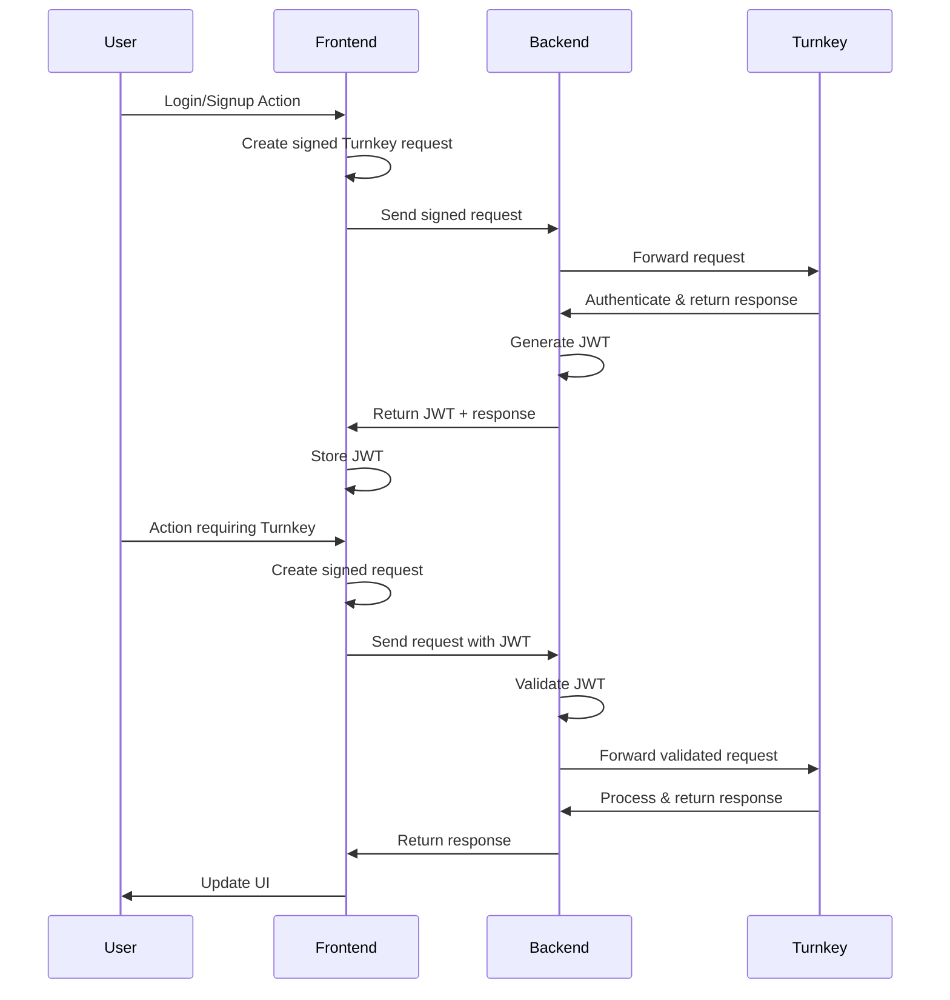
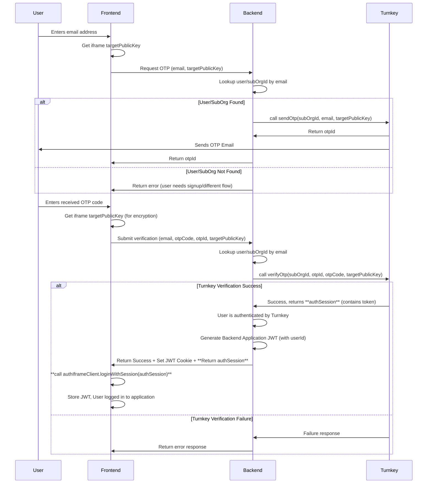

## Introduction

When integrating Turnkey into an application with an existing authentication system, you'll need to establish a secure communication pattern between your frontend, backend, and the Turnkey API.
This guide explains how to implement a backend proxy pattern that leverages your existing user authentication while enabling Turnkey operations.

## Why Use a Backend Proxy?

There are several benefits to proxying Turnkey requests through your own backend:

1. **User data**: Store and retrieve user data associated with Turnkey sub-organizations
2. **Metrics and monitoring**: Add custom validations, rate limiting, and logging
3. **Co-signing capabilities**: Enable 2/2 signing patterns where your application is a co-signer

## JWT Authentication Flow

JSON Web Tokens (JWTs) provide a secure, stateless way to authenticate requests between your frontend and backend. Here's how to implement a JWT-based flow with Turnkey:

### Architecture Overview



### Login and Sign Up Flows

The first step in integrating Turnkey with JWT authentication is handling user login and signup. Both processes follow similar patterns but differ in how they establish the user's identity with Turnkey.

#### Getting the User's Sub-organization ID

Before you can authenticate a user with Turnkey, you need their sub-organization ID. There are multiple ways to obtain this:

1. **Database Lookup**: Query your database using the user's email or ID

   ```typescript
   const user = await db.users.findUnique({
     where: { email: userEmail },
     select: { turnkeySubOrgId: true },
   });
   ```

2. **Turnkey API Lookup (Alternative)**
   If you don't have the sub-organization ID stored alongside your user record, you can query Turnkey using the user's email to find associated sub-organization IDs.

```typescript
const { organizationIds } = await turnkeyServer.getSubOrgIds({
  organizationId: process.env.TURNKEY_ORGANIZATION_ID,
  filterType: "EMAIL",
  filterValue: userEmail,
});

// NB: This assumes the user has exactly one sub-org. See notes below!
const subOrgId = organizationIds[0]; // First matching sub-org
```

<Accordion title="Important Considerations for API Lookup">

The example above (`const subOrgId = organizationIds[0];`) simply takes the first ID found. **This approach might not be suitable for all applications.**

- **Handling No Results:** If `organizationIds` is empty, your application needs a defined behavior. This might involve failing the login/signup attempt or prompting the user differently.
- **Handling Multiple Results:** If multiple IDs are returned, your application must decide how to proceed. You could:
  - Prompt the user to select the intended sub-organization.
  - Enforce a business rule that an email can only map to one sub-organization and treat multiple results as an error state.
  - Use other contextual information (if available) to disambiguate.
- **Crucial Verification Step:** Retrieving a `subOrgId` via email lookup **does not grant access**. After obtaining a potential `subOrgId`, your application _must_ proceed with user authentication (e.g., using the passkey flow described next). Only after the user successfully authenticates should you trust the `subOrgId` and verify that the _authenticated user_ is indeed authorized to operate within that specific sub-organization (typically by checking against your application's user database). Blindly trusting the first ID returned without proper authentication and authorization checks is insecure.

</Accordion>

3. **JWT Cookie**: Extract the sub-organization ID from an existing JWT in cookies (for returning users)

   If a user has previously logged in, their JWT might be stored in a cookie. You can verify this token and extract the user ID to confirm their identity.

```typescript
// Example: Extracting User ID from JWT Cookie
async function getUserIdFromCookie(req) {
  const token = req.cookies.authToken;
  if (!token) return null;

  try {
    const decoded = jwt.verify(token, JWT_SECRET);
    // JWT payload now only contains userId
    return decoded.userId;
  } catch (error) {
    // Invalid or expired token
    return null;
  }
}

// If you need the subOrgId associated with this userId,
// perform a database lookup after verifying the JWT:
// const user = await db.users.findUnique({
//   where: { id: userId },
//   select: { turnkeySubOrgId: true }
// });
// const subOrgId = user?.turnkeySubOrgId;
```

#### Login Flow

<Steps>
  <Step title="Client-side">
  Generate a signed Turnkey request

  <CodeGroup> 
    ```typescript app.ts
    import { turnkeyClient } from "./turnkey";

    // This will require passkey authentication from the user
    const signedWhoamiRequest = await turnkeyClient.stampGetWhoami({
      organizationId: subOrgId,
    });
    ```

    ```typescript turnkey.ts
    import { Turnkey } from "@turnkey/sdk-browser";

    export const turnkeyClient = new Turnkey({
      apiBaseUrl: "https://api.turnkey.com",
      defaultOrganizationId: subOrgId, // From previous step
    });
    ```

  </CodeGroup>

  </Step>

  <Step title="Send to Backend">
  Forward the signed request

    ```typescript
    const response = await fetch("/api/auth/login", {
      method: "POST",
      body: JSON.stringify({ signedRequest: signedWhoamiRequest }),
      headers: { "Content-Type": "application/json" },
    });
    ```

  </Step>

  <Step title="Backend Verification">
    Process the request and issue JWT

    <CodeGroup>

    ```typescript app.ts [expandable]
    import { turnkeyServer } from "./turnkey";
    import jwt from "jsonwebtoken";

    app.post("/api/auth/login", async (req, res) => {
      const { signedRequest } = req.body;

      try {
      // Forward to Turnkey - the request is already signed by the user's passkey
        const { url, body, stamp } = signedRequest;

        // Forward to Turnkey
        const response = await fetch(url, {
          method: 'POST',
          body,
          headers: {
            [stamp.stampHeaderName]: stamp.stampHeaderValue,
          },
        });

        const turnkeyResponse = await response.json();

        // If we get here without error, the authentication succeeded
        if (turnkeyResponse.organizationId) {
          // Lookup or create user in your database
          const user = await findOrCreateUser(turnkeyResponse.organizationId);

          // Generate JWT containing only the application's user ID
          // The subOrgId is stored in the database, associated with the userId
          const token = jwt.sign(
            {
              userId: user.id,
            },
            JWT_SECRET,
            { expiresIn: "1h" }
          );

          // Set JWT as cookie or return in response
          res.cookie("authToken", token, { httpOnly: true, secure: true });
          return res.status(200).json({ success: true });
        }
      } catch (error) {
        return res.status(401).json({ error: "Authentication failed" });
      }
    });
    ```

```typescript turnkey.ts
import { Turnkey } from "@turnkey/sdk-server";

// Initialize server-side client
export const turnkeyServer = new Turnkey({
  apiBaseUrl: "https://api.turnkey.com",
  apiPrivateKey: process.env.TURNKEY_API_PRIVATE_KEY,
  apiPublicKey: process.env.TURNKEY_API_PUBLIC_KEY,
  defaultOrganizationId: process.env.TURNKEY_ORGANIZATION_ID,
}).apiClient();
```

</CodeGroup>

  </Step>
</Steps>

#### Sign Up Flow

For new users, the flow is similar but involves creating a new sub-organization:

<Steps>
  <Step title="Client-side">
    Collect user information

    <CodeGroup>

    ```typescript app.ts
    import { turnkeyClient } from "./turnkey";

    const email = "user@example.com";

    const { encodedChallenge, attestation } =
    (await turnkeyClient?.createUserPasskey({
      publicKey: {
        user: {
          name: 'Popup Wallet Demo',
          displayName: 'Popup Wallet Demo',
        },
      },
    })) || {};

    // Send to backend
    const response = await fetch("/api/auth/signup", {
      method: "POST",
      body: JSON.stringify({
        email,
        challenge: encodedChallenge,
        attestation,
      }),
      headers: { "Content-Type": "application/json" },
    });
    ```

    ```typescript turnkey.ts
    import { Turnkey } from "@turnkey/sdk-browser";

    const turnkey =  new Turnkey({
      apiBaseUrl: "https://api.turnkey.com",
      defaultOrganizationId: process.env.TURNKEY_ORGANIZATION_ID,
      // Set this to your domain for production
      rpId: "localhost",
    });

    export const turnkeyClient = turnkey.passkeyClient();
    ```

    </CodeGroup>

  </Step>

  <Step title="Backend Processing">
    Create sub-organization and issue JWT

    <CodeGroup>
    ```typescript app.ts [expandable]
    import { turnkeyServer } from "./turnkey";
    import jwt from "jsonwebtoken";
    import { DEFAULT_ETHEREUM_ACCOUNTS } from "@turnkey/sdk-browser";

    const JWT_SECRET = process.env.JWT_SECRET;

    app.post("/api/auth/signup", async (req, res) => {
      const { email, challenge, attestation } = req.body;

      try {
        // Create the sub-organization
        const createSubOrgResponse = await turnkeyServer.createSubOrganization({
          subOrganizationName: `${email} - Organization`,
          rootUsers: [
            {
              userName: email,
              userEmail: email,
              apiKeys: [],
              authenticators: [
                {
                  authenticatorName: "Default Passkey",
                  challenge,
                  attestation,
                },
              ],
            },
          ],
          rootQuorumThreshold: 1,
          wallet: {
            walletName: "Default Wallet",
            accounts: DEFAULT_ETHEREUM_ACCOUNTS,
          },
        });

        if (createSubOrgResponse.organizationId) {
          // Store user in your database
          const user = await createUser(createSubOrgResponse.organizationId, email);

          // Generate JWT containing only the application's user ID
          const token = jwt.sign(
            {
              userId: user.id, // Only include userId in the JWT payload
            },
            JWT_SECRET,
            { expiresIn: "1h" }
          );

          res.cookie("authToken", token, { httpOnly: true, secure: true });
          return res.status(200).json({
            success: true,
            message: "Signup successful, user created, and logged in."
          });
        }
      } catch (error) {
        // Handle specific errors (e.g., email already exists)
        console.error("Signup Error:", error);
        return res.status(500).json({ error: "Signup failed" });
      }
    });
    ```

```typescript turnkey.ts
import { Turnkey } from "@turnkey/sdk-server";

// Initialize server-side client
export const turnkeyServer = new Turnkey({
  apiBaseUrl: "https://api.turnkey.com",
  apiPrivateKey: process.env.TURNKEY_API_PRIVATE_KEY,
  apiPublicKey: process.env.TURNKEY_API_PUBLIC_KEY,
  defaultOrganizationId: process.env.TURNKEY_ORGANIZATION_ID,
}).apiClient();
```

</CodeGroup>

  </Step>
</Steps>

### Email OTP Authentication Flow

Turnkey allows users to authenticate via email using a secure One-Time Passcode (OTP). Your backend initiates this by calling `sendOtp`. Turnkey emails the code to the user. The user enters the code in the frontend, which sends it (along with identifiers) to your backend. Your backend then calls `verifyOtp`. Upon successful Turnkey verification, your backend issues its own application JWT to manage the proxied session.

**Note:** This flow generally assumes the user and their associated Turnkey Sub-Organization already exist, as it's primarily for authentication rather than initial signup.

#### Architecture Overview



#### Implementation Steps

<Steps>
  <Step title="Request OTP">
  The user provides their email. The frontend gets the Turnkey iframe's public key (referred to as `targetPublicKey`) and sends both to the backend. The backend finds the user's sub-organization and asks Turnkey to send the OTP email by calling `sendOtp`, passing the iframe's public key as the `targetPublicKey` parameter (used by Turnkey for credential encryption upon successful verification).

  <CodeGroup>
  
  ```typescript frontend.ts [expandable]
  import { useTurnkey } from "@turnkey/sdk-react"; // Or however you access the client

  // User enters email and clicks 'Send OTP'
  const handleRequestOtp = async (email: string) => {
    const { authIframeClient } = useTurnkey();
    if (!authIframeClient) {
      console.error("Turnkey iframe client not available");
      // Handle error: Inform user or disable button
      return;
    }

    try {
      // Get the public key associated with the Turnkey iframe client instance.
      // This is sent to the backend for the sendOtp request.
      const targetPublicKey = await authIframeClient.getPublicKey();

      const response = await fetch('/api/auth/otp/request', {
        method: 'POST',
        headers: { 'Content-Type': 'application/json' },
        body: JSON.stringify({ email, targetPublicKey }),
      });

      const data = await response.json();

      if (response.ok) {
        // Store otpId returned from backend for the verification step
        const otpId = data.otpId;
        console.log('OTP requested successfully, otpId:', otpId);
        // Show UI for OTP input, store otpId for the next step
        // e.g., setOtpIdState(otpId);
      } else {
        console.error('Failed to request OTP:', data.error);
        // Show error message to the user
      }
    } catch (error) {
      console.error('Error requesting OTP:', error);
      // Show error message to the user
    }
  };
  ```

```typescript backend-otp-request.ts [expandable]
import { turnkeyServer } from "./turnkey"; // Import initialized Turnkey server client
import { findUserByEmail } from "./dbUtils"; // Assume DB utility for finding user/subOrgId

app.post("/api/auth/otp/request", async (req, res) => {
  const { email, targetPublicKey } = req.body;
  if (!email || !targetPublicKey) {
    return res.status(400).json({ error: "Email and targetPublicKey (iframe public key) are required" });
  }

  try {
    // Find the user and their associated sub-organization in your database
    const user = await findUserByEmail(email);
    if (!user || !user.turnkeySubOrgId) {
      // Handle case where user/sub-org is not found appropriately
      return res.status(404).json({ error: "User or associated sub-organization not found for this email." });
    }
    const subOrgId = user.turnkeySubOrgId;

    // Call Turnkey to initiate the OTP flow via email
    const otpResponse = await turnkeyServer.sendOtp({
      suborgID: subOrgId,
      otpType: "EMAIL",
      contact: email,
      targetPublicKey: targetPublicKey, // Pass the iframe public key as targetPublicKey
    });

    if (otpResponse?.otpId) {
      // Return the otpId to the frontend; it's needed for verification
      console.log(`Turnkey sendOtp successful for ${email}, otpId: ${otpResponse.otpId}`);
      return res.status(200).json({ message: "OTP sent successfully", otpId: otpResponse.otpId });
    } else {
      throw new Error("Turnkey sendOtp did not return an otpId.");
    }
  } catch (error) {
    console.error("Error requesting Turnkey OTP:", error);
    // Avoid leaking internal Turnkey errors; log them and return a generic error
    return res.status(500).json({ error: "Failed to send OTP" });
  }
});
```

  </CodeGroup>
  </Step>

  <Step title="Verify OTP & Issue Backend JWT">
  The user submits the received OTP code. The frontend gets the iframe's public key again (as `targetPublicKey` for encryption) and sends the code, email, original `otpId`, and `targetPublicKey` to the backend. The backend asks Turnkey to verify the code using `verifyOtp`. If successful, the backend generates and sets its own application session JWT cookie **and** returns the `authSession` object from Turnkey to the frontend. The frontend then uses this `authSession` to establish the Turnkey session within the iframe via `loginWithSession`.

  <CodeGroup>

```typescript frontend.ts [expandable]
import { useTurnkey } from "@turnkey/sdk-react";

// User enters OTP and clicks 'Verify'
// Assumes 'otpId' was stored in state from the previous step
const handleVerifyOtp = async (email: string, otpCode: string, otpId: string) => {
  const { authIframeClient } = useTurnkey();
  if (!authIframeClient) {
    console.error("Turnkey iframe client not available");
    return;
  }

  try {
    // Get the public key again, this time as the target for credential encryption
    const targetPublicKey = await authIframeClient.getPublicKey();
    
    const response = await fetch("/api/auth/otp/verify", {
      method: "POST",
      headers: { "Content-Type": "application/json" },
      body: JSON.stringify({ email, otpCode, otpId, targetPublicKey }),
    });

    if (response.ok) {
      // Backend successfully verified OTP with Turnkey and issued its JWT (in cookie)
      console.log("OTP verification successful, backend session established.");

      // Get the authSession from the backend response
      const data = await response.json();
      const authSession = data.authSession;

      if (!authSession?.token) {
        console.error("Backend did not return a valid Turnkey authSession.");
        // Handle error: inform user authentication might be incomplete
        return;
      }

      // Use the session token from the backend to log in the Turnkey iframe
      console.log("Establishing Turnkey iframe session...");
      await authIframeClient.loginWithSession(authSession);
      console.log("Turnkey iframe session established.");

      // Now both backend app session (cookie) and Turnkey iframe session are active.
      // Redirect user or update UI state (e.g., router.push('/dashboard'))
    } else {
      const data = await response.json();
      console.error("OTP verification failed:", data.error);
      // Show error message to the user
    }
  } catch (error) {
    console.error("Error verifying OTP:", error);
    // Show error message to the user
  }
};
```

```typescript backend-otp-verify.ts [expandable]
import { turnkeyServer } from "./turnkey"; // Import initialized Turnkey server client
import { findUserByEmail } from "./dbUtils"; // Assume DB utility
import jwt from "jsonwebtoken";

const JWT_SECRET = process.env.JWT_SECRET;

app.post("/api/auth/otp/verify", async (req, res) => {
  const { email, otpCode, otpId, targetPublicKey } = req.body;
  if (!email || !otpCode || !otpId || !targetPublicKey) {
    return res.status(400).json({ error: "Email, OTP code, OTP ID, and targetPublicKey are required" });
  }

  try {
    // Find the user again to get their subOrgId and application userId
    const user = await findUserByEmail(email);
    if (!user || !user.turnkeySubOrgId) {
      return res.status(404).json({ error: "User not found for this email during verification." });
    }
    const subOrgId = user.turnkeySubOrgId;
    const applicationUserId = user.id; // Your application's internal user ID

    // Call Turnkey to verify the OTP code
    // If successful, Turnkey generates credentials encrypted for the targetPublicKey.
    // The backend doesn't necessarily need the returned session details,
    // but success confirms the user validated via OTP.
    const verifyResult = await turnkeyServer.verifyOtp({
      suborgID: subOrgId,
      otpId: otpId,
      otpCode: otpCode,
      targetPubKey: targetPublicKey, // Encrypt credentials for the iframe client
    });

    // If verifyOtp doesn't throw, verification was successful with Turnkey.
    console.log(`Turnkey OTP verified successfully for ${email}. Issuing backend JWT.`);
    // console.log('Turnkey verifyOtp result:', verifyResult); // Optional: log result if needed

    // Generate the application's session JWT
    const token = jwt.sign({ userId: applicationUserId }, JWT_SECRET, {
      expiresIn: "1h", // Or your desired session duration
    });

    // Set JWT as secure, httpOnly cookie for the application session
    res.cookie('authToken', token, {
      httpOnly: true,
      secure: true, // Set to true in production (requires HTTPS)
      sameSite: 'lax', // Or 'strict'
    });

    return res.status(200).json({
      success: true,
      message: "Authentication successful",
      userId: applicationUserId,
      authSession: verifyResult, // Return the session object to the frontend
    });

  } catch (error: any) {
    // Handle specific Turnkey errors if possible, otherwise return generic error
    console.error("Error verifying Turnkey OTP:", error);
    let errorMessage = "Failed to verify OTP.";
    if (error.message?.includes("invalid code")) { 
        errorMessage = "Invalid or expired OTP code.";
        return res.status(401).json({ error: errorMessage }); // 401 Unauthorized
    }
    // Add more specific error handling based on Turnkey error codes/messages if needed
    return res.status(500).json({ error: errorMessage });
  }
});
```

  </CodeGroup>
  </Step>

</Steps>

This provides a secure authentication flow using Turnkey's Email OTP service, integrated with your backend's JWT-based session management **and** Turnkey's frontend iframe session management.

### Subsequent Authenticated Requests

Once the user is logged in (via passkey, OTP, or other methods) and has a valid JWT, subsequent requests from the frontend to your backend should include this JWT.

**Crucial Security Note on Proxied Requests (Read and Write):**

When proxying requests to Turnkey through your backend, it's **critical** to ensure that the authenticated user (identified by `userId` from the JWT) is actually authorized to perform the requested action on the _target_ Turnkey sub-organization (`subOrgId`). This applies to **both write operations (like signing transactions) and read operations (like fetching balances or activities)**.

Simply verifying the JWT authenticates the user, but it doesn't authorize them for a specific sub-organization. Your backend **must**:

1. Verify the JWT to get the authenticated `userId`.
2. Look up the `subOrgId`(s) associated with that `userId` in your application's database.
3. Compare the `subOrgId` from the incoming request against the one
   associated with the authenticated user in your database.
4. **Only proceed** if the requested `subOrgId` matches the one(s) associated with the authenticated user.

Failure to perform this check, especially on read operations, could allow a user to potentially access information from sub-organizations they do not belong to.

1. **Client-side**: Include JWT in requests to your backend

   ```typescript
   const signedTurnkeyRequest = await turnkeyClient.signRequest({
     organizationId: subOrgId,
     // Parameters for the specific Turnkey operation
   });

   const response = await fetch("/api/proxy/turnkey/sign-transaction", {
     method: "POST",
     body: JSON.stringify({ signedTurnkeyRequest }),
     headers: {
       "Content-Type": "application/json",
       // JWT automatically included in cookies if httpOnly
       // Or explicitly: 'Authorization': `Bearer ${jwt}`
     },
     credentials: "include", // Include cookies
   });
   ```

2. **Backend Verification**: Your backend verifies the JWT and processes the request

   ```typescript [expandable]
   // Example: JWT middleware
   const verifyJwt = (req, res, next) => {
     const token =
       req.cookies.authToken || req.headers.authorization?.split(" ")[1];

     if (!token) {
       return res.status(401).json({ error: "Unauthorized" });
     }

     try {
       const decoded = jwt.verify(token, JWT_SECRET);
       // Attach only userId to the request object
       req.user = { userId: decoded.userId };
       next();
     } catch (err) {
       return res.status(401).json({ error: "Invalid token" });
     }
   };

   // Protected route
   app.post(
     "/api/proxy/turnkey/sign-transaction",
     verifyJwt,
     async (req, res) => {
       const { signedRequest } = req.body;
       // Extract userId from the request object populated by middleware
       const { userId } = req.user;

       // --- Database Lookup Required for Authorization ---
       // Fetch the user's subOrgId from your database.
       // This lookup is ESSENTIAL for authorizing the user for the target sub-org,
       // regardless of whether the operation is a read or a write.
       const user = await db.users.findUnique({
         where: { id: userId },
         select: { turnkeySubOrgId: true },
       });
       const subOrgId = user?.turnkeySubOrgId;

       if (!subOrgId) {
         // User exists (JWT verified) but isn't linked to a sub-org in our DB
         return res.status(403).json({
           error:
             "Forbidden: User not associated with a Turnkey sub-organization.",
         });
       }
       // --- End DB Lookup ---

       // Validate the request is for the correct sub-organization
       // Compare the subOrgId from the incoming request against the one
       // associated with the authenticated user in our database.
       if (signedRequest.organizationId !== subOrgId) {
         return res
           .status(403)
           .json({ error: "Forbidden: Sub-organization ID mismatch" });
       }

       // Forward to Turnkey
       const { url, body, stamp } = signedRequest;

       const response = await fetch(url, {
         method: "POST",
         body,
         headers: {
           [stamp.stampHeaderName]: stamp.stampHeaderValue,
         },
       });

       const turnkeyResponse = await response.json();

       // Return the response
       return res.status(200).json(turnkeyResponse);
     }
   );
   ```

### JWT Implementation

When implementing JWT authentication:

```typescript [expandable]
import jwt from "jsonwebtoken";

// Get this from a secure environment variable
const JWT_SECRET = process.env.JWT_SECRET;

// Generate a JWT after successful authentication
function generateToken(user) {
  return jwt.sign(
    {
      userId: user.id,
    },
    JWT_SECRET,
    {
      expiresIn: "1h", // Token expires in 1 hour
    }
  );
}

// Verify a JWT
function verifyToken(token) {
  try {
    return jwt.verify(token, JWT_SECRET);
  } catch (error) {
    // Handle various JWT verification errors
    return null;
  }
}
```

#### JWT Best Practices

- Keep token expiration times short (15-60 minutes)
- Include only necessary claims in the payload
- Use HTTPS for all communications
- Store tokens securely (use HTTP-only cookies rather than localStorage)
- Implement token refresh mechanisms for long-lived sessions
- Consider using JWTs with signatures (JWS) for enhanced security

## User Data Storage and Retrieval

Many applications need to store additional user data and associate it with their Turnkey activities. Here's how to implement this:

### User-Turnkey Association Model

Store a mapping between your application's user IDs and their corresponding Turnkey organization IDs:

```typescript
// Prisma schema example
model User {
  id                String   @id @default(uuid())
  email             String   @unique
  name              String?
  turnkeySubOrgId   String   @unique
  createdAt         DateTime @default(now())
  lastLoginAt       DateTime @updatedAt
}
```

### Storing User Data

When a user first authenticates with Turnkey (either by creating a new sub-organization or linking to an existing one):

1. Save the Turnkey organization ID in your user database
2. Optionally store additional metadata (creation time, recovery options, etc.)
3. Set up any necessary hooks or listeners for Turnkey activities

### Retrieving User Data

When processing a proxied Turnkey request:

1. Extract the user ID from the authenticated JWT
2. Look up the associated Turnkey organization ID
3. Use this organization ID when forwarding requests to Turnkey

## Implementation Examples

### Next.js Server Actions

Next.js Server Actions provide a convenient way to implement secure backend operations:

<CodeGroup>

```typescript actions.ts [expandable]
"use server";

import { cookies } from "next/headers";
import jwt from "jsonwebtoken";
import { db } from "@/lib/db"; // Assuming db setup
import { turnkeyServer } from "./turnkey"; // Import the initialized client

// Proxy a signing request to Turnkey
export async function proxySignTransaction(signedRequest) {
  const token = cookies().get("authToken")?.value;

  if (!token) {
    throw new Error("Unauthorized: No token provided");
  }

  let userId;
  try {
    const decoded = jwt.verify(token, process.env.JWT_SECRET);
    userId = decoded.userId;
  } catch (err) {
    throw new Error("Unauthorized: Invalid token");
  }

  // --- Database Lookup Required for Authorization ---
  const user = await db.user.findUnique({
    where: { id: userId },
    select: { turnkeySubOrgId: true },
  });
  const subOrgId = user?.turnkeySubOrgId;

  if (!subOrgId) {
    throw new Error(
      "Forbidden: User not associated with a Turnkey sub-organization."
    );
  }
  // --- End DB Lookup ---

  // Validate the request is for the correct sub-organization
  if (signedRequest.organizationId !== subOrgId) {
    throw new Error("Forbidden: Sub-organization ID mismatch");
  }

  try {
    // Forward to Turnkey
    const { url, body, stamp } = signedRequest;

    const response = await fetch(url, {
      method: "POST",
      body,
      headers: {
        [stamp.stampHeaderName]: stamp.stampHeaderValue,
      },
    });

    const turnkeyResponse = await response.json();
    return turnkeyResponse;
  } catch (error) {
    console.error("Error proxying to Turnkey:", error);
    throw new Error("Failed to proxy request to Turnkey");
  }
}
```

```typescript turnkey.ts
import { Turnkey } from "@turnkey/sdk-server";

// Initialize the server-side Turnkey client
export const turnkeyServer = new Turnkey({
  apiBaseUrl: "https://api.turnkey.com",
  apiPrivateKey: process.env.TURNKEY_API_PRIVATE_KEY,
  apiPublicKey: process.env.TURNKEY_API_PUBLIC_KEY,
  defaultOrganizationId: process.env.TURNKEY_ORGANIZATION_ID,
}).apiClient();
```

</CodeGroup>

### Express.js Example

For standard Node.js applications using Express:

```typescript [expandable]
import express from "express";
import cookieParser from "cookie-parser";
import jwt from "jsonwebtoken";
import { Turnkey } from "@turnkey/sdk-server";

const app = express();
app.use(express.json());
app.use(cookieParser());

// Initialize the server-side Turnkey client
const turnkeyServer = new Turnkey({
  apiBaseUrl: "https://api.turnkey.com",
  apiPrivateKey: process.env.TURNKEY_API_PRIVATE_KEY,
  apiPublicKey: process.env.TURNKEY_API_PUBLIC_KEY,
  defaultOrganizationId: process.env.TURNKEY_ORGANIZATION_ID,
}).apiClient();

// JWT middleware
const verifyJwt = (req, res, next) => {
  const token =
    req.cookies.authToken || req.headers.authorization?.split(" ")[1];

  if (!token) {
    return res.status(401).json({ error: "Unauthorized" });
  }

  try {
    const decoded = jwt.verify(token, process.env.JWT_SECRET);
    // Attach only userId to the request object
    req.user = { userId: decoded.userId };
    next();
  } catch (err) {
    return res.status(401).json({ error: "Invalid token" });
  }
};

// Proxy endpoint for Turnkey transaction signing
app.post("/api/proxy/turnkey/sign-transaction", verifyJwt, async (req, res) => {
  const { signedRequest } = req.body;
  // Extract userId from the request object populated by middleware
  const { userId } = req.user;

  // --- Database Lookup Required for Authorization ---
  // Fetch the user's subOrgId from your database
  const user = await db.users.findUnique({
    where: { id: userId },
    select: { turnkeySubOrgId: true },
  });
  const subOrgId = user?.turnkeySubOrgId;

  if (!subOrgId) {
    // User exists (JWT verified) but isn't linked to a sub-org in our DB
    return res.status(403).json({
      error: "Forbidden: User not associated with a Turnkey sub-organization.",
    });
  }
  // --- End DB Lookup ---

  // Validate the request is for the correct sub-organization
  // Compare against the subOrgId retrieved from the database
  if (signedRequest.organizationId !== subOrgId) {
    return res
      .status(403)
      .json({ error: "Forbidden: Sub-organization ID mismatch" });
  }

  try {
    // Forward to Turnkey
    const { url, body, stamp } = signedRequest;

    const response = await fetch(url, {
      method: "POST",
      body,
      headers: {
        [stamp.stampHeaderName]: stamp.stampHeaderValue,
      },
    });

    const turnkeyResponse = await response.json();

    // Return the response
    return res.status(200).json(turnkeyResponse);
  } catch (error) {
    console.error("Error signing transaction:", error);
    return res.status(500).json({
      error: "Failed to sign transaction",
      message: error.message,
    });
  }
});

const PORT = process.env.PORT || 3000;
app.listen(PORT, () => {
  console.log(`Server running on port ${PORT}`);
});
```

## Security Considerations

When implementing this pattern, keep these security considerations in mind:

1. **API Key Security**: Never expose your backend Turnkey API keys to the frontend
2. **JWT Validation**: Thoroughly validate JWTs (signature, expiration, audience, etc.)
3. **Input Validation**: Sanitize and validate all input received from the frontend
4. **Rate Limiting**: Implement rate limiting to prevent abuse
5. **Monitoring**: Set up logging and monitoring for suspicious activities
6. **Error Handling**: Return appropriate error messages without exposing sensitive details

## Advanced Topics

<Card title="Co-signing Transactions" icon="file-signature" href="../signing-automation/co-signing-transactions.mdx">
  Learn about advanced patterns like multi-signature setups requiring approvals from both the user and the backend.
</Card>
