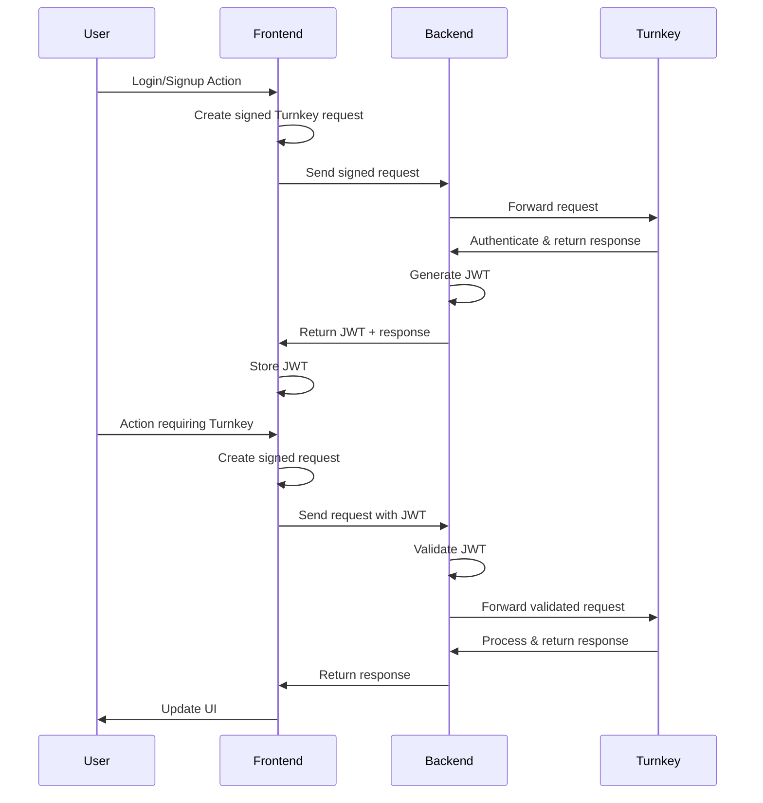

## Introduction

When integrating Turnkey into an application with an existing authentication system, you'll need to establish a secure communication pattern between your frontend, backend, and the Turnkey API.
This guide explains how to implement a backend proxy pattern that leverages your existing user authentication while enabling Turnkey operations.

## Why Use a Backend Proxy?

There are several benefits to proxying Turnkey requests through your own backend:

1. **User data**: Store and retrieve user data associated with Turnkey sub-organizations
2. **Metrics and monitoring**: Add custom validations, rate limiting, and logging
3. **Co-signing capabilities**: Enable 2/2 signing patterns where your application is a co-signer

## JWT Authentication Flow

JSON Web Tokens (JWTs) provide a secure, stateless way to authenticate requests between your frontend and backend. Here's how to implement a JWT-based flow with Turnkey:

### Architecture Overview



### Login and Sign Up Flows

The first step in integrating Turnkey with JWT authentication is handling user login and signup. Both processes follow similar patterns but differ in how they establish the user's identity with Turnkey.

#### Getting the User's Sub-organization ID

Before you can authenticate a user with Turnkey, you need their sub-organization ID. There are multiple ways to obtain this:

1. **Database Lookup**: Query your database using the user's email or ID

   ```typescript
   const user = await db.users.findUnique({
     where: { email: userEmail },
     select: { turnkeySubOrgId: true },
   });
   ```

2. **Turnkey API Lookup**: Query Turnkey directly for sub-organizations associated with an email

   ```typescript
   const { organizationIds } = await turnkeyServer.getSubOrgIds({
     // The parent organization ID
     organizationId: YOUR_PARENT_ORG_ID,
     filterType: "PUBLIC_KEY",
     filterValue: publicKey, // Or use EMAIL for email-based lookup
   });

   const subOrgId = organizationIds[0]; // First matching sub-org
   ```

3. **JWT Cookie**: Extract the sub-organization ID from an existing JWT in cookies (for returning users)
   ```typescript
   const token = req.cookies.authToken;
   const decoded = jwt.verify(token, JWT_SECRET);
   const subOrgId = decoded.subOrgId;
   ```

#### Login Flow

<Steps>
  <Step title="Client-side">
  Generate a signed Turnkey request

    ```typescript
    import { Turnkey } from "@turnkey/sdk-browser";

    const turnkeyClient = new Turnkey({
      apiBaseUrl: "https://api.turnkey.com",
      defaultOrganizationId: subOrgId, // From previous step
    });

    // This will require passkey authentication from the user
    const signedWhoamiRequest = await turnkeyClient.stampGetWhoami({
      organizationId: subOrgId,
    });
    ```

  </Step>

  <Step title="Send to Backend">
  Forward the signed request

    ```typescript
    const response = await fetch("/api/auth/login", {
      method: "POST",
      body: JSON.stringify({ signedRequest: whoamiRequest }),
      headers: { "Content-Type": "application/json" },
    });
    ```

  </Step>

  <Step title="Backend Verification">
    Process the request and issue JWT
    
    ```typescript
    import { Turnkey } from "@turnkey/sdk-server";
    import jwt from "jsonwebtoken";

    // Initialize the server-side Turnkey client
    const turnkeyServer = new Turnkey({
      apiBaseUrl: "https://api.turnkey.com",
      apiPrivateKey: process.env.TURNKEY_API_PRIVATE_KEY,
      apiPublicKey: process.env.TURNKEY_API_PUBLIC_KEY,
      defaultOrganizationId: process.env.TURNKEY_ORGANIZATION_ID,
    }).apiClient();

    app.post("/api/auth/login", async (req, res) => {
      const { signedRequest } = req.body;

      try {
        // Forward to Turnkey - the request is already signed by the user's passkey
        const turnkeyResponse = await turnkeyServer.postWhoami(signedRequest);

        // If we get here without error, the authentication succeeded
        if (turnkeyResponse.organizationId) {
          // Lookup or create user in your database
          const user = await findOrCreateUser(turnkeyResponse.organizationId);

          // Generate JWT
          const token = jwt.sign(
            {
              subOrgId: turnkeyResponse.organizationId,
              userId: user.id,
            },
            JWT_SECRET,
            { expiresIn: "1h" }
          );

          // Set JWT as cookie or return in response
          res.cookie("authToken", token, { httpOnly: true, secure: true });
          return res.status(200).json({ success: true });
        }
      } catch (error) {
        return res.status(401).json({ error: "Authentication failed" });
      }
    });
    ```

  </Step>
</Steps>

#### Sign Up Flow

For new users, the flow is similar but involves creating a new sub-organization:

<Steps>
  <Step title="Client-side">
    Collect user information

    ```typescript
    const email = "user@example.com";
    const username = "New User";
    const attestation = await browserClient.createPasskeyAttestation();

    // Send to backend
    const response = await fetch("/api/auth/signup", {
      method: "POST",
      body: JSON.stringify({
        email,
        username,
        attestation,
      }),
      headers: { "Content-Type": "application/json" },
    });
    ```

  </Step>

  <Step title="Backend Processing">
    Create sub-organization and issue JWT

    ```typescript
    import { Turnkey } from "@turnkey/sdk-server";
    import { DEFAULT_ETHEREUM_ACCOUNTS } from "@turnkey/sdk-browser";

    // Initialize server-side client
    const turnkeyServer = new Turnkey({
      apiBaseUrl: "https://api.turnkey.com",
      apiPrivateKey: process.env.TURNKEY_API_PRIVATE_KEY,
      apiPublicKey: process.env.TURNKEY_API_PUBLIC_KEY,
      defaultOrganizationId: process.env.TURNKEY_ORGANIZATION_ID,
    }).apiClient();

    app.post("/api/auth/signup", async (req, res) => {
      const { email, username, attestation } = req.body;

      try {
        // Create the sub-organization
        const createSubOrgResponse = await turnkeyServer.createSubOrganization({
          subOrganizationName: `${username}'s Organization`,
          rootUsers: [
            {
              userName: username,
              userEmail: email,
              apiKeys: [],
              authenticators: [
                {
                  authenticatorName: "Default Passkey",
                  challenge: YOUR_CHALLENGE, // Should be stored in session
                  attestation: attestation,
                },
              ],
            },
          ],
          rootQuorumThreshold: 1,
          wallet: {
            walletName: "Default Wallet",
            accounts: DEFAULT_ETHEREUM_ACCOUNTS,
          },
        });

        if (createSubOrgResponse.organizationId) {
          // Store user in your database
          const user = await db.users.create({
            data: {
              email: email,
              name: username,
              turnkeySubOrgId: createSubOrgResponse.organizationId,
            },
          });

          // Generate JWT
          const token = jwt.sign(
            {
              subOrgId: createSubOrgResponse.organizationId,
              userId: user.id,
            },
            JWT_SECRET,
            { expiresIn: "1h" }
          );

          res.cookie("authToken", token, { httpOnly: true, secure: true });
          return res.status(200).json({ success: true });
        }
      } catch (error) {
        return res.status(400).json({ error: "Failed to create account" });
      }
    });
    ```

  </Step>
</Steps>

### Authenticating Subsequent Requests

Once a user is authenticated and has a valid JWT, you can use it to authenticate subsequent requests to your backend:

1. **Client-side**: Include JWT in requests to your backend

   ```typescript
   const signedTurnkeyRequest = await turnkeyClient.signRequest({
     organizationId: subOrgId,
     // Parameters for the specific Turnkey operation
   });

   const response = await fetch("/api/proxy/turnkey/sign-transaction", {
     method: "POST",
     body: JSON.stringify({ signedTurnkeyRequest }),
     headers: {
       "Content-Type": "application/json",
       // JWT automatically included in cookies if httpOnly
       // Or explicitly: 'Authorization': `Bearer ${jwt}`
     },
     credentials: "include", // Include cookies
   });
   ```

2. **Backend Verification**: Your backend verifies the JWT and processes the request

   ```typescript
   // Example: JWT middleware
   const verifyJwt = (req, res, next) => {
     const token =
       req.cookies.authToken || req.headers.authorization?.split(" ")[1];

     if (!token) {
       return res.status(401).json({ error: "Unauthorized" });
     }

     try {
       const decoded = jwt.verify(token, JWT_SECRET);
       req.user = decoded;
       next();
     } catch (err) {
       return res.status(401).json({ error: "Invalid token" });
     }
   };

   // Protected route
   app.post(
     "/api/proxy/turnkey/sign-transaction",
     verifyJwt,
     async (req, res) => {
       const { signedTurnkeyRequest } = req.body;
       const { subOrgId } = req.user;

       // Validate the request is for the correct sub-organization
       if (signedTurnkeyRequest.organizationId !== subOrgId) {
         return res.status(403).json({ error: "Forbidden" });
       }

       // Forward to Turnkey
       const turnkeyResponse = await turnkeyApiClient.signTransaction(
         signedTurnkeyRequest
       );

       // Process and return response
       return res.status(200).json(turnkeyResponse);
     }
   );
   ```

### JWT Implementation

When implementing JWT authentication:

```typescript
import jwt from "jsonwebtoken";

// Get this from a secure environment variable
const JWT_SECRET = process.env.JWT_SECRET;

// Generate a JWT after successful authentication
function generateToken(user, subOrgId) {
  return jwt.sign(
    {
      userId: user.id,
      email: user.email,
      subOrgId: subOrgId,
      // Add other claims as needed
    },
    JWT_SECRET,
    {
      expiresIn: "1h", // Token expires in 1 hour
    }
  );
}

// Verify a JWT
function verifyToken(token) {
  try {
    return jwt.verify(token, JWT_SECRET);
  } catch (error) {
    // Handle various JWT verification errors
    return null;
  }
}
```

#### JWT Best Practices

- Keep token expiration times short (15-60 minutes)
- Include only necessary claims in the payload
- Use HTTPS for all communications
- Store tokens securely (use HTTP-only cookies rather than localStorage)
- Implement token refresh mechanisms for long-lived sessions
- Consider using JWTs with signatures (JWS) for enhanced security

## User Data Storage and Retrieval

Many applications need to store additional user data and associate it with their Turnkey activities. Here's how to implement this:

### User-Turnkey Association Model

Store a mapping between your application's user IDs and their corresponding Turnkey organization IDs:

```typescript
// Prisma schema example
model User {
  id                String   @id @default(uuid())
  email             String   @unique
  name              String?
  turnkeySubOrgId   String   @unique
  createdAt         DateTime @default(now())
  lastLoginAt       DateTime @updatedAt
}
```

### Storing User Data

When a user first authenticates with Turnkey (either by creating a new sub-organization or linking to an existing one):

1. Save the Turnkey organization ID in your user database
2. Optionally store additional metadata (creation time, recovery options, etc.)
3. Set up any necessary hooks or listeners for Turnkey activities

### Retrieving User Data

When processing a proxied Turnkey request:

1. Extract the user ID from the authenticated JWT
2. Look up the associated Turnkey organization ID
3. Use this organization ID when forwarding requests to Turnkey

## Implementation Examples

### Next.js Server Actions

Next.js Server Actions provide a convenient way to implement secure backend operations:

```typescript [expandable]
"use server";

import { Turnkey } from "@turnkey/sdk-server";
import { cookies } from "next/headers";
import jwt from "jsonwebtoken";
import { db } from "@/lib/db";

// Initialize the server-side Turnkey client
const turnkeyServer = new Turnkey({
  apiBaseUrl: "https://api.turnkey.com",
  apiPrivateKey: process.env.TURNKEY_API_PRIVATE_KEY,
  apiPublicKey: process.env.TURNKEY_API_PUBLIC_KEY,
  defaultOrganizationId: process.env.TURNKEY_ORGANIZATION_ID,
}).apiClient();

// Proxy a signing request to Turnkey
export async function proxySignTransaction(request) {
  // Get the auth token from the cookie
  const cookieStore = cookies();
  const token = cookieStore.get("authToken")?.value;

  if (!token) {
    throw new Error("Unauthorized");
  }

  try {
    // Verify the token
    const decoded = jwt.verify(token, process.env.JWT_SECRET);
    const { userId, subOrgId } = decoded;

    // Ensure the request is for the correct organization
    if (request.organizationId !== subOrgId) {
      throw new Error("Forbidden: Organization ID mismatch");
    }

    // Proxy the request to Turnkey
    const response = await turnkeyServer.signTransaction(request);

    // Log the activity
    await db.activity.create({
      data: {
        userId,
        type: "SIGN_TRANSACTION",
        status: "SUCCESS",
        metadata: { txHash: response.hash },
      },
    });

    return response;
  } catch (error) {
    console.error("Error proxying request:", error);
    throw new Error("Failed to process request");
  }
}
```

### Standalone API Endpoint

For applications using a traditional API backend:

```typescript [expandable]
import express from "express";
import cookieParser from "cookie-parser";
import jwt from "jsonwebtoken";
import { Turnkey } from "@turnkey/sdk-server";

const app = express();
app.use(express.json());
app.use(cookieParser());

// Initialize the server-side Turnkey client
const turnkeyServer = new Turnkey({
  apiBaseUrl: "https://api.turnkey.com",
  apiPrivateKey: process.env.TURNKEY_API_PRIVATE_KEY,
  apiPublicKey: process.env.TURNKEY_API_PUBLIC_KEY,
  defaultOrganizationId: process.env.TURNKEY_ORGANIZATION_ID,
}).apiClient();

// JWT middleware
const verifyJwt = (req, res, next) => {
  const token =
    req.cookies.authToken || req.headers.authorization?.split(" ")[1];

  if (!token) {
    return res.status(401).json({ error: "Unauthorized" });
  }

  try {
    const decoded = jwt.verify(token, process.env.JWT_SECRET);
    req.user = decoded;
    next();
  } catch (err) {
    return res.status(401).json({ error: "Invalid token" });
  }
};

// Proxy endpoint for Turnkey transaction signing
app.post("/api/proxy/turnkey/sign-transaction", verifyJwt, async (req, res) => {
  const { signedRequest } = req.body;
  const { subOrgId, userId } = req.user;

  // Validate the request is for the correct sub-organization
  if (signedRequest.organizationId !== subOrgId) {
    return res.status(403).json({ error: "Forbidden" });
  }

  try {
    // Forward to Turnkey
    const turnkeyResponse = await turnkeyServer.signTransaction(signedRequest);

    // Log the activity in your database if needed
    // ...

    // Return the response
    return res.status(200).json(turnkeyResponse);
  } catch (error) {
    console.error("Error signing transaction:", error);
    return res.status(500).json({
      error: "Failed to sign transaction",
      message: error.message,
    });
  }
});

const PORT = process.env.PORT || 3000;
app.listen(PORT, () => {
  console.log(`Server running on port ${PORT}`);
});
```

## Security Considerations

When implementing this pattern, keep these security considerations in mind:

1. **API Key Security**: Never expose your backend Turnkey API keys to the frontend
2. **JWT Validation**: Thoroughly validate JWTs (signature, expiration, audience, etc.)
3. **Input Validation**: Sanitize and validate all input received from the frontend
4. **Rate Limiting**: Implement rate limiting to prevent abuse
5. **Monitoring**: Set up logging and monitoring for suspicious activities
6. **Error Handling**: Return appropriate error messages without exposing sensitive details

## Advanced Topics

### Co-signing Transactions

Your backend can participate as a co-signer in a 2/2 multisig arrangement:

```typescript
// Backend co-signing implementation
async function cosignTransaction(transaction, userId) {
  // Get the user's sub-organization ID
  const user = await db.users.findUnique({
    where: { id: userId },
    select: { turnkeySubOrgId: true },
  });

  if (!user) {
    throw new Error("User not found");
  }

  // Sign the transaction with the backend's key
  const cosignedTx = await turnkeyServer.signTransaction({
    organizationId: process.env.TURNKEY_ORGANIZATION_ID,
    parameters: {
      type: "TRANSACTION_TYPE_ETHEREUM",
      signWith: BACKEND_WALLET_ADDRESS, // The address of the wallet you want to sign with
      unsignedTransaction: transaction, // The RLP-encoded unsigned transaction as a hex string
    },
  });

  return cosignedTx;
}
```

## Example Applications

For complete example applications demonstrating these patterns, check out:

- [Next.js Turnkey Sample App](https://github.com/tkhq/example-apps/nextjs-sample) (placeholder)
- [Express Turnkey Backend Proxy](https://github.com/tkhq/example-apps/express-proxy) (placeholder)
