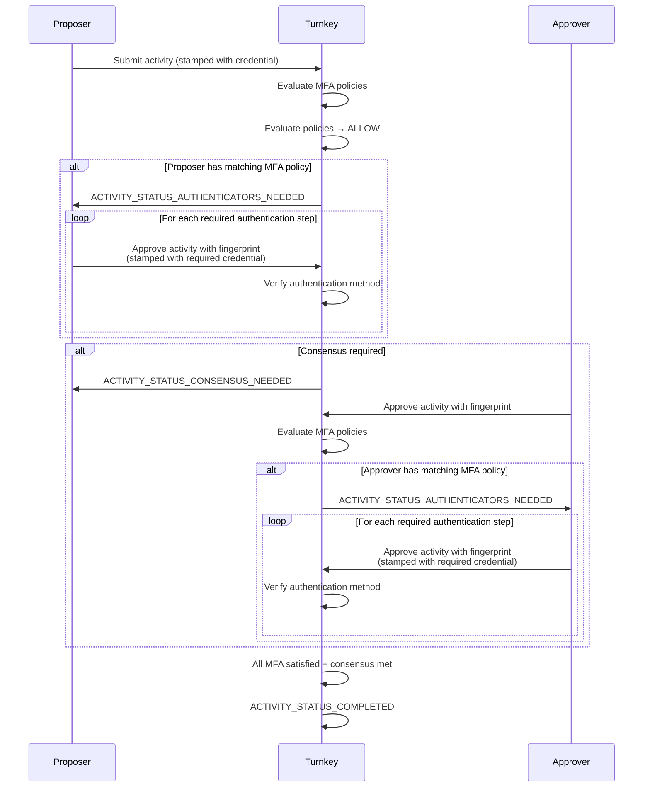

When a user submits an activity and an MFA policy evaluates to `true`, the activity enters `ACTIVITY_STATUS_AUTHENTICATORS_NEEDED` status. The activity will not execute until the user satisfies the authentication challenges.

The user must call the `APPROVE_ACTIVITY` activity, passing in the `fingerprint` of the original activity:

```ts
// This endpoint can be found in any of Turnkey's SDKs, within a client access point or provider.
approveActivity({
  fingerprint: "<fingerprint-of-original-activity>",
});
```

The credential used to stamp this approval request determines which authentication method is being proven.

You can learn more about stamps [here](/developer-reference/api-overview/stamps).

## API key

To prove API key authentication, the user stamps the `APPROVE_ACTIVITY` request with an API key. 

If the MFA policy specifies an `id`, the user must stamp with that specific API key.

## Passkey

To prove passkey authentication, the user stamps the `APPROVE_ACTIVITY` request with a WebAuthn authenticator. 

If the MFA policy specifies an `id`, the user must stamp with that specific authenticator.

## Session

To prove session authentication, the user stamps the `APPROVE_ACTIVITY` request with a session credential. A session credential is an API key that was classified as a session after a login activity (e.g., `STAMP_LOGIN`, `OTP_LOGIN`).

If the MFA policy specifies an `id` for a session authentication method, the `id` refers to a [session profile](../sessions/session-profiles) ID. The user must stamp with a session credential that was issued with that specific session profile.


## Email OTP, SMS OTP, and OAuth

TODO (Amir/Moe): Talk about token stamps and link to docs

## MFA and consensus

MFA works alongside Turnkey's [consensus](/concepts/users/root-quorum) system for activities that require approval from multiple users.

When an activity requires both MFA and consensus:

1. **The activity initiator must satisfy their own MFA requirements first.** If the proposer has an MFA policy that matches the activity, the activity is returned with `ACTIVITY_STATUS_AUTHENTICATORS_NEEDED`. The proposer must satisfy their MFA requirements before the activity can proceed to consensus.
2. **Subsequent approvers vote on the activity as normal.** Once the proposer's MFA is satisfied, other users in the quorum can approve or reject the activity.
3. **Approving users must also satisfy their own MFA requirements.** If an approver has an MFA policy that matches the activity, their vote will return `ACTIVITY_STATUS_AUTHENTICATORS_NEEDED`. The approver must satisfy their MFA requirements before their vote is recorded. 
4. **The activity executes only after all required users have satisfied MFA and consensus is met.**

This ensures that every user involved in an activity is individually held to their own MFA requirements, regardless of whether they are the proposer or an approver.


