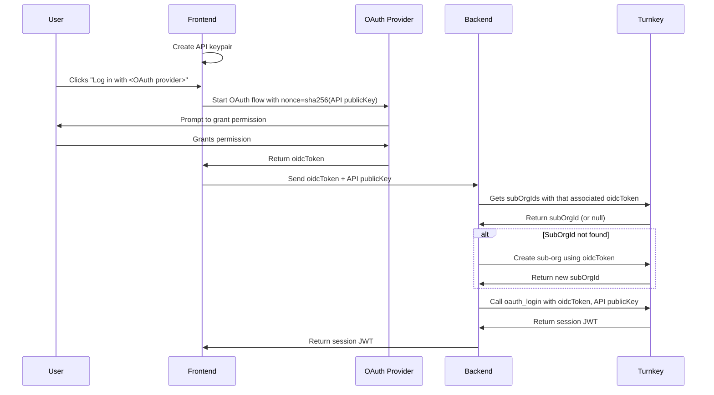
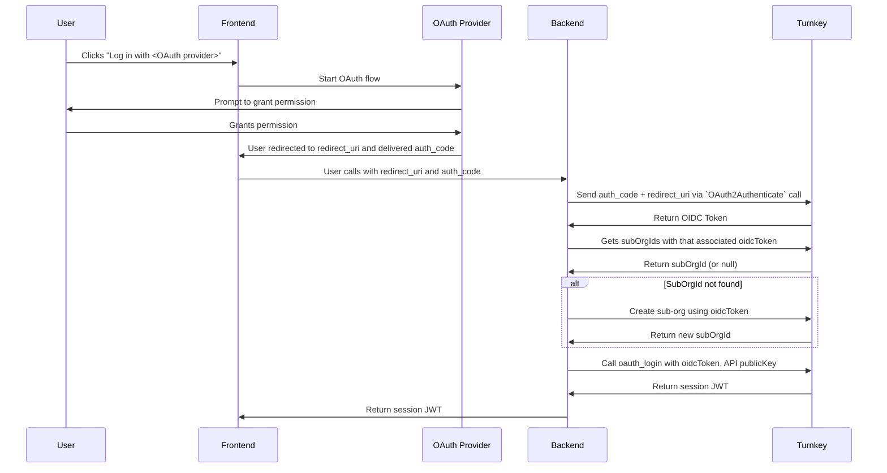
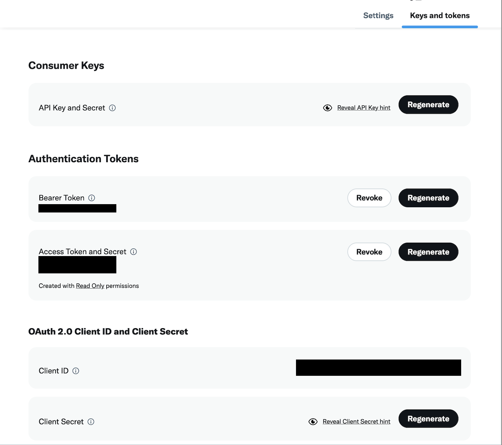
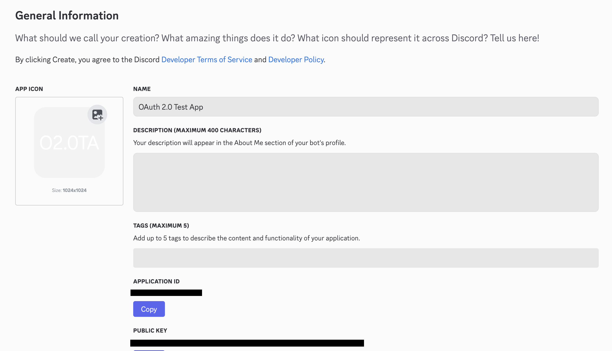

Similar to [email auth](/authentication/email), social login authentication is ideal for users who prefer not to manage API keys or [passkeys](/authentication/passkeys/introduction) directly. This makes it particularly well-suited for onboarding users who are comfortable with traditional web2-style accounts but may be unfamiliar with cryptographic keys and credentials. An example implementing social login authentication for an organization can be found in our SDK repo [here](https://github.com/tkhq/sdk/tree/main/examples/oauth).

## Types of Social Login Providers

Turnkey supports two different types of Social Login Providers:

1) **OIDC Providers**
(Google, Apple, Auth0, Cognito…)
These Providers issue your app an **OIDC ID Token** identifying an end-user, which can subsequently be passed to Turnkey as a means of authentication.

2) **OAuth 2.0-Only Providers**
(X/Twitter, Discord…)
These Providers do *not* issue **OIDC ID Tokens** themselves, and instead provide only bare-bones OAuth 2.0.  To work around this limitation, Turnkey runs the **OAuth 2.0 Authorization Code + PKCE** flow, calls the provider’s `who-am-I` endpoint using your app's credentials, and then uses the returned user data to **issue a short-lived OIDC ID token**.  In effect, Turnkey acts as an "*OIDC Wrapper*" for these OAuth 2.0 Services.

While the backend flows associated with these two types of Providers differ upstream of **OIDC ID Token** generation, they converge at that point and have no downstream differences.  In both cases, the goal is to get an **OIDC ID Token** identifying the end user.

### Social Login Provider Types - Comparison

The table below can be helpful in understanding the similarities and differences between the two types of Social Login Providers that Turnkey supports:

| **Provider Type**   | **OIDC Provider**                                 | **OAuth 2.0-Only Providers**                                          |
|---------------------|---------------------------------------------------|-------------------------------------------------------------------|
| Providers           | Google, Apple, Facebook, Auth0, Cognito           | X/Twitter, Discord                                                |
| Token Transport     | Returned to your App by Provider                  | Returned by Turnkey after the **OAuth 2.0 Auth Code + PKCE** flow     |
| Issuer (`iss`)      | Provider (iss = Provider URL)                     | Turnkey (iss = Turnkey URL)                                       |
| Audience  (`aud`)   | Provider’s `client_id` for your app               | Provider’s `client_id` for your app                               |
| Subject (`sub`)     | Provider’s subject (stable user ID)               | Derived from ID `who-am-I` response (e.g., `x:123456789`)         |
| Nonce (`nonce`)     | Sent to Provider; echoed in ID token              | Sent to Turnkey; echoed in ID token.                              |
| Refresh/access      | If the Provider returns them, you may use them    | Not provided.                                                     |

## Roles and responsibilities

- **Turnkey**: Runs verifiable infrastructure to create credentials, verify OIDC tokens and, in the case of **OAuth 2.0-Only Providers**, issue them as well.

- **Parent**: That's you! **For the rest of this guide we'll assume you, the reader, are a Turnkey customer**. We assume that you have:

  - An existing Turnkey organization (we'll refer to this organization as "the parent organization")
  - A web application frontend (we'll refer to this as just "app" or "web app")
  - A backend able to sign and POST Turnkey activities ("backend" or "parent backend")

- **End-User**: The end-user is a user of your web app. They have an account with Google.

- **OIDC Provider**: A provider able to authenticate your End-Users and provide OIDC tokens as proof. We'll use [Google](https://developers.google.com/identity/openid-connect/openid-connect) as an example.

- **OAuth 2.0-Only Provider**: A provider of OAuth 2.0-based Authorization, for which Turnkey is able to act as an "*OIDC Wrapper*".

## Authentication Sequence Diagrams

The sequence diagrams below display the differing flows for the two types of Social Login Providers.

### OIDC Provider

<Steps>
  <Step title="Create API Key">
  The frontend generates an API keypair before starting the OAuth login flow. This keypair will later become the session keypair once the user is authenticated via Turnkey.
  </Step>

  <Step title="Start the OAuth Login Flow">
  The user begins the login process by clicking "Log in with &lt;OAuth provider&gt;" on the frontend.
  </Step>

  <Step title="Initiate OAuth with Nonce">
  When starting the OAuth request to the provider, the frontend sets the `nonce` to `sha256(publicKey)` based on the API public key. This binds the resulting OIDC token to the keypair.
  </Step>

  <Step title="User Grants Permission">
  The OAuth provider prompts the user to grant permission to share their identity. Once approved, the OAuth provider returns an `oidcToken` to the frontend.
  </Step>

  <Step title="Send Credentials to Backend">
  The frontend sends the `oidcToken` and API public key to your backend.
  </Step>

  <Step title="Get or Create a Turnkey Sub-organization">
  The backend gets subOrgIds that are associated with that `oidcToken`. If no sub-organization exists, it creates one using the identity in the token.
  </Step>

  <Step title="Create a Session">
  The backend calls `oauth_login` with the `oidcToken`, and API public key. Turnkey validates that the token’s `nonce` matches `sha256(publicKey)` and returns a session JWT. The backend sends this JWT to the frontend.
  </Step>

  <Step title="You're Now Authenticated">
  Your frontend now treats the API keypair as the session keypair. It can use the private key to sign requests to Turnkey using the `x-stamp` header.
  </Step>
</Steps>

### OAuth 2.0-Only Provider

<Steps>
  <Step title="Create API Key">
  The frontend generates an API keypair before starting the OAuth login flow. This keypair will later become the session keypair once the user is authenticated via Turnkey.
  </Step>

  <Step title="Start the OAuth Login Flow">
  The user begins the login process by clicking "Log in with &lt;OAuth provider&gt;" on the frontend.
  </Step>

  <Step title="Initiate OAuth">
  The frontend initiates the OAuth Authentication flow with the provider.
  </Step>

  <Step title="User Grants Permission">
  The OAuth provider prompts the user to grant permission to share their identity. Once approved, the OAuth provider returns an `oidcToken` to the frontend.
  </Step>

  <Step title="Provider Delivers auth_code">
  The provider delivers a short-lived auth_code via the redirect_uri.
  </Step>

  <Step title="Get OIDC Token">
  The backend exchanges the auth_code + redirect_uri for an OIDC ID Token using the `OAuth2Authenticate` activity.
  </Step>

  <Step title="Get or Create a Turnkey Sub-organization">
  The backend gets subOrgIds that are associated with that `oidcToken`. If no sub-organization exists, it creates one using the identity in the token.
  </Step>

  <Step title="Create a Session">
  The backend calls `oauth_login` with the `oidcToken`, and API public key. Turnkey validates that the token’s `nonce` matches `sha256(publicKey)` and returns a session JWT. The backend sends this JWT to the frontend.
  </Step>

  <Step title="You're Now Authenticated">
  Your frontend now treats the API keypair as the session keypair. It can use the private key to sign requests to Turnkey using the `x-stamp` header.
  </Step>
</Steps>

## What does Turnkey use from the OIDC tokens to prove identity?
Turnkey parses and validates the following fields from the OIDC token to confirm the user's identity:
- `issuer` (iss) – The OAuth provider that issued the token (e.g., `https://accounts.google.com`)
- `audience` (aud) – The OAuth app’s client ID
- `subject` (sub) – The unique identifier for the user in the OAuth provider's system

**Note:**  
Some OAuth providers (like Google) encourage you to register separate client IDs for each platform (e.g., web, iOS, Android). However, as discussed above, in the Turnkey flow the `aud` claim from the OIDC token is used as part of how sub-organizations are identified.

If a user logs in on one platform using the web client ID, and then later logs in on another platform using a different iOS client ID, the two tokens will have different `aud` values. Because of this, Turnkey will not consider them the same identity.

To ensure users are recognized consistently across platforms, you must use the same OAuth client ID everywhere. In most cases, this means using your web client ID for web, iOS, and Android flows.

## OIDC token verification

All OIDC tokens are verified inside of Turnkey's [secure enclaves](/security/secure-enclaves).

We've designed a new secure enclave to fetch TLS content securely and bring [non-repudiation](https://en.wikipedia.org/wiki/Non-repudiation#In_digital_security) on top of TLS content: our TLS fetcher returns a URL and the fetched content, signed by the TLS fetcher's quorum key. By trusting the TLS fetcher quorum key, other Turnkey enclaves can bring TLS-fetched data into their computation safely. Verifying OIDC token is the first computation which requires this!

To verify an OIDC token, other Turnkey enclaves receive the OIDC token as well as:

- the signed content of the issuer's OpenId configuration. OpenId configuration **must** be hosted under `/.well-known/openid-configuration` for each domain. For Google for example, the issuer configuration is at [`accounts.google.com/.well-known/openid-configuration`](https://accounts.google.com/.well-known/openid-configuration). This JSON document contains, among other thing, a `jwksUri` key. The value for this key is a URL hosting the list of currently-valid OIDC token signers.
- the signed content of the issuer's `jwksUri` (e.g., for Google, the `jwksUri` is [`googleapis.com/oauth2/v3/cert`](https://www.googleapis.com/oauth2/v3/certs)). This is a list of public keys against which the secure enclave can verify tokens. Note: **these public keys rotate periodically** (every \~6hrs), hence it's not possible to hardcode these public keys in our secure enclave code directly. We have to fetch them dynamically!

With all of that, an enclave can independently verify an OIDC token without making outbound requests. Once the token is parsed and considered authentic, our enclaves match the `iss`, `aud` and `sub` attributes against the registered OAuth providers on the Turnkey sub-organization. We also check `exp` to make sure the OIDC token is not expired, and the `nonce` attribute (see next section).

## Nonce restrictions in OIDC tokens

Our [`OAUTH_LOGIN`](/api-reference/user-auth/oauth_login) activity requires 2 parameters minimum:

- `oidcToken`: the base64 OIDC token
- `publicKey`: the client-side public key generated by the user

In order to prevent OIDC tokens from being used against multiple public keys, our enclaves parse the OIDC token and, as part of the validation logic, enforce that the `nonce` claim is set to `sha256(publicKey)`.

For example, if the public key is `0394e549c71fa99dd5cf752fba623090be314949b74e4cdf7ca72031dd638e281a`, our enclaves expect the OIDC token nonce to be `1663bba492a323085b13895634a3618792c4ec6896f3c34ef3c26396df22ef82`.

This restriction only applies during **authentication** (`OAUTH` activity). Registration via `CREATE_OAUTH_PROVIDER` and `CREATE_SUB_ORGANIZATION` activities is not affected since these activities do not accept a `publicKey` and do not return encrypted credentials as a result.

If your OAuth provider does not allow you to customize `nonce` claims, Turnkey also accepts and validates `tknonce` claims. This is an alternative claim that will be considered. Only one of (`nonce`, `tknonce`) needs to be set to `sha256(publicKey)`; not both.

## OAuth vs. OIDC

[OAuth2.0](https://datatracker.ietf.org/doc/html/rfc6749) is a separate protocol from [OIDC](https://openid.net/specs/openid-connect-core-1_0.html), with distinct goals:

- "OAuth2.0" is an authorization framework
- "OIDC" is an authentication framework

We chose to name this feature "OAuth" because of the term familiarity: most Turnkey customers will have to setup an "OAuth" app with Google, and the user experience is often referred to as "OAuth" flows regardless of the protocol underneath.

## OIDC Providers

Below, some details and pointers about specific providers we've worked with before. If yours isn't listed below it does not mean it can't be supported: any OIDC provider should work with Turnkey's OAuth.

### Google

This provider is extensively tested and supported. We've integrated it in our demo wallet (hosted at [https://wallet.tx.xyz](https://wallet.tx.xyz)), along with Apple and Facebook:

<Frame>
  
</Frame>

The code is open-source, feel free to [check it out](https://github.com/tkhq/demo-embedded-wallet) for reference. The exact line where the OAuth component is loaded is here: [ui/src/screens/LandingScreen.tsx](https://github.com/tkhq/demo-embedded-wallet/blob/d4ec308e9ce0bf0da7b64da2b39e1a80c077eb82/ui/src/screens/LandingScreen.tsx#L384).

The main documentation for Google OIDC is available [here](https://github.com/tkhq/demo-embedded-wallet/blob/bf0e2292cbd2ee9cde6b241591b077fadf7ee71b/src/components/auth.tsx#L157).

### Apple

Apple integration is also extensively tested and supported, and is integrated into our demo wallet (hosted at [https://wallet.tx.xyz](https://wallet.tx.xyz)). The code provides an [example component](https://github.com/tkhq/demo-embedded-wallet/blob/bf0e2292cbd2ee9cde6b241591b077fadf7ee71b/src/components/apple-auth.tsx) as well as an [example redirect handler](<https://github.com/tkhq/demo-embedded-wallet/blob/bf0e2292cbd2ee9cde6b241591b077fadf7ee71b/src/app/(landing)/oauth-callback/apple/page.tsx>).

Documentation for Apple OIDC can be found [here](https://developer.apple.com/documentation/sign_in_with_apple/sign_in_with_apple_rest_api/authenticating_users_with_sign_in_with_apple).

### Facebook

Facebook OIDC requires a [manual flow with PFKE](https://developers.facebook.com/docs/facebook-login/guides/advanced/oidc-token/) (Proof for Key Exchange). This flow requires a few extra steps compared with Apple or Google. Specifically:

- You will need to generate a **code verifier** that can either be recalled (e.g. from a database) or reassembled in a later request.
- You will need to provide a **code challenge** as a parameter of the OAuth redirect that is either the code verifier itself or the hash of the code verifier.
- Instead of receiving the OIDC token after the OAuth flow, you will receive an **auth code** that must be exchanged for an OIDC token in a subsequent request. The code verifier and your app's ID are also required in this exchange.

In our example demo wallet, we opt to avoid using a database in the authentication process and instead generate our verification code serverside using the hash of a nonce and a secret salt value. The nonce is then passed to and returned from the Facebook API as a **state** parameter (see [the API spec](https://developers.facebook.com/docs/facebook-login/guides/advanced/oidc-token/) for details). Finally, the server reconstructs the verification code by re-hashing the nonce and the the salt. The full flow is displayed below:

<Frame>
  
</Frame>

Code for the [redirect component](https://github.com/tkhq/demo-embedded-wallet/blob/bf0e2292cbd2ee9cde6b241591b077fadf7ee71b/src/components/facebook-auth.tsx), [OAuth callback](<https://github.com/tkhq/demo-embedded-wallet/blob/bf0e2292cbd2ee9cde6b241591b077fadf7ee71b/src/app/(landing)/oauth-callback/facebook/page.tsx>), and [code exchange](https://github.com/tkhq/demo-embedded-wallet/blob/bf0e2292cbd2ee9cde6b241591b077fadf7ee71b/src/actions/turnkey.ts#L54) are all available in the example wallet repo.

If you prefer to use a database such as Redis instead of reassembling the verification code, you can store the verification code and retrieve it in the exchange stage using a lookup key either passed as **state** or stored in local browser storage.

### Auth0

This provider was tested successfully and offers a wide range of authentication factors and integration. For example, Auth0 can wrap Twitter's auth or any other ["Social Connection"](https://marketplace.auth0.com/features/social-connections).

In the testing process we discovered that Auth0 admins can manage users freely. Be careful about who can and can't access your Auth0 account: Auth0's management APIs allow for account merging. Specifically, anyone with a `users:update` scope token can call [this endpoint](https://auth0.com/docs/api/management/v2/users/post-identities) to arbitrarily link an identity.

For example, if a Google-authenticated user (OIDC token `sub` claim: `google-oauth2|118121659617646047510`) gets merged into a Twitter-authenticated user (OIDC token `sub` claim: `twitter|47169608`), the OIDC token obtained by logging in through Google post-merge will be `twitter|47169608`. This can be surprising and lead to account takeover if an Auth0 admin is malicious. This is documented in Auth0's own docs, [here](https://auth0.com/docs/manage-users/user-accounts/user-account-linking#precautions).

### AWS Cognito

The main thing to call out is the inability to pass custom `nonce` claims easily. To pass the hash of the end-user's public key, use a custom `tknonce` claim instead.

### Social linking

Social linking is the concept of automatically linking an email address to a Turnkey user by authenticating with a social provider. This allows an end-user to authenticate with the social provider, or a matching email address. Currently, we only allow automatic linking for Google social logins.

The cases are as follows:

1. The end-user authenticates with Google. Their email address is automatically linked to their authentication methods and considered “verified,” allowing them to log in with email OTP or email auth in the future.
2. The end-user authenticates with a Google email address (e.g., @gmail.com) via email OTP or email auth. If they later authenticate with Google, the Google OIDC provider will automatically be added as a valid login method, provided the email matches.
3. The end-user has existing non-Google authentication methods (e.g. phone number, passkeys, etc.) and later adds Google OIDC as a login method (via [CREATE_OAUTH_PROVIDERS](/api-reference/activities/create-oauth-providers#api-key)). The email address in the Google account will be automatically marked as "verified" and linked to the existing user.

For more information on how to implement social linking, see the [social linking code example](/embedded-wallets/code-examples/social-linking).

## Setup for OAuth 2.0-Only Providers

### Setting Up X/Twitter

Navigate to the [X developer portal](https://developer.twitter.com/en/portal/dashboard) and create/setup your app.  In the **Keys and Tokens** section, you'll need to save your **Client ID** and **Client Secret** so that these values can be uploaded to Turnkey's servers:

#### Required Scopes

In order for Turnkey to access the `/2/users/me` endpoint, the following scopes must be set during Authorization:
- `tweet.read`
- `user.read`

### Setting Up Discord

Navigate to the [Discord developer portal](https://discord.com/developers) and create/setup your app.  In the **General Information** section, you'll need to save your **Client ID** and **Client Secret** so that these values can be uploaded to Turnkey's servers:

#### Required Scopes

In order for Turnkey to access the `/api/users/@me` endpoint, the following scopes must be set during Authorization:
- `identify`
- `email`

### Client Secret Upload

For every OAuth 2.0-Only Social Provider that you wish to integrate with, you must upload the **Client ID** and **Client Secret** issued by that Provider to Turnkey's Servers.  In order to protect these sensitive credentials, they will be encrypted to the Quorum Key of the TLS Fetcher enclave, which ensures they cannot be accessed outside of that environment.

Presently, the encryption and upload of these client credentials is supported programmatically through our SDK, but in the near future we will introduce support in our Dashboard.  See the example [here](https://github.com/tkhq/sdk/blob/main/examples/with-x/credential-upload.tsx) demonstrating how to encrypt and upload your client secrets using our SDK.
