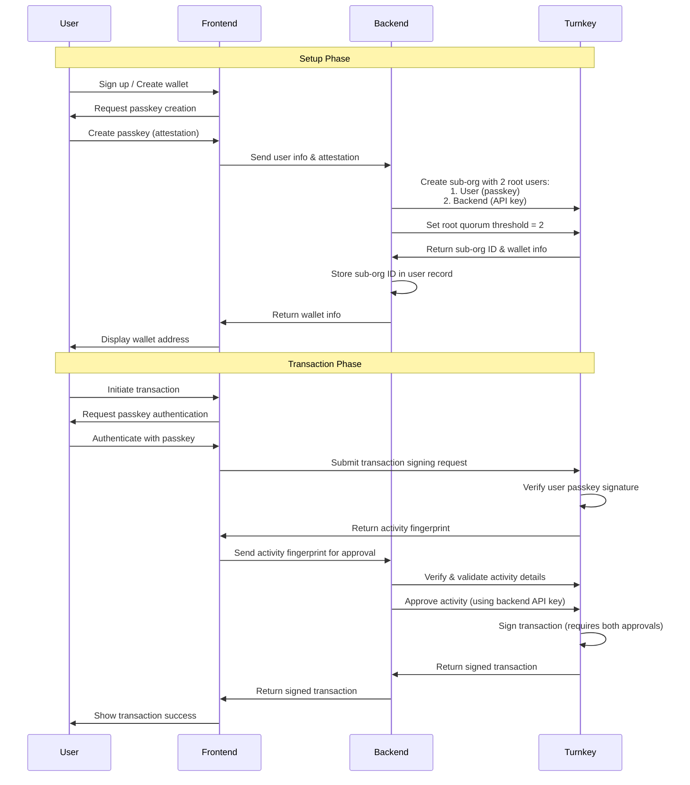

## Introduction to co-signing

Co-signing, often referred to as multi-signature (multi-sig), provides an enhanced layer of security for blockchain transactions. It requires approvals from multiple parties before a transaction can be executed. This guide details how to implement a 2/2 co-signing setup using Turnkey, where both the end-user and your application backend (via API key) must approve transactions.

<Note>
  See the [with-cosigning example](https://github.com/tkhq/sdk/tree/main/examples/with-cosigning) for a full working implementation using Next.js, OTP login, SSE webhooks, and a 2-of-2 root quorum.
</Note>

## Co-signing architecture

The following diagram illustrates the setup and transaction flow for a co-signing wallet managed by Turnkey and your backend application:



## Implementation steps

<Steps>
  <Step title="Create a Sub-Organization with Multiple Root Users">
    To set up a multi-sig wallet in Turnkey, you first need to create a sub-organization with two root users. 
    This sub-organization will function as a separate entity with its own wallet and security settings.
    
    The key configuration here is setting up:
    - A root user for the end-user, authenticated with their passkey
    - A root user for your application service, authenticated with an API key
    - A root quorum threshold of 2, requiring both users to approve critical operations
    
    This creates a true multi-sig arrangement where neither party can unilaterally control the wallet.
    The following code shows how to implement this setup on your backend:

    <CodeGroup>

    ```typescript app.ts [expandable]
    import { Turnkey, DEFAULT_ETHEREUM_ACCOUNTS } from "@turnkey/sdk-server";

    const turnkeyServer = new Turnkey({
      apiBaseUrl: "https://api.turnkey.com",
      apiPrivateKey: process.env.TURNKEY_API_PRIVATE_KEY!,
      apiPublicKey: process.env.TURNKEY_API_PUBLIC_KEY!,
      defaultOrganizationId: process.env.TURNKEY_ORGANIZATION_ID!,
    }).apiClient();

    async function createMultiSigWallet(
      userId: string,
      userEmail: string,
      userPasskeyChallenge: string,
      userPasskeyAttestation: object,
    ) {
      const subOrg = await turnkeyServer.createSubOrganization({
        organizationId: process.env.TURNKEY_ORGANIZATION_ID!,
        subOrganizationName: `Multi-Sig Wallet for ${userEmail}`,
        rootUsers: [
          // First root user - the end user with their passkey
          {
            userName: "End User",
            userEmail,
            apiKeys: [],
            authenticators: [
              {
                authenticatorName: "User Passkey",
                challenge: userPasskeyChallenge,
                attestation: userPasskeyAttestation,
              },
            ],
          },
          // Second root user - your application's service account
          {
            userName: "Application Service",
            userEmail: "service@yourapp.com",
            apiKeys: [
              {
                apiKeyName: "Service API Key",
                publicKey: process.env.SERVICE_API_PUBLIC_KEY!,
                curveType: "API_KEY_CURVE_P256",
              },
            ],
            authenticators: [],
          },
        ],
        // This is the key setting - requiring both users to approve
        rootQuorumThreshold: 2,
        wallet: {
          walletName: "Shared Wallet",
          accounts: DEFAULT_ETHEREUM_ACCOUNTS,
        },
      });

      // Store the sub-org ID against the user in your database
      await db.users.update({
        where: { id: userId },
        data: { turnkeySubOrgId: subOrg.organizationId },
      });

      return subOrg;
    }
    ```

    </CodeGroup>

  </Step>

  <Step title="Client-Side Transaction Initiation">
    When the user wants to sign a transaction using their multi-sig wallet, they need to initiate the process from your frontend application.
    This step involves:
    
    - Authenticating the user with their passkey (handled automatically by Turnkey)
    - Creating a transaction signing request to Turnkey
    - Receiving an activity fingerprint that needs further approval
    - Forwarding this fingerprint to your backend for the second signature
    
    The transaction won't be fully signed yet - it will be in a `CONSENSUS_NEEDED` status until your backend approves it.
    Here's how to implement this flow in your frontend:


    ```typescript
    import { useTurnkey, StamperType } from "@turnkey/react-wallet-kit";

    function SignButton({ walletAddress, subOrgId }: { walletAddress: string; subOrgId: string }) {
      const { httpClient } = useTurnkey();

      const handleSign = async () => {
        const payload = "0x" + Buffer.from("Hello from Turnkey!").toString("hex");

        // StamperType.Passkey ensures this request is stamped with the user's passkey.
        // With a 2-of-2 quorum the activity lands in CONSENSUS_NEEDED after this call —
        // it won't complete until the backend approves it.
        const res = await httpClient!.signRawPayload(
          {
            organizationId: subOrgId,
            signWith: walletAddress,
            payload,
            encoding: "PAYLOAD_ENCODING_HEXADECIMAL",
            hashFunction: "HASH_FUNCTION_SHA256",
          },
          StamperType.Passkey,
        );

        // Forward the activity fingerprint to your backend for the second approval
        const fingerprint = (res as any).activity?.fingerprint;
        await fetch("/api/approve-transaction", {
          method: "POST",
          headers: { "Content-Type": "application/json" },
          body: JSON.stringify({ fingerprint, subOrgId }),
        });
      };

      return <button onClick={handleSign}>Sign</button>;
    }
    ```

  </Step>

  <Step title="Backend Activity Approval">
    Your backend needs an endpoint to receive the activity fingerprint from the frontend and approve it using its own API key.

    <CodeGroup>

    ```typescript app.ts [expandable]
    import { Turnkey } from "@turnkey/sdk-server";
    import { verifyJwt } from "./authMiddleware"; // Assume standard JWT middleware

    const turnkeyServer = new Turnkey({
      apiBaseUrl: "https://api.turnkey.com",
      apiPrivateKey: process.env.TURNKEY_API_PRIVATE_KEY!,
      apiPublicKey: process.env.TURNKEY_API_PUBLIC_KEY!,
      defaultOrganizationId: process.env.TURNKEY_ORGANIZATION_ID!,
    }).apiClient();

    // Endpoint to approve a transaction activity
    app.post(
      "/api/proxy/turnkey/approve-transaction",
      verifyJwt,
      async (req, res) => {
        const { activityFingerprint, subOrgId } = req.body;
        const { userId } = req.user;

        // --- Authorization Check ---
        // Verify the user is authorized for this subOrgId
        const user = await db.users.findUnique({
          where: { id: userId },
          select: { turnkeySubOrgId: true },
        });

        if (user?.turnkeySubOrgId !== subOrgId) {
          return res.status(403).json({ error: "Forbidden" });
        }
        // --- End Authorization ---

        try {
          // Approve the activity using the backend service's API key
          await turnkeyServer.approveActivity({
            organizationId: subOrgId,
            fingerprint: activityFingerprint,
          });

          // Once both parties have approved, Turnkey completes the signing.
          // Use Webhooks to get notified when the activity reaches a terminal status.
          return res.status(200).json({ success: true });
        } catch (error) {
          console.error("Error approving transaction:", error);
          return res.status(500).json({ error: "Failed to approve transaction" });
        }
      }
    );
    ```

    </CodeGroup>
  </Step>
</Steps>

<Note>
  The quorum is symmetric — the backend can also initiate signing (vote 1) and the user approves (vote 2). See the [with-cosigning example](https://github.com/tkhq/sdk/tree/main/examples/with-cosigning) for a full walkthrough of both flows.
</Note>

#### Security considerations and best practices

- **Validation Before Approval**: Always validate transaction details (recipient, amount, etc.) before approving activities.
- **API Key Security**: Protect your backend service's API key.
- **Authorization**: Ensure the authenticated frontend user is authorized for the `subOrgId` they are interacting with.
- **Webhooks**: Use Turnkey Webhooks to get notified about activity status changes (e.g., when a transaction is fully signed and confirmed).
