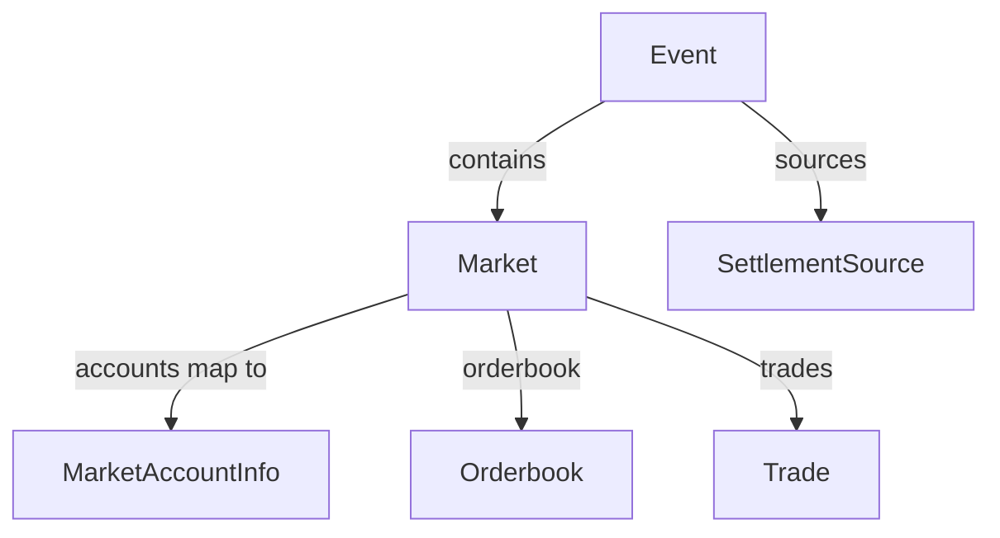

## Overview

With [DFlow](https://pond.dflow.net), you can add Solana spot token swaps and prediction market trading to your app through a single API. You get aggregated liquidity across major Solana DEXs and access to the full catalog of tokenized [Kalshi](https://kalshi.com/) prediction markets.

This guide walks through trading crypto and prediction market outcome tokens using DFlow APIs, with transactions signed by a Turnkey wallet. For the full API reference, recipes, and advanced topics, see the [DFlow documentation](https://pond.dflow.net/introduction).

---

## Getting started

### Turnkey 

Before you begin, make sure you've followed the [Turnkey Quickstart guide](/getting-started/quickstart).

### DFlow

DFlow exposes two APIs:

| API              | Dev Endpoint                                    |
|------------------|--------------------------------------------------|
| Trade API        | `https://dev-quote-api.dflow.net`                |
| Metadata API     | `https://dev-prediction-markets-api.dflow.net`   |

The dev endpoints are free to use and don't require an API key, but they are rate-limited. For production, [request an API key](https://pond.dflow.net/build/api-key) and [include it via the `x-api-key` header](https://pond.dflow.net/build/recipes/api-keys).

---

## Trading crypto

DFlow's routing adapts to live onchain conditions, so your users get better prices and fewer failed transactions. 

DFlow's `GET /order` endpoint returns a quote and a ready-to-sign Solana transaction in a single request. Pass `inputMint`, `outputMint`, `amount` (in atomic units), `slippageBps`, and `userPublicKey`. The response includes a base64-encoded `VersionedTransaction`.

### Request an order

```tsx
const SOL = "So11111111111111111111111111111111111111112";
const USDC = "EPjFWdd5AufqSSqeM2qN1xzybapC8G4wEGGkZwyTDt1v";

const API_BASE_URL = "https://dev-quote-api.dflow.net";
const API_KEY = process.env.DFLOW_API_KEY;

const queryParams = new URLSearchParams();
queryParams.append("inputMint", SOL);
queryParams.append("outputMint", USDC);
queryParams.append("amount", "100000000"); // 0.1 SOL (9 decimals)
queryParams.append("slippageBps", "50");
queryParams.append("userPublicKey", userPublicKey);

const headers: HeadersInit = {};
if (API_KEY) {
  headers["x-api-key"] = API_KEY;
}

const order = await fetch(
  `${API_BASE_URL}/order?${queryParams.toString()}`,
  { headers }
).then((res) => res.json());
```

Token swaps execute synchronously in a single atomic transaction.

### Sign and submit

Deserialize the transaction, sign it with your Turnkey signer, and submit to Solana.

```tsx
import { Connection, VersionedTransaction } from "@solana/web3.js";
import { TurnkeySigner } from "@turnkey/solana";

const connection = new Connection("https://solana-rpc.publicnode.com", "confirmed");

const tx = VersionedTransaction.deserialize(
  Buffer.from(order.transaction, "base64")
);
await turnkeySigner.signTransaction(tx);
const signature = await connection.sendTransaction(tx);

await connection.confirmTransaction(signature, "confirmed");
```

See the full [trading recipe](https://pond.dflow.net/build/recipes/trading/imperative-trade) for additional options like priority fees, venue control, and platform fees.

---

## Trading prediction markets

You can also trade Kalshi [Prediction Markets](https://pond.dflow.net/learn/prediction-markets) tokenized on Solana by DFlow. The full Kalshi catalog is available, and users trade with USDC or CASH as the settlement currency.

The mechanics are similar to crypto swaps: you call `/order` and get back a transaction. But the user receives a binary outcome token that trades between \$0 and \$1. When the market settles, one side resolves to \$1 and the other to \$0.

Because outcome tokens are standard SPL tokens, they're composable. Users can sell positions before resolution to lock in profit or cut losses, and builders can layer new primitives on top (lending, yield strategies, or portfolio products) using the same mechanics they already know.


### High-level model

Before diving in, it's important to understand the high-level data model.

Events group one or more markets. Each market has onchain accounts (mints and a
ledger), and produces orderbook and trade data. 



### Example (Red Sox vs Yankees)

- **[Event](#event-singleeventresponse)**: “Who will win the World Series?”  
- **[Market 1](#market-singlemarketresponse)**: The Red Sox (YES OR NO).
- **[Market 2](#market-singlemarketresponse)**: The Yankees (YES OR NO).
- **[Orderbook](#orderbook)**: The current bid/ask ladders for that market.  
- **[Trade](#trade-singletraderesponse)**: Executed trades for that market ticker.  


### Discover markets

Use the Metadata API to fetch events and their nested markets. Each market's `accounts` field contains the `yesMint` and `noMint` addresses you need for trading.

```tsx
const METADATA_API_BASE_URL = "https://dev-prediction-markets-api.dflow.net";

const response = await fetch(
  `${METADATA_API_BASE_URL}/api/v1/events?withNestedMarkets=true&limit=200`
);
const data = await response.json();

data.events.forEach((event: any) => {
  console.log(`${event.title}`);

  event.markets?.forEach((market: any) => {
    const accounts = Object.values(market.accounts) as any[];
    accounts.forEach((account) => {
      console.log(`  ${market.title}: YES=${account.yesMint} NO=${account.noMint}`);
    });
  });
});
```

### Trade into a position

Pass any SPL token as `inputMint` and an outcome token mint as `outputMint`. The trade automatically routes through the settlement mint (USDC or CASH) as an intermediate step: Input Token -> Settlement Mint -> Outcome Token.

```tsx
const inputMint = "EPjFWdd5AufqSSqeM2qN1xzybapC8G4wEGGkZwyTDt1v"; // USDC
const outcomeMint = "OUTCOME_TOKEN_MINT_ADDRESS";
const amount = 25_000_000; // 25 USDC (6 decimals)

const queryParams = new URLSearchParams();
queryParams.append("inputMint", inputMint);
queryParams.append("outputMint", outcomeMint);
queryParams.append("amount", amount.toString());
queryParams.append("userPublicKey", userPublicKey);

const headers: HeadersInit = {};
if (API_KEY) {
  headers["x-api-key"] = API_KEY;
}

const order = await fetch(
  `${API_BASE_URL}/order?${queryParams.toString()}`,
  { headers }
).then((res) => res.json());

const tx = VersionedTransaction.deserialize(
  Buffer.from(order.transaction, "base64")
);
await turnkeySigner.signTransaction(tx);
const signature = await connection.sendTransaction(tx);
```
<Info>
  If the market hasn't been tokenized yet, the `/order` endpoint automatically includes market initialization in the transaction before executing the swap. This incurs a small onchain fee (~0.02 SOL).
</Info>

### Monitor async trades

Prediction market trades execute asynchronously across multiple transactions. You can poll `/order-status` for completion.

```tsx
if (order.executionMode === "async") {
  let status;
  let fills: any[] = [];

  do {
    const statusResponse = await fetch(
      `${API_BASE_URL}/order-status?signature=${signature}`,
      { headers }
    );
    const statusData = await statusResponse.json();

    status = statusData.status;
    fills = statusData.fills || [];

    if (status === "open" || status === "pendingClose") {
      await new Promise((resolve) => setTimeout(resolve, 2000));
    }
  } while (status === "open" || status === "pendingClose");

  switch (status) {
    case "closed":
      console.log(fills.length > 0 ? "Trade completed" : "Closed without fills");
      break;
    case "failed":
      console.log("Order failed");
      break;
  }
}
```

### Sell before resolution

While a market is still active, you can reduce or close a position by trading outcome tokens back into the settlement stablecoin. Pass the outcome token as `inputMint` and the settlement mint as `outputMint`.

```tsx
const outcomeMint = "OUTCOME_TOKEN_MINT_ADDRESS";
const settlementMint = "EPjFWdd5AufqSSqeM2qN1xzybapC8G4wEGGkZwyTDt1v"; // USDC
const amount = 5_000_000; // 5 outcome tokens (6 decimals)

const queryParams = new URLSearchParams();
queryParams.append("inputMint", outcomeMint);
queryParams.append("outputMint", settlementMint);
queryParams.append("amount", amount.toString());
queryParams.append("userPublicKey", userPublicKey);

const headers: HeadersInit = {};
if (API_KEY) {
  headers["x-api-key"] = API_KEY;
}

const order = await fetch(
  `${API_BASE_URL}/order?${queryParams.toString()}`,
  { headers }
).then((res) => res.json());

const tx = VersionedTransaction.deserialize(
  Buffer.from(order.transaction, "base64")
);
await turnkeySigner.signTransaction(tx);
const signature = await connection.sendTransaction(tx);
```

<Warning>
  Selling before resolution requires available liquidity. Prediction market liquidity comes from [Concurrent Liquidity Programs (CLPs)](https://pond.dflow.net/learn/clp), and reduce orders execute as immediate-or-cancel (IOC): whatever size can be filled at your limit price executes immediately, and the unfilled portion is canceled rather than resting on the book. If there isn't enough liquidity at your price, the order may partially fill or not fill at all.
</Warning>

### Redeem after resolution

Once a market has settled, you can redeem winning outcome tokens for the settlement stablecoin. Redemption uses the same `/order` endpoint: pass the outcome token as `inputMint` and the settlement mint as `outputMint`.

Before redeeming, check that the market status is `"determined"` or `"finalized"` and that `redemptionStatus` is `"open"` for the settlement mint.

```tsx
const outcomeMint = "OUTCOME_TOKEN_MINT_ADDRESS";
const settlementMint = "EPjFWdd5AufqSSqeM2qN1xzybapC8G4wEGGkZwyTDt1v"; // USDC
const amount = 1_000_000; // 1 outcome token (6 decimals)

const queryParams = new URLSearchParams();
queryParams.append("inputMint", outcomeMint);
queryParams.append("outputMint", settlementMint);
queryParams.append("amount", amount.toString());
queryParams.append("userPublicKey", userPublicKey);

const order = await fetch(
  `${API_BASE_URL}/order?${queryParams.toString()}`,
  { headers }
).then((res) => res.json());

const tx = VersionedTransaction.deserialize(
  Buffer.from(order.transaction, "base64")
);
await turnkeySigner.signTransaction(tx);
const signature = await connection.sendTransaction(tx);
```

<Warning>
  Markets settle in either USDC or CASH, and the `outputMint` must be the settlement mint that the outcome token belongs to. If you pass the wrong settlement mint, the redemption will fail. You can check which settlement mint a market uses via the Metadata API's `accounts` field.
</Warning>

For the complete prediction markets integration, including position tracking, market lifecycle, and closing token accounts, see the [DFlow prediction markets recipes](https://pond.dflow.net/build/recipes/prediction-markets/trade-into-position).

---

### Geoblocking

Geoblocking is required for prediction markets to meet Kalshi's compliance requirements. See the [DFlow docs](https://pond.dflow.net/legal/prediction-market-compliance) for details.

---

### Identity verification with Proof

To trade prediction markets, your users need to verify their identity through [Proof](https://pond.dflow.net/build/proof/introduction), DFlow's KYC service. Users verify their identity and then can attach any number of Solana wallets to it. Once verified, they can reuse their verification across any app that integrates Proof. 

Your app directs users to `https://dflow.net/proof` to complete verification and provides a redirect URL to bring them back. **Proof is not required for crypto swaps**.

---

## Next steps

This guide covers the basics of trading with DFlow. The [DFlow documentation](https://pond.dflow.net/introduction) has full coverage of:

- [Platform fees](https://pond.dflow.net/build/recipes/trading/platform-fees) to monetize trading volume
- [Priority fees](https://pond.dflow.net/build/recipes/trading/priority-fees) for execution speed control
- [Prediction market lifecycle](https://pond.dflow.net/build/recipes/prediction-markets/monitor-market-lifecycle) including redemption and position management
- [API key setup](https://pond.dflow.net/build/api-key) for production deployments
