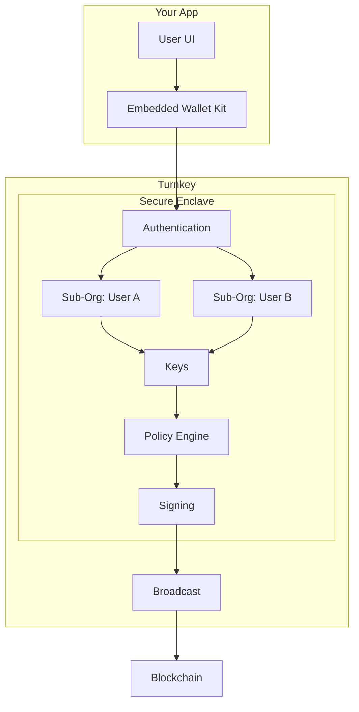

## Why Turnkey for Consumer Embedded Wallets?

Turnkey provides a secure, flexible solution for embedding end-user wallets directly into your application. Our approach combines hardware-backed key storage with sub-organizations and programmable policies so you can:

* Offer non-custodial or app-controlled wallets
* Sponsor gas for users
* Delegate transaction signing to backend services
* Integrate embedded wallets for your users without building or operating your own signing infrastructure

Private keys remain protected within [Turnkey's verifiable security architecture](https://whitepaper.turnkey.com/architecture). You integrate using:

* [Embedded Wallet Kit (EWK)](/reference/embedded-wallet-kit)
* [Turnkey SDKs](/sdks/introduction)
* [Turnkey API](/api-reference/overview) for low-level control

## Core product principles

Turnkey's solution is engineered for consumer wallet use cases:

* **Secure key management:** Keys live in Trusted Execution Environments (TEEs). Private keys never leave the enclave. See [Turnkey's Security Architecture](https://whitepaper.turnkey.com/architecture) for remote attestation, QuorumOS, and verifiable infrastructure.
* **Composable wallet control:** Non-custodial, hybrid, or app-controlled. Configure via [policies](/concepts/policies/quickstart) and sub-organization settings.
* **Flexible authentication:** Email, passkeys, social login. Wire it to your onboarding. See [Authentication Overview](/authentication/overview) for all methods.
* **Pre-built UI and SDKs:** [Embedded Wallet Kit (EWK)](/reference/embedded-wallet-kit) and [React SDK](/sdks/react/landing) for quick integration. For all client, server, and Web3 SDKs, see the [SDK introduction](/sdks/introduction).
* **Transaction flows:** Sign and broadcast through Turnkey. No custom backend for signing.

## Trusted by leading consumer apps

Turnkey's embedded wallet infrastructure powers products across the crypto ecosystem. See full customer stories on the [Turnkey Customers page](https://www.turnkey.com/customers). Featured examples include [Moonshot](https://www.turnkey.com/customers/how-moonshot-powers-millions-of-self-custodial-wallets-using-turnkey), [Infinex](https://www.turnkey.com/customers/making-onchain-ux-seamless-with-infinex-and-turnkey), and [Axiom](https://www.turnkey.com/customers/axiom-global-defi-trading-platform).

## Typical use cases

**Typical needs for consumer embedded wallets:**

| Need | Solution |
| :---- | :---- |
| Seamless onboarding | Flexible auth and automated wallet provisioning via EWK and SDKs |
| User custody without key exposure | Keys remain in secure enclaves; only signatures are provided |
| Gasless UX | Gas sponsorship and broadcast through Turnkey |
| Email auth and recovery flows | User recovery without your org holding keys; see [Sub-organization auth](/embedded-wallets/sub-organization-auth) and [Sub-organization recovery](/embedded-wallets/sub-organization-recovery) |
| Send crypto, no account required | [Claim links](/wallets/claim-links#claim-links): send crypto via URL; recipient claims with email, no wallet or account needed |
| Delegated backend automation | Policies enforce scoped signing for sponsored flows and scheduled ops |
| Multichain support | Sign and broadcast transactions across supported chains |
| Fast integration | Pre-built [React Embedded Wallet Kit](/reference/embedded-wallet-kit) and [SDKs](/sdks/introduction) |

## How Turnkey structures embedded wallets

Each user gets a **sub-organization**: an isolated container for their keys, authenticators, and policies, under your parent organization. That keeps user wallets and access partitioned and manageable at scale. See [Sub-organizations as wallets](/embedded-wallets/sub-organizations-as-wallets) for how they work.

**Wallet control models:**

* **Non-custodial** — Users sign via their own authenticators (passkey, email, etc.). Your app never holds signing authority.
* **Hybrid / delegated access** — The backend can sign for specific flows (e.g. sponsored gas) when policies allow it. Good for gasless UX while keeping user custody.
* **App-controlled** — Policies give your app authority over wallet actions. Use when the product is custodial or needs to act on the user's behalf.

## User onboarding

Decide how users join and get a wallet. Turnkey supports multiple paths:

* **Authentication:** Users sign in with email, passkeys, or social login. Auth must complete before wallet actions. Use the [Embedded Wallets Quickstart](/getting-started/embedded-wallet-quickstart) for setup and [Authentication Overview](/authentication/overview) for all methods.
* **Wallet creation:** Create a wallet in the user's sub-org via the SDK. The React Embedded Wallet Kit handles creation and lifecycle. See the [Code Examples Hub](/category/code-examples) for wallet creation, multi-chain derivation, and import/export, and [Wallets Concept](/concepts/wallets) for HD wallet structure and account derivation.
* **Bring your own wallet:** Let users authenticate or sign with an external wallet (e.g. MetaMask, WalletConnect). See [Using external wallets](/sdks/react/using-external-wallets/overview) for EWK support and provider setup.
* **Other onboarding choices:** Import/export flows, key backup, and custody model (non-custodial vs app-controlled) are configured via policies and sub-org design. The [Embedded Wallets Production Checklist](/production-checklist/embedded-wallet) and [Code Examples Hub](/category/code-examples) cover these decisions.

## Transaction experience

Shape how users send transactions and how seamless they feel:

* **How users send transactions:** Build transactions in your app and submit to Turnkey for signing and broadcast. [Transaction Management](/concepts/transaction-management) covers nonce handling, transaction construction, signing, and broadcast.
* **Gas sponsorship:** Optionally sponsor gas so users don't pay. Turnkey supports paymaster-style flows and relay integration. See [Transaction Management](/concepts/transaction-management) and the [Code Examples Hub](/category/code-examples) for sponsored transaction examples.
* **Seamless decisions:** Consider relay providers, gas policies, and error handling so signing and broadcast feel smooth. The [Embedded Wallets Production Checklist](/production-checklist/embedded-wallet) and code examples for [sending sponsored transactions](/embedded-wallets/code-examples/sending-sponsored-transactions) help align UX with your stack.

## Engagement and retention experiences

Keep users active and secure as they grow:

* **Delegated access:** Grant your backend limited signing for sponsored flows, scheduled ops, or background actions. Policies enforce scoped access. See [Delegated Access (Frontend)](/concepts/policies/delegated-access-frontend) and [Delegated Access (Backend)](/concepts/policies/delegated-access-backend) for design and the [Production Checklist](/production-checklist/embedded-wallet) for implementation.
* **Multichain as they expand:** Add chains and derive accounts as users need them. Turnkey supports [multiple networks](/networks/overview); use the SDK and [Wallets Concept](/concepts/wallets) for multi-chain derivation and switching.
* **Recovery flows:** Let users recover access (e.g. after losing a passkey) without your organization holding keys. Recovery credentials can be encrypted to keys you don't have access to. See [Sub-organization recovery](/embedded-wallets/sub-organization-recovery) and [Sub-organization auth](/embedded-wallets/sub-organization-auth) for email-based recovery and auth flows.

## Architecture at a glance

## The result: Wallets as a feature

Turnkey transforms embedded wallets from a custom build into a secure, policy-driven feature. You control auth and flows. Keys stay in enclaves and access is strictly controlled by code. Scale consumer wallet experiences without operating signing infrastructure.

> Get started with the [Embedded Wallets Quickstart](/getting-started/embedded-wallet-quickstart) or explore the [Embedded Wallet Kit reference](/reference/embedded-wallet-kit).
