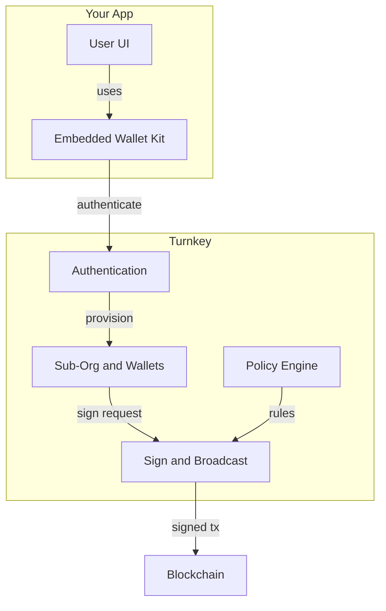

## Why Turnkey for Embedded Consumer Wallets?

Turnkey provides a secure, flexible solution for embedding end-user wallets in your application. Our approach combines hardware-backed key storage with sub-organizations and policies so you can offer non-custodial or app-controlled wallets, sponsor gas, and delegate signing—without building or operating signing infrastructure. Private keys remain in [Turnkey's verifiable security architecture](https://whitepaper.turnkey.com/architecture); you integrate via the [Embedded Wallet Kit (EWK)](/reference/embedded-wallet-kit) and [SDKs](/sdks/introduction), with the option to use [Turnkey's API](/api-reference/overview) for low-level control.

## Core product principles

Turnkey's solution is engineered for consumer wallet use cases:

* **Secure key management:** Keys live in Trusted Execution Environments (TEEs). Private keys never leave the enclave. See [Turnkey's Security Architecture](https://whitepaper.turnkey.com/architecture) for remote attestation, QuorumOS, and verifiable infrastructure.
* **Composable wallet control:** Non-custodial, hybrid, or app-controlled. Configure via [policies](/concepts/policies/quickstart) and sub-organization settings.
* **Flexible authentication:** Email, passkeys, social login. Wire it to your onboarding. See [Authentication Overview](/authentication/overview) for all methods.
* **Pre-built UI and SDKs:** [Embedded Wallet Kit (EWK)](/reference/embedded-wallet-kit) and [React SDK](/sdks/react/landing) for quick integration. For all client, server, and Web3 SDKs, see the [SDK introduction](/sdks/introduction).
* **Transaction flows:** Sign and broadcast through Turnkey. No custom backend for signing.

## Trusted by leading consumer apps

Turnkey's embedded wallet infrastructure powers products across the crypto ecosystem. See full customer stories on the [Turnkey Customers page](https://www.turnkey.com/customers). Featured examples include [Moonshot](https://www.turnkey.com/customers/how-moonshot-powers-millions-of-self-custodial-wallets-using-turnkey), [Infinex](https://www.turnkey.com/customers/making-onchain-ux-seamless-with-infinex-and-turnkey), and [Axiom](https://www.turnkey.com/customers/axiom-global-defi-trading-platform).

## Typical use cases

**Typical needs for embedded consumer wallets:**

| Need | Solution |
| :---- | :---- |
| Seamless onboarding | Flexible auth and automated wallet provisioning via EWK and SDKs |
| User custody without key exposure | Keys remain in secure enclaves; only signatures are provided |
| Gasless UX | Gas sponsorship and broadcast through Turnkey |
| Delegated backend automation | Policies enforce scoped signing for sponsored flows and scheduled ops |
| Multichain support | Sign and broadcast transactions across supported chains |
| Fast integration | Pre-built [React Embedded Wallet Kit](/reference/embedded-wallet-kit) and [SDKs](/sdks/introduction) |

## How Turnkey structures embedded wallets

Wallets run on sub-organizations: one sub-org per user, each with access controls, authenticators, and policies. Control models include **non-custodial** (users sign via authenticators), **hybrid / delegated access** (backend gets limited signing via policies for sponsored flows), and **app-controlled** (policies grant app-level authority for specific workflows).

## How Turnkey secures the embedded wallet lifecycle

Turnkey provides secure, granular control across the wallet lifecycle:

<Steps>
<Step title="User authentication">

Users sign in with email, passkeys, or social login. Auth must complete before wallet actions. Use the [Embedded Wallets Quickstart](/getting-started/embedded-wallet-quickstart) for setup and [Authentication Overview](/authentication/overview) for all auth methods.
</Step>

<Step title="User wallet creation">

Create a wallet in the user's sub-org via the SDK. The React Embedded Wallet Kit handles creation and lifecycle. See the [Code Examples Hub](/category/code-examples) for wallet creation, multi-chain derivation, and import/export, and [Wallets Concept](/concepts/wallets) for HD wallet structure and account derivation.
</Step>

<Step title="Transaction sponsorship and broadcast">

Build transactions in your app, optionally sponsor gas, and submit to Turnkey for signing and broadcast. [Transaction Management](/concepts/transaction-management) covers gas sponsorship, nonce management, and signing; the [Code Examples Hub](/category/code-examples) includes sponsored transaction examples.
</Step>

<Step title="Delegated access policies">

Backend automation (sponsored flows, scheduled ops) is governed by policy rules that grant limited signing to backend services. See the [Embedded Wallets Production Checklist](/production-checklist/embedded-wallet) and [Delegated Access (Frontend)](/concepts/policies/delegated-access-frontend) and [Delegated Access (Backend)](/concepts/policies/delegated-access-backend) for multi-user control and policy design.
</Step>
</Steps>

## Architecture at a glance

## The result: Wallets as a feature

Turnkey transforms embedded wallets from a custom build into a secure, policy-driven feature. You control auth and flows; keys stay in enclaves and access is defined by code. Scale consumer wallet experiences without operating signing infrastructure.

> Get started with the [Embedded Wallets Quickstart](/getting-started/embedded-wallet-quickstart) or explore the [Embedded Wallet Kit reference](/reference/embedded-wallet-kit).
