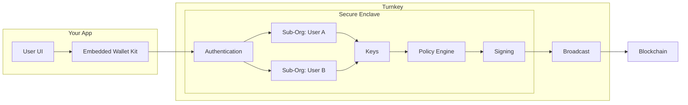

## Why Turnkey for Consumer Embedded Wallets?

Turnkey provides a secure, flexible solution for embedding end-user wallets directly into your application. Where other solutions focus on onboarding but lack flexible tools for engagement and retention, Turnkey lets you compose your app's core experiences (onboarding, wallet flows, and transactions) with full control, without outsourcing critical product decisions to opinionated, pre-built flows. You get hardware-backed key storage, sub-organizations, and programmable policies so you can offer non-custodial or app-controlled wallets, sponsor gas, delegate transaction signing to your backend, and ship in weeks instead of the 3+ months it typically takes to build from scratch.

You can customize the full user journey and recompose low-level primitives (auth, policies, sessions, multichain) to evolve without limits. Sub-100ms signing keeps in-app crypto interactions feeling instantaneous, and private keys stay protected within [Turnkey's verifiable security architecture](https://whitepaper.turnkey.com/architecture): dedicated TEEs, not shared MPC-style infrastructure, with remote attestation so security is verifiable. Integrate using the [Embedded Wallet Kit (EWK)](/reference/embedded-wallet-kit), [Turnkey SDKs](/sdks/introduction), or [Turnkey API](/api-reference/overview) for low-level control.

## Core security principles

Turnkey's solution is engineered for consumer wallet use cases:

* **Secure key management:** Keys live in Trusted Execution Environments (TEEs). Private keys never leave the enclave; raw private keys are never exposed to your developers or to Turnkey itself. See [Turnkey's Security Architecture](https://whitepaper.turnkey.com/architecture) for remote attestation, QuorumOS, and verifiable infrastructure.
* **Composable wallet control:** Non-custodial, hybrid, or app-controlled. Configure via [policies](/concepts/policies/quickstart) and sub-organization settings.
* **Flexible authentication:** Email, passkeys, social login. Wire it to your onboarding. See [Authentication Overview](/authentication/overview) for all methods.
* **Pre-built UI and SDKs:** [Embedded Wallet Kit (EWK)](/reference/embedded-wallet-kit) and [React SDK](/sdks/react/landing) for quick integration. Integrate EWK in under 7 minutes; front-end only, no proxy or backend required. Custom integrations can ship in as little as 1–2 weeks. For all client, server, and Web3 SDKs, see the [SDK introduction](/sdks/introduction).
* **Speed and scale:** Sub-100ms transaction signing latency. Turnkey's infrastructure powers 50+ million embedded wallets.
* **Transaction flows:** Sign and broadcast through Turnkey. No custom backend for signing.

Leading apps like [Moonshot](https://www.turnkey.com/customers/how-moonshot-powers-millions-of-self-custodial-wallets-using-turnkey), [Infinex](https://www.turnkey.com/customers/making-onchain-ux-seamless-with-infinex-and-turnkey), and [Axiom](https://www.turnkey.com/customers/axiom-global-defi-trading-platform) use Turnkey to power consumer embedded wallets at scale. See more on the [Turnkey Customers page](https://www.turnkey.com/customers).

## Example

Consumer embedded wallets power in-app custody and seamless UX for end users.

**Typical needs for consumer embedded wallets:**

| Need | Solution |
| :---- | :---- |
| Seamless onboarding | Flexible auth and automated wallet provisioning via [Embedded Wallets Quickstart](/getting-started/embedded-wallet-quickstart), [EWK](/reference/embedded-wallet-kit), and [SDKs](/sdks/introduction) |
| User custody without key exposure | Keys remain in [secure enclaves](/security/secure-enclaves); only signatures are provided |
| Gasless UX | [Gas sponsorship](/concepts/transaction-management) and broadcast through Turnkey; see [sending sponsored transactions](/embedded-wallets/code-examples/sending-sponsored-transactions) |
| Email auth and recovery flows | User recovery without your org holding keys; see [Sub-organization auth](/embedded-wallets/sub-organization-auth) and [Sub-organization recovery](/embedded-wallets/sub-organization-recovery) |
| Send crypto, no account required | [Claim links](/wallets/claim-links#claim-links): send crypto via URL; recipient claims with email, no wallet or account needed |
| Delegated backend automation | [Policies](/concepts/policies/quickstart) enforce scoped signing; see [Delegated Access (Frontend)](/concepts/policies/delegated-access-frontend) and [Backend](/concepts/policies/delegated-access-backend) |
| Multichain support | Sign and broadcast across [supported networks](/networks/overview); see [Wallets Concept](/concepts/wallets) for derivation |
| Fast integration | Pre-built [React Embedded Wallet Kit](/reference/embedded-wallet-kit) and [SDKs](/sdks/introduction) |

## How Turnkey structures embedded wallets

Each user gets a **sub-organization**: an isolated container for their keys, authenticators, and policies, under your parent organization. That keeps user wallets and access partitioned and manageable at scale. See [Sub-organizations as wallets](/embedded-wallets/sub-organizations-as-wallets) for how they work.

**Wallet control models:**

* **Non-custodial:** Users sign via their own authenticators (passkey, email, etc.). Your app never holds signing authority.
* **Hybrid / delegated access:** The backend can sign for specific flows (e.g. sponsored gas) when policies allow it. Good for gasless UX while keeping user custody.
* **App-controlled:** Policies give your app authority over wallet actions. Use when the product is custodial or needs to act on the user's behalf.

## How Turnkey supports the embedded wallet lifecycle

Turnkey can help at every step from onboarding to transactions to long-term engagement:

<Steps>
<Step title="User authentication">

Users sign in with **email**, **passkeys**, or **social login**. Authentication must be completed before any wallet actions.

* **Get started:** [Embedded Wallets Quickstart](/getting-started/embedded-wallet-quickstart)
* **All methods:** [Authentication Overview](/authentication/overview)
</Step>

<Step title="Wallet creation">

Create a wallet in the user's sub-org via the SDK. The React Embedded Wallet Kit handles creation and lifecycle.

* [Code Examples Hub](/category/code-examples): wallet creation, multi-chain derivation, import/export
* [Wallets Concept](/concepts/wallets): HD wallet structure and account derivation
* [Using external wallets](/sdks/react/using-external-wallets/overview): let users link or sign with MetaMask, WalletConnect, etc.

Import/export, key backup, and custody model (non-custodial vs app-controlled) are configured via policies and sub-org design. See the [Embedded Wallets Production Checklist](/production-checklist/embedded-wallet) and [Code Examples Hub](/category/code-examples).
</Step>

<Step title="Transaction experience">

Build transactions in your app and submit to Turnkey for signing and broadcast. Optionally sponsor gas so users don't pay; Turnkey supports paymaster-style flows and relay integration.

* [Transaction Management](/concepts/transaction-management): nonce handling, transaction construction, signing, broadcast
* [Code Examples Hub](/category/code-examples): sponsored transaction examples
* [Sending sponsored transactions](/embedded-wallets/code-examples/sending-sponsored-transactions): relay providers, gas policies, error handling

The [Embedded Wallets Production Checklist](/production-checklist/embedded-wallet) helps align UX with your stack.
</Step>

<Step title="Engagement and retention">

Grant your backend limited signing for sponsored flows, scheduled ops, or background actions via policies. Add chains and derive accounts as users grow; support recovery so users can regain access without your org holding keys.

* [Delegated Access (Frontend)](/concepts/policies/delegated-access-frontend) and [Delegated Access (Backend)](/concepts/policies/delegated-access-backend)
* [Production Checklist](/production-checklist/embedded-wallet)
* [Networks](/networks/overview) and [Wallets Concept](/concepts/wallets): multichain derivation
* [Sub-organization recovery](/embedded-wallets/sub-organization-recovery) and [Sub-organization auth](/embedded-wallets/sub-organization-auth): email-based recovery
</Step>
</Steps>

## Architecture at a glance

## The result: Wallets as a feature

Turnkey transforms embedded wallets from a custom build into a secure, policy-driven feature. You control auth and flows. Keys stay in enclaves and access is strictly controlled by code. Scale consumer wallet experiences without operating signing infrastructure.
