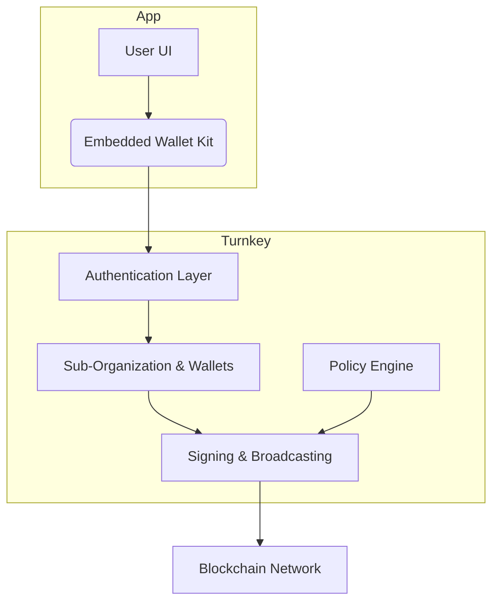

## Documentation Index
Fetch the complete documentation index at: https://docs.turnkey.com/llms.txt  
Use this file to discover all available pages before exploring further.

# Embedded Consumer Wallets

> Add wallets inside your app. Users get secure, non-custodial wallets. You control auth, transaction flows, and access policies. See [Embedded Wallets Overview](https://docs.turnkey.com/embedded-wallets/overview) for details.

## Why Turnkey for Embedded Consumer Wallets?

**Consumer wallets** are end-user-facing wallets embedded directly in your application—designed for retail users, not internal treasury or automation workflows. Think onboarding flows, in-app transactions, and seamless UX where users control their assets without managing seed phrases.

Turnkey runs wallet infrastructure for consumer apps. Generate wallets for users. Set auth and transaction rules. Sponsor gas. Create delegated access policies. Private keys stay in hardware-backed enclaves—secured through Turnkey's [verifiable security architecture](https://whitepaper.turnkey.com/architecture). You do not build signing systems.

Use pre-built UI and SDKs. The React Embedded Wallet Kit (EWK) ships ready to integrate.

### Fast integration, long-term flexibility

**Get started in under 7 minutes** with pre-built SDKs, or build custom workflows with low-level primitives and API access.

**Client-side SDKs:**
* **[React](https://docs.turnkey.com/sdks/react/landing)** — @turnkey/react-wallet-kit for React apps
* **[TypeScript/JavaScript](https://docs.turnkey.com/sdks/typescript-frontend/landing)** — @turnkey/core for frontend frameworks (Angular, Vue, Svelte)
* **[React Native](https://docs.turnkey.com/sdks/react-native)** — Native mobile development with TypeScript
* **[Flutter](https://docs.turnkey.com/sdks/flutter/landing)** — Cross-platform mobile with turnkey_sdk_flutter
* **[Kotlin](https://docs.turnkey.com/sdks/kotlin/landing)** — Native Android development
* **[Swift](https://docs.turnkey.com/sdks/swift/landing)** — Native iOS development

**Server-side SDKs:**
* **[TypeScript](https://docs.turnkey.com/sdks/javascript-server)** — @turnkey/sdk-server for Node.js backends
* **Go, Ruby, Rust, Python** — [Server SDK reference](https://docs.turnkey.com/sdks/introduction)

**Web3 integration libraries:**
* **[@turnkey/ethers](https://docs.turnkey.com/sdks/web3/ethers)** — Ethers.js signers
* **[@turnkey/viem](https://docs.turnkey.com/sdks/web3/viem)** — Viem integration
* **[@turnkey/solana](https://docs.turnkey.com/sdks/web3/solana)** — Solana blockchain
* **[@turnkey/cosmjs](https://docs.turnkey.com/sdks/web3/cosmjs)** — Cosmos ecosystem

**Low-level access:**
For advanced use cases, drop down to [Turnkey's API](https://docs.turnkey.com/api-reference/overview) for full control over authentication, signing, policy management, and wallet operations.

---

## Trusted by leading consumer apps

Turnkey's embedded wallet infrastructure powers products across the crypto ecosystem. See full customer stories on the [Turnkey Customers page](https://www.turnkey.com/customers).

Featured examples include:

* **[Moonshot](https://www.turnkey.com/customers/how-moonshot-powers-millions-of-self-custodial-wallets-using-turnkey)** — Millions of self-custodial wallets with branded onboarding.
* **[Infinex](https://www.turnkey.com/customers/making-onchain-ux-seamless-with-infinex-and-turnkey)** — Secure wallet creation and transaction flow for user-friendly crypto experiences.
* **[Axiom](https://www.turnkey.com/customers/axiom-global-defi-trading-platform)** — Scalable embedded wallets supporting global trading platforms.

---

## Core product principles

* **Secure key management:** Keys live in Trusted Execution Environments (TEEs). Private keys never leave the enclave. See [Turnkey's Security Architecture](https://whitepaper.turnkey.com/architecture) for details on remote attestation, QuorumOS, and verifiable infrastructure.
* **Composable wallet control:** Non-custodial, hybrid, or app-controlled. Configure via policies and sub-organization settings.
* **Flexible authentication:** Email, passkeys, social login. Wire it to your onboarding.
* **Pre-built UI and SDKs:** [Embedded Wallet Kit (EWK)](https://docs.turnkey.com/reference/embedded-wallet-kit) includes UI components, hooks, and helpers. See [React SDK Documentation](https://docs.turnkey.com/sdks/react/landing) for @turnkey/react-wallet-kit details.
* **Transaction flows:** Sign and broadcast through Turnkey. No custom backend for signing.

---

## Typical use cases

| Need | Turnkey solution |
|------|------------------|
| Seamless onboarding | Flexible auth and automated wallet provisioning |
| User custody without key exposure | Secure enclave key management |
| Gasless UX | Gas sponsorship and broadcasting |
| Delegated backend automation | Policy-driven scoped signing |
| Multichain support | Sign transactions across supported chains |
| Fast integration | React Embedded Wallet Kit UI and SDKs |

---

## How Turnkey structures embedded wallets

Wallets run on sub-organizations. One sub-org per user. Each sub-org has access controls, authenticators, and policies.

**Wallet control models:**

* **Non-custodial:** Users sign via authenticators.
* **Hybrid / delegated access:** Backend gets limited signing via policies. Use for sponsored flows.
* **App-controlled:** Policies grant app-level authority for specific workflows.

---

## Implementation workflow

<AccordionGroup>
<Accordion title="1. Authenticate users">
Users sign in (email, passkeys, social login). Auth must complete before wallet actions.

Setup and auth: [Embedded Wallets Quickstart](https://docs.turnkey.com/getting-started/embedded-wallet-quickstart). See [Authentication Overview](https://docs.turnkey.com/authentication/overview) for all auth methods (passkeys, email/SMS OTP, social logins, API keys, wallet auth).
</Accordion>

<Accordion title="2. Create user wallets">
Create a wallet in the user's sub-org via the SDK. React Embedded Wallet Kit handles creation and lifecycle.

Code examples: [Code Examples Hub](https://docs.turnkey.com/category/code-examples.md) for wallet creation, multi-chain derivation, import/export. See [Wallets Concept](https://docs.turnkey.com/concepts/wallets.md) for HD wallet structure and account derivation.
</Accordion>

<Accordion title="3. Sponsor & broadcast transactions">
Build transactions in your app. Optionally sponsor gas. Submit to Turnkey for signing and broadcast.

[Transaction Management](https://docs.turnkey.com/concepts/transaction-management.md) covers gas sponsorship, nonce management, transaction construction, signing, and broadcast. See [Code Examples Hub](https://docs.turnkey.com/category/code-examples.md) for sponsored transaction examples.
</Accordion>

<Accordion title="4. Apply delegated access policies">
Backend automation (sponsored flows, scheduled ops) needs policy rules. Grant limited signing to backend services.

[Embedded Wallets Production Checklist](https://docs.turnkey.com/production-checklist/embedded-wallet.md) for implementation guidance. See [Delegated Access (Frontend)](https://docs.turnkey.com/concepts/policies/delegated-access-frontend.md) and [Delegated Access (Backend)](https://docs.turnkey.com/concepts/policies/delegated-access-backend.md) for multi-user wallet control and policy design.
</Accordion>
</AccordionGroup>

---

## Architecture at a glance

