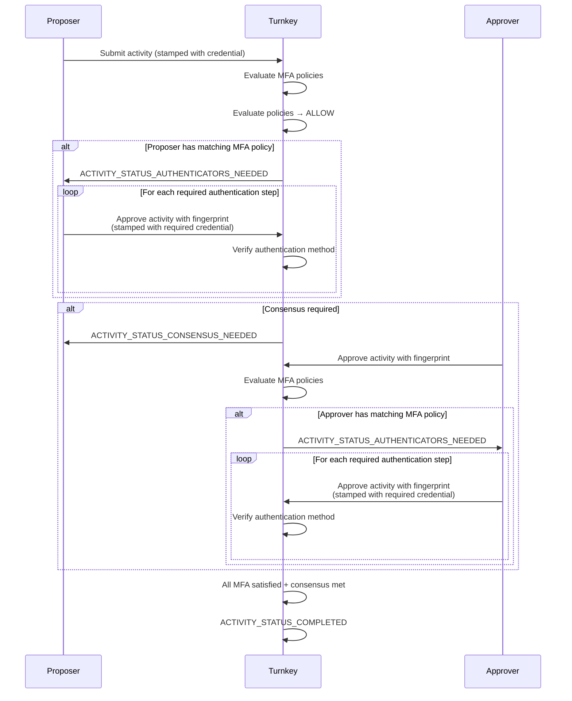

When a user submits an activity and an MFA policy evaluates to `true`, the activity enters `ACTIVITY_STATUS_AUTHENTICATORS_NEEDED` status. The activity will not execute until the user satisfies the authentication challenges.

The user must call the `APPROVE_ACTIVITY` activity, passing in the `fingerprint` of the original activity:

```ts
// This endpoint can be found in any of Turnkey's SDKs, within a client access point or provider.
approveActivity({
  fingerprint: "<fingerprint-of-original-activity>",
});
```

The credential used to stamp this approval request determines which authentication method is being proven.

You can learn more about stamps [here](/api-reference/overview/stamps).

## API key

To prove API key authentication, the user stamps the `APPROVE_ACTIVITY` request with an API key.

If the MFA policy specifies an `id`, the user must stamp with that specific API key.

## Passkey

To prove passkey authentication, the user stamps the `APPROVE_ACTIVITY` request with a WebAuthn authenticator.

If the MFA policy specifies an `id`, the user must stamp with that specific authenticator.

## Session

To prove session authentication, the user stamps the `APPROVE_ACTIVITY` request with a session credential. A session credential is an API key that was classified as a session after a login activity (e.g., `STAMP_LOGIN`, `OTP_LOGIN`).

If the MFA policy specifies an `id` for a session authentication method, the `id` refers to a [session profile](../sessions/session-profiles) ID. The user must stamp with a session credential that was issued with that specific session profile.

Note that sessions are **not transitive**. For example, if a passkey was used to create a session, and an MFA policy requires `AUTHENTICATION_TYPE_PASSKEY`, the session **will not** satisfy that requirement. The user must stamp directly with the passkey.

The same applies to logins that used an OTP or OAuth. A session obtained by signing in with Google presents as `AUTHENTICATION_TYPE_SESSION`, never `AUTHENTICATION_TYPE_OAUTH`, so a policy requiring OAuth sends the user back through the provider for a fresh OIDC token. Only an attested stamp presents `AUTHENTICATION_TYPE_OAUTH`, `AUTHENTICATION_TYPE_EMAIL_OTP` or `AUTHENTICATION_TYPE_SMS_OTP`.

## Email OTP, SMS OTP, and OAuth

Unlike API keys and passkeys, OTP and OAuth authenticators cannot directly sign requests. Instead, they use [attested stamps](/api-reference/overview/stamps#attested), where a client-side key signs the request and a token (verification token or OIDC token) attests that the key belongs to the identity.

To prove Email OTP, SMS OTP, or OAuth authentication, the user stamps the `APPROVE_ACTIVITY` request with an attested stamp.

Only OAuth authenticators support the `id` field in MFA policies. If specified, the user must prove ownership of that specific OAuth provider identity. Email and SMS OTP authenticators do not have IDs.

### Obtaining the attested stamp

Both token types come from a flow the user completes in the browser, and both are bound to a key the client generates.

Email or SMS OTP:

```ts
// verifyOtp points the attested stamper at the verification token
await verifyOtp({ otpId, otpCode, otpEncryptionTargetBundle });
await httpClient.approveActivity({ fingerprint, organizationId }, StamperType.Attested);
```

OAuth, where `onOauthSuccess` hands back the token instead of logging the user in:

```ts
await handleGoogleOauth({
  onOauthSuccess: async ({ oidcToken, publicKey }) => {
    await overrideAttestedStamper({ oidcToken, publicKey });
    await httpClient.approveActivity({ fingerprint, organizationId }, StamperType.Attested);
  },
});
```

### How the stamp is attributed

An attested stamp carries no user id: Turnkey resolves the user from the token, inside the organization the activity targets. Verification tokens match on **contact**, so the email or phone must be the one on the user. OIDC tokens match on `(sub, aud, iss)`, so a token from a different OAuth client will not match the same person.

Attested stamps only work against sub-organizations. The same mechanism decides who a **login** belongs to: stamped in the browser it is the end user, so their MFA policies apply; stamped by your backend or the Auth Proxy with a parent-organization API key it is that parent user, and they do not.

## MFA and consensus

MFA works alongside Turnkey's [consensus](/features/users/root-quorum) system for activities that require approval from multiple users.

When an activity requires both MFA and consensus:

1. **The activity initiator must satisfy their own MFA requirements first.** If the proposer has an MFA policy whose condition evaluates to `true`, the activity is returned with `ACTIVITY_STATUS_AUTHENTICATORS_NEEDED`. The proposer must satisfy their MFA requirements before the activity can proceed to consensus and other users can vote on it.
2. **Subsequent approvers vote on the activity as normal.** Once the proposer's MFA is satisfied, other users in the quorum can approve or reject the activity.
3. **Approving users must also satisfy their own MFA requirements.** If an approver has an MFA policy whose condition evaluates to `true`, their vote will return `ACTIVITY_STATUS_AUTHENTICATORS_NEEDED`. The approver must satisfy their MFA requirements before their vote is counted.
4. **The activity executes once consensus is met.** A user's vote only counts toward consensus after their MFA requirements are satisfied.

This ensures that every user involved in an activity is individually held to their own MFA requirements, regardless of whether they are the proposer or an approver.


