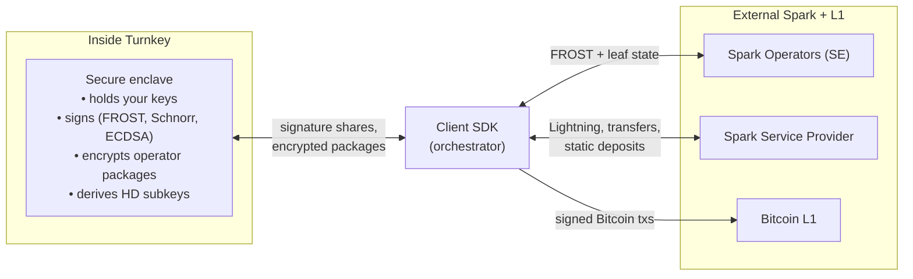

[Spark](https://www.spark.money/) is a Bitcoin Layer 2 that uses FROST threshold signing across a collective of operators to enable fast, low-fee transfers and Lightning payments without giving up self-custody of the underlying BTC. Turnkey provides enclave-based key management for Spark: your identity key, leaf keys, deposit keys, and Lightning preimages are generated and used inside the Turnkey enclave, and never leave it.

If you don't know the protocol, read [Spark core concepts](https://docs.spark.money/learn/core-concepts) and [Sovereignty](https://docs.spark.money/learn/sovereignty) first. This page covers what Turnkey adds to a Spark integration.

## How Spark works (and where Turnkey fits)

A Spark _leaf_ is an individual unit of BTC held inside the protocol. Leaves are jointly controlled by your identity key and the Spark Operators using FROST threshold signing: no single party can move a leaf, and every leaf operation requires a quorum of operators to co-sign with you. The trust model is **1-of-n**: as long as at least one operator is honest, your funds cannot be stolen. If every operator is unavailable you cannot transact, but you can still exit to Bitcoin L1 using transactions pre-signed at deposit time (see [Security model](#security-model)).

Three external roles to know:

- **Spark Operator (SO).** A node in the operator collective that holds a threshold key share for every leaf. The current operators are Lightspark and Flashnet.
- **Spark Entity (SE).** The SOs acting together. A quorum of the SE is required to authorize any leaf operation.
- **Spark Service Provider (SSP).** An application-layer service (a wallet backend, an exchange, etc.) that coordinates flows on your behalf: routing Lightning payments, processing static deposits, submitting transfers. The SSP has no key-share authority over leaves; it relies on the SOs for that.

Turnkey is none of these. It runs the secure enclave that holds your identity key and derives leaf keys, deposit keys, and Lightning preimages. When a flow needs your signature, the client calls a Turnkey activity ([`SPARK_SIGN_FROST`](/api-reference/activities/sign-frost-spark), [`SPARK_PREPARE_TRANSFER`](/api-reference/activities/prepare-spark-transfer), [`SPARK_CLAIM_TRANSFER`](/api-reference/activities/claim-spark-transfer), or [`SPARK_PREPARE_LIGHTNING_RECEIVE`](/api-reference/activities/spark-prepare-lightning-receive)) and the enclave does the cryptographic work without returning key material. All communication with SOs and the SSP happens directly from the client; Turnkey is not on those paths.

Turnkey only connects to the client. SO, SSP, and L1 communication happens directly from the client; Turnkey is not on those paths.

## Address derivation and key types

Spark uses a unique BIP-32 purpose number (`8797555`) rather than the standard BIP-44 coin type system. Every Spark key is a hardened child of `m/8797555'/{account}'`, with the next path segment selecting the key type:

| Type                | Path segment | Per-item derivation                                                   | Purpose                                                                      |
| ------------------- | ------------ | --------------------------------------------------------------------- | ---------------------------------------------------------------------------- |
| `IDENTITY`          | `/0'`        | flat (used as is)                                                     | Primary wallet identifier; the key behind `ADDRESS_FORMAT_SPARK_*` addresses |
| `SIGNING_HD`        | `/1'`        | hardened child at `u32_be(sha256(leaf_id)[0..4]) % 2^31`              | Base key for per-leaf signing keys                                           |
| `DEPOSIT`           | `/2'`        | flat (used as is)                                                     | Single-use L1 deposit address                                                |
| `STATIC_DEPOSIT_HD` | `/3'`        | hardened child at `index`                                             | Reusable deposit addresses (SSP integration)                                 |
| `HTLC_PREIMAGE_HD`  | `/4'`        | not exposed for signing; used only for HMAC-SHA256 inside the enclave | Lightning HTLC preimage generation                                           |

The supported `IDENTITY` address formats are:

| Network | Address format                 | HRP       |
| ------- | ------------------------------ | --------- |
| Mainnet | `ADDRESS_FORMAT_SPARK_MAINNET` | `spark`   |
| Regtest | `ADDRESS_FORMAT_SPARK_REGTEST` | `sparkrt` |

When creating a wallet account via the Turnkey dashboard or API, select `ADDRESS_FORMAT_SPARK_MAINNET` or `ADDRESS_FORMAT_SPARK_REGTEST` and the identity path will be set automatically. Only `secp256k1` keys are supported; `ed25519` keys will be rejected.

### Schnorr signing on the identity key

Spark payloads signed with the identity key use **plain BIP-340 Schnorr**, without the Taproot key tweak that Bitcoin P2TR addresses require (see [Bitcoin Schnorr signatures and tweaks](/features/networks/bitcoin#schnorr-signatures-and-tweaks) for the contrast). Turnkey picks the right signing scheme from the address format on your key:

| Address type          | Signing scheme            |
| --------------------- | ------------------------- |
| Bitcoin P2TR          | Tweaked Schnorr (BIP-341) |
| Spark Mainnet/Regtest | Plain Schnorr (BIP-340)   |
| All others            | ECDSA                     |

Use [`SIGN_RAW_PAYLOAD`](/api-reference/activities/sign-raw-payload) with the Spark address as `signWith` to produce a plain-Schnorr signature. The `hashFunction` field should match how the payload was prepared (e.g. `HASH_FUNCTION_NO_OP` for a pre-hashed payload). The returned signature always has `V = "00"` since Schnorr signatures do not carry a recovery ID.

This identity-key signing path is sufficient on its own for token operations via the Spark SDK (`@buildonspark/spark-sdk`, `@buildonspark/issuer-sdk`). The FROST-based flows below require the additional Spark-specific activities.

For more information on Spark keys and address derivation, see documentation [here](https://docs.spark.money/wallets/identity-key-derivation).

## Turnkey activities for Spark

Four activities cover the Spark-specific cryptographic operations. All of them run inside the enclave; none return key material to the client.

| Activity                                                                                       | What it does                                                                                                                                                                                                                                                                     |
| ---------------------------------------------------------------------------------------------- | -------------------------------------------------------------------------------------------------------------------------------------------------------------------------------------------------------------------------------------------------------------------------------- |
| [`SPARK_SIGN_FROST`](/api-reference/activities/sign-frost-spark)                               | Returns the enclave's FROST signature share for a sighash, or for a batch of them in one call. Used by deposits, withdrawals, transfers, and static deposit claims.                                                                                                              |
| [`SPARK_PREPARE_TRANSFER`](/api-reference/activities/prepare-spark-transfer)                   | Sender side of a transfer. Produces an encrypted transfer package: per-leaf key tweaks Feldman-VSS-split for the SOs, the recipient's new leaf key ECIES-encrypted to their identity public key, and your identity-key ECDSA signature over the whole thing.                     |
| [`SPARK_CLAIM_TRANSFER`](/api-reference/activities/claim-spark-transfer)                       | Receiver side of a transfer. Decrypts the inbound leaf-key ciphertext with your identity key, derives the new leaf key, and packages the claim tweak shares for the SOs.                                                                                                         |
| [`SPARK_PREPARE_LIGHTNING_RECEIVE`](/api-reference/activities/spark-prepare-lightning-receive) | Returns only the `paymentHash` for a freshly generated Lightning preimage. The preimage itself is created inside the enclave, Feldman-split across the SOs (each share ECIES-encrypted to its operator), and never leaves whole. The hash is what you put in the BOLT11 invoice. |

These don't replace Turnkey's existing primitives. Spark flows also use [`CREATE_WALLET_ACCOUNTS`](/api-reference/activities/create-wallet-accounts) to derive new deposit and signing keys, [`SIGN_RAW_PAYLOAD`](/api-reference/activities/sign-raw-payload) for identity-key Schnorr signatures, [`SIGN_TRANSACTION`](/api-reference/activities/sign-transaction) for the Bitcoin L1 transactions that fund deposits or receive cooperative withdrawals, and [`EXPORT_WALLET_ACCOUNT`](/api-reference/activities/export-wallet-account) in exactly one flow — see [Static deposits export a key from the enclave](#static-deposits-export-a-key-from-the-enclave).

## Supported operations

Turnkey supports every Spark wallet operation. For a runnable walkthrough of each flow, including the exact sequence of Turnkey, SO, and SSP calls, see the [SDK example](#sdk-example).

| Operation              | Direction                                                                                                                                           | Turnkey activities used                                                                                                                      |
| ---------------------- | --------------------------------------------------------------------------------------------------------------------------------------------------- | -------------------------------------------------------------------------------------------------------------------------------------------- |
| Deposit                | Bitcoin L1 → Spark (single-use address; also produces the [pre-signed exit transactions](#pre-signed-exit-transactions-are-seed-phrase-equivalent)) | `SIGN_TRANSACTION`, `SPARK_SIGN_FROST`                                                                                                       |
| Cooperative withdrawal | Spark → Bitcoin L1 (fast path; requires SO co-signing; falls back to unilateral exit below if SOs are unavailable)                                  | `SPARK_SIGN_FROST`, `SPARK_PREPARE_TRANSFER`                                                                                                 |
| Unilateral exit        | Spark → Bitcoin L1 (emergency path; no SO cooperation needed)                                                                                       | none at exit time; broadcasts the [pre-signed transactions](#pre-signed-exit-transactions-are-seed-phrase-equivalent) created during deposit |
| Transfer               | Spark → Spark                                                                                                                                       | `SPARK_SIGN_FROST`, `SPARK_PREPARE_TRANSFER` (sender); `SPARK_SIGN_FROST`, `SPARK_CLAIM_TRANSFER` (receiver)                                 |
| Lightning receive      | Lightning → Spark                                                                                                                                   | `SPARK_PREPARE_LIGHTNING_RECEIVE`                                                                                                            |
| Lightning send         | Spark → Lightning                                                                                                                                   | `SPARK_SIGN_FROST`, `SPARK_PREPARE_TRANSFER`                                                                                                 |
| Static deposit         | Bitcoin L1 → Spark (reusable address)                                                                                                               | `CREATE_WALLET_ACCOUNTS`, `EXPORT_WALLET_ACCOUNT`, `SIGN_TRANSACTION`                                                                        |
| Token transfer         | Spark token operations (mint, transfer)                                                                                                             | `SIGN_RAW_PAYLOAD`                                                                                                                           |

## Security model

### Pre-signed exit transactions are seed-phrase-equivalent

When you deposit BTC into Spark, the deposit flow pre-signs two Bitcoin L1 transactions inside the Turnkey enclave: a branch transaction and a timelocked exit transaction. These are your unilateral exit path. If every Spark Operator goes offline or acts maliciously, you can broadcast them directly to Bitcoin L1 and recover your BTC without operator cooperation. Per the [Spark sovereignty docs](https://docs.spark.money/learn/sovereignty), exiting can take "as little as 100 blocks" (~16 hours) — the actual wait depends on leaf depth and how recently the leaf was transferred, since timelocks decrement at each transfer.

The corollary: **these transactions must be stored durably.** If they are lost and the SOs are unavailable, your recovery path is gone. Treat them with the same care as a seed phrase — durable, encrypted, off-device storage, with backups. The Turnkey enclave does not retain them; it signs them once at deposit time and returns them to the client.

This is the property that makes Spark Operator unavailability a _liveness_ concern rather than a _safety_ concern: you may not be able to transact, but you can always exit.

### Static deposits export a key from the enclave

Static deposit addresses are reusable: one address can receive many deposits, each creating a separate Spark leaf. To make that work, the SSP needs to process deposits while your wallet is offline, which means it needs co-signing capability on the static deposit key. This is the **only** Spark flow that uses [`EXPORT_WALLET_ACCOUNT`](/api-reference/activities/export-wallet-account) to take a raw private key out of the Turnkey enclave.

From the moment the static deposit key is shared with the SSP until you claim any deposits made to that address, the SSP holds co-signing capability. This is the intentional custodial tradeoff of static deposits. To minimize exposure:

- Use a fresh ephemeral P-256 keypair for each export and zero it immediately after decrypting.
- Transmit the key to the SSP only over an encrypted channel.
- Zero the key in your local memory immediately after transmission.
- Only use SSPs you trust: a compromised SSP holding this key can co-sign spends from the static deposit address.

If you don't need a reusable receiving address, prefer single-use deposits. They keep key material inside the enclave throughout.

### Communication with SOs and the SSP is outside Turnkey

Every Spark flow involves direct calls from the client to the Spark Operators (for nonce commitments, partial signatures, leaf state queries, and claim submissions) and, for some flows, to the SSP. Turnkey is not on these network paths and does not see this traffic. The client SDK is responsible for SO and SSP communication; the Turnkey enclave is responsible for the cryptographic operations on key material. The SDK example shows where each of these responsibilities sits.

## SDK example

The canonical reference for integrating Turnkey with Spark is [`examples/with-spark`](https://github.com/tkhq/sdk/tree/main/examples/with-spark) in the Turnkey SDK monorepo. It contains:

- A Turnkey-backed Spark signer (`TurnkeySparkSigner`) that plugs into the Spark SDK.
- End-to-end runnable flows for deposit, transfer (send + claim), withdrawal, Lightning receive and send, and static deposit.
- Token-operation scripts (create, mint, transfer) using the issuer SDK.
- Comments mapping each step to the actor model above.

If you're integrating Spark, start with the SDK example and refer back to this page for the conceptual model and the security notes.

## Additional resources

- [Spark addressing specification](https://docs.spark.money/wallets/addressing)
- [Spark identity-key derivation](https://docs.spark.money/wallets/identity-key-derivation)
- [BIP-340: Schnorr Signatures for secp256k1](https://github.com/bitcoin/bips/blob/master/bip-0340.mediawiki)

If you're building on Spark and have questions about integrating with Turnkey, contact us at [hello@turnkey.com](mailto:hello@turnkey.com), on [X](https://x.com/turnkeyhq/), or [on Slack](https://join.slack.com/t/clubturnkey/shared_invite/zt-3aemp2g38-zIh4V~3vNpbX5PsSmkKxcQ).
