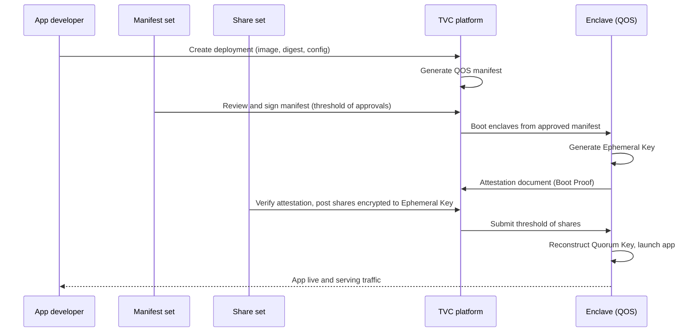

import { TvcBetaCallout } from "/snippets/tvc-beta-callout.mdx";

<TvcBetaCallout />

Every TVC app is controlled by two groups of [operators](/features/verifiable-cloud/overview#operators). They have the same shape in the API, and their members can even overlap, but they answer two different questions:

- The **manifest set** is the set of operators authorized to approve [QOS manifests](/features/verifiable-cloud/overview#manifests). It answers: *what code and configuration is allowed to run?*
- The **share set** is the set of operators authorized to provision [Quorum Key](/features/verifiable-cloud/overview#keys-signatures-and-verification) shares to an enclave during boot. It answers: *which enclaves are allowed to receive the Quorum Key?*

## Operator sets

Both sets are instances of the same building block, an **operator set**:

- A **name**, so you can identify the set on the dashboard.
- A list of **operators**, up to 50 per set. Each operator is an alias plus a P-256 public key. `tvc login` generates a local operator key for you; `tvc operator create` creates a Turnkey-hosted operator instead.
- A **threshold**: the number of operators whose signatures are required before the set's authority takes effect. The threshold can't exceed the number of members.

You define both sets when creating an app, via `manifestSetParams` and `shareSetParams` on the [`create_tvc_app`](/api-reference/activities/create-a-tvc-app) activity. If you already have an operator set from a previous app, reuse it by passing its ID (`manifestSetId` or `shareSetId`) instead. TVC also deduplicates automatically: defining a set with the exact same name, threshold, and members as an existing one reuses the existing set.

The manifest set ID and its operator IDs are printed when you create an app:

```
App created successfully!

App ID: <APP_UUID>
Name: <APP_NAME>
Manifest Set ID: <MANIFEST_SET_UUID>
Manifest Set Operator IDs: <OPERATOR_UUID>, <OPERATOR_UUID>
Config: app.json

Use one of the Manifest Set Operator IDs above with `tvc deploy approve --operator-id`
```

The share set ID is not part of this output. To find both the manifest set and the share set, along with their IDs and each operator's ID, open the app's page in the dashboard.

The same person can be an operator in both sets. Whether they *should* be depends on your security model; see [Choosing your sets](#choosing-your-sets) below.

## The manifest set: who approves what runs

Every TVC deployment is specified by a [QOS manifest](https://github.com/tkhq/qos#manifest): the container image, expected binary digest, executable arguments, ports, the operator sets themselves, and everything else QOS uses to boot your application. Nothing is deployed onto TVC infrastructure until the manifest is cryptographically approved by a threshold of manifest set members.

When you create a deployment, TVC generates the manifest and the deployment shows as `Approval Required` on the dashboard. Each manifest set member reviews and signs the manifest with their operator key via the TVC CLI:

```bash
tvc deploy approve \
  --deploy-id <DEPLOYMENT_UUID> \
  --operator-id <OPERATOR_UUID>
```

The CLI walks the operator through the manifest section by section: the namespace and Quorum Key, the enclave PCR measurements, the pivot binary digest and arguments, and the membership and thresholds of both operator sets. The signature is posted via the [`create_tvc_manifest_approvals`](/api-reference/activities/create-tvc-manifest-approvals) activity.

Once approvals from distinct operators reach the manifest set's threshold, TVC infrastructure proceeds with the deployment (and, if the app has no live deployment yet, promotes it to live). Below the threshold, nothing runs: a single compromised or careless operator cannot ship code on their own if your threshold is at least 2.

This threshold is enforced by [QuorumOS](https://github.com/tkhq/qos#manifest-set), the software the enclave itself runs, not by TVC infrastructure. An enclave refuses to boot a manifest unless it carries a threshold of valid manifest set signatures, so the guarantee holds even if the surrounding infrastructure is compromised.

Approvals are recorded in the manifest envelope, so they travel with the deployment as an audit trail. Anyone verifying your app can see exactly which operators approved the manifest as part of its [Boot Proof](/features/verifiable-cloud/proofs-and-verification#boot-proof).

The manifest set acts on **every new deployment**. Upgrading your app to a new image, changing its arguments, or modifying its configuration all produce a new manifest that must be approved again.

## The share set: who guards the Quorum Key

Your app's Quorum Key is its long-lived identity: it is the same across all enclaves and across deployments, and it can encrypt or sign state that must survive application upgrades. That durability is exactly why it needs stronger custody than any single machine or person can provide.

The Quorum Key is never stored whole. It is split into shares using Shamir's Secret Sharing, each share is encrypted to one share set member's key, and reassembly requires the share set's threshold to be met. By design this only ever happens inside an enclave. Share set thresholds must be at least 2.

<Note>
Looking to use a custom Quorum Key for your app? Reach out to us via your dedicated Slack channel and we'll get your organization set up.
</Note>

## Side by side

|                                | Manifest set                                        | Share set                                                                 |
| :----------------------------- | :--------------------------------------------------- | :------------------------------------------------------------------------ |
| Authorizes                     | Which code and configuration may run                 | Which verified enclaves receive the Quorum Key                            |
| Members hold                   | An operator signing key                              | An operator signing key plus an encrypted share of the Quorum Key         |
| Acts when                      | Every new deployment, before enclaves boot           | Every new deployment, after enclaves boot and attest                      |
| Threshold protects against     | A minority of operators shipping unauthorized code   | A minority of share holders reconstructing or leaking the Quorum Key      |
| If the threshold isn't met     | The deployment never leaves `Approval Required`      | The Quorum Key cannot be reconstructed; the app cannot unlock its secrets |
| Defined in `create_tvc_app` as | `manifestSetId` / `manifestSetParams`                | `shareSetId` / `shareSetParams`                                           |

## How they fit together

The two sets act at different points in a deployment's life. The manifest set gates the boot; the share set gates the key injection that follows it.



Note the chain of trust between the two sets: share set members only release their shares to an enclave whose attestation proves it booted from a manifest the manifest set approved. The manifest set's review is what makes the share set's verification meaningful.

## Worked example

Acme runs a price oracle on TVC. The oracle derives its signing identity from the app's Quorum Key, so key custody matters. Acme sets up:

- **Manifest set** `"Acme Deploy Reviewers"`: three platform engineers (Alice, Bob, Carol), threshold **2**. Any production deployment needs two engineers to independently review the manifest.
- **Share set** `"Acme Key Custodians"`: three members of the security team (Dana, Erin, Frank), threshold **2**. No single custodian can reconstruct the oracle's signing key.

Acme first generates a custom Quorum Key split across the custodians, producing one share encrypted to each custodian's operator key and a `quorumPublicKey` to declare at app creation. No custodian ever holds the whole key.

The app configuration passed to [`create_tvc_app`](/api-reference/activities/create-a-tvc-app) then looks like this:

```json
{
  "name": "Acme Price Oracle",
  "quorumPublicKey": "<ACME_QUORUM_PUBLIC_KEY>",
  "manifestSetId": null,
  "manifestSetParams": {
    "name": "Acme Deploy Reviewers",
    "threshold": 2,
    "newOperators": [
      { "name": "alice", "publicKey": "<ALICE_PUBLIC_KEY>" },
      { "name": "bob", "publicKey": "<BOB_PUBLIC_KEY>" },
      { "name": "carol", "publicKey": "<CAROL_PUBLIC_KEY>" }
    ],
    "existingOperatorIds": []
  },
  "shareSetId": null,
  "shareSetParams": {
    "name": "Acme Key Custodians",
    "threshold": 2,
    "newOperators": [
      { "name": "dana", "publicKey": "<DANA_PUBLIC_KEY>" },
      { "name": "erin", "publicKey": "<ERIN_PUBLIC_KEY>" },
      { "name": "frank", "publicKey": "<FRANK_PUBLIC_KEY>" }
    ],
    "existingOperatorIds": []
  }
}
```

### Shipping the first deployment

1. An Acme engineer creates a deployment: the oracle's container image, expected binary digest, ports, and arguments. TVC generates the QOS manifest and the deployment sits at `Approval Required`.
2. Alice and Bob each run `tvc deploy approve`, review the manifest section by section, and sign it. Carol is on vacation; with a 2-of-3 threshold, that's fine. The threshold is met and TVC boots the enclaves.
3. Each enclave generates its Ephemeral Key and produces an attestation document.
4. Dana and Erin each verify an enclave's attestation, re-encrypt their share to its Ephemeral Key, and submit it. At 2 shares, the enclave reconstructs the Quorum Key and launches the oracle.
5. The oracle is live at `https://app-<APP_UUID>.turnkey.cloud`, signing responses with keys derived from the Quorum Key.

### Shipping an upgrade

Acme releases `v2` of the oracle. The new image produces a new manifest, so both sets act again: two of Alice, Bob, and Carol review and approve the new manifest, then two of Dana, Erin, and Frank verify the new enclaves' attestations and post their shares. Key forwarding does not cross deployment boundaries, so a fresh deployment always requires fresh share postings.

The Quorum Key itself stays the same across deployments, which is the point: state encrypted by `v1` remains readable by `v2`, and consumers see a continuous signing identity.

### What the thresholds bought Acme

- Alice's laptop is compromised. The attacker can sign manifests as Alice, but cannot reach the 2-approval threshold alone: no unauthorized code ships.
- Frank's Quorum Key share leaks. One share reveals nothing about the key, and an attacker cannot get a second share released to anything but a verified enclave running manifest-set-approved code.

## Choosing your sets

- **Manifest set membership** should mirror who reviews production changes today. Treat a manifest approval like a code review with teeth: members are expected to actually inspect the image digest, arguments, and configuration they sign.
- **Share set membership** is key custody. Prefer people (or systems) with strong operational security. The role is distinct from the manifest set: approving a manifest authorizes what code runs, while holding a share governs whether the Quorum Key can be reconstructed for a verified enclave.
- **Thresholds**: share set thresholds must be at least 2, and for production a threshold of at least 2 on the manifest set too means no single actor can ship code or expose the key. Keep thresholds comfortably below the member count so vacations and lost keys don't halt deployments.
- **Reuse**: operator sets can be shared across apps by passing `manifestSetId` / `shareSetId` at app creation, so a platform team can maintain one reviewed set of operators for many apps.
- **Demos and prototypes**: the [quickstart](/features/verifiable-cloud/quickstart) flow, with a 1-of-1 manifest set (just your login key) and the well-known development quorum key, is the fastest way to a running app. Graduate to real sets before handling anything sensitive.

## See also

- [Overview: Manifests](/features/verifiable-cloud/overview#manifests) and [Operators](/features/verifiable-cloud/overview#operators)
- [Quickstart](/features/verifiable-cloud/quickstart) for the end-to-end deployment and approval flow
- [Proofs and Verification](/features/verifiable-cloud/proofs-and-verification) for how manifests and attestations surface in Boot Proofs
- [`create_tvc_app`](/api-reference/activities/create-a-tvc-app) and [`create_tvc_manifest_approvals`](/api-reference/activities/create-tvc-manifest-approvals) API references
- [QOS boot standard](https://github.com/tkhq/qos/blob/main/docs/boot_standard.md) for the underlying provisioning protocol
