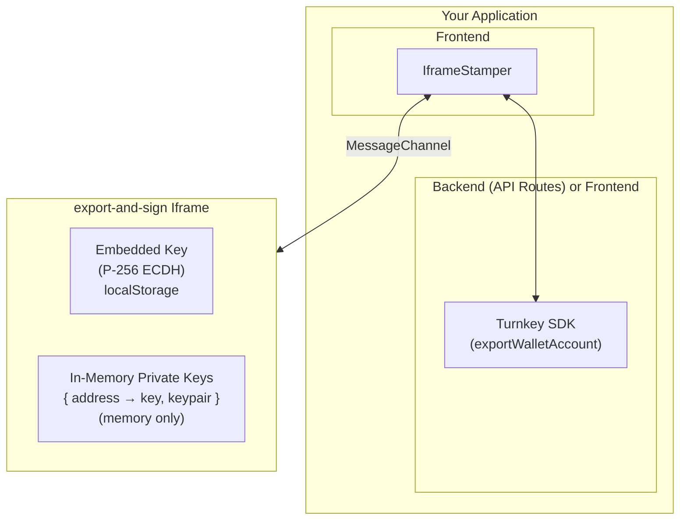

This guide covers how to set up client-side signing using Turnkey's `@turnkey/iframe-stamper` package and the `export-and-sign` iframe. This architecture enables secure transaction and message signing directly in the browser without exposing private keys to your application code. Note that mishandling of exported private keys introduces inherent risks; please proceed with caution.

<Note>
  Versions of `@turnkey/iframe-stamper` below 2.0.0 are vulnerable to cross-origin attacks. If you are using an older version, upgrade to 2.0.0 or later.

  Higher-level SDKs depend on `@turnkey/iframe-stamper` transitively — including `@turnkey/sdk-browser`, which uses a frame for session key storage. The minimum version of each that ships a patched `@turnkey/iframe-stamper`:

  - `@turnkey/sdk-browser` 0.2.1
  - `@turnkey/sdk-react` 0.2.1
  - `@turnkey/react-wallet-kit` — all versions

  Only the three `@turnkey/sdk-browser` and `@turnkey/sdk-react` releases published before 0.2.1 (May 8, 2024) depend on a vulnerable `@turnkey/iframe-stamper`.
</Note>

## Overview

Client-side signing allows you to:

- Export private keys from Turnkey to a secure iframe
- Sign transactions and messages directly in the browser via iframe
- Maintain multiple keys simultaneously for signing operations
- Keep private keys isolated from your application's JavaScript context

### Chains and formats

| Chain          | Address format            | Key format for injection            | Message signing            | Transaction signing                                                |
| -------------- | ------------------------- | ----------------------------------- | -------------------------- | ------------------------------------------------------------------ |
| Solana         | `ADDRESS_FORMAT_SOLANA`   | `Hexadecimal` or `Solana`           | Yes → bare hex signature   | Hex-encoded serialized `VersionedTransaction` in, hex signed tx out |
| Ethereum / EVM | `ADDRESS_FORMAT_ETHEREUM` | `Hexadecimal` **only**              | Yes (EIP-191) → `0x` sig   | `0x` serialized unsigned tx in, `0x` broadcast-ready signed tx out  |

Transaction signing works the same way on both chains: serialized **unsigned** transaction in, serialized **signed** transaction out, ready to broadcast.

<Note>
  Turnkey reuses `ADDRESS_FORMAT_ETHEREUM` (secp256k1) for all EVM chains, so one exported key can sign for any EVM network — the chain is determined by the `chainId` in the transaction you serialize, not by the key.
</Note>

<Warning>
  EVM signing requires keys injected as `KeyFormat.Hexadecimal`. If you inject a key as `KeyFormat.Solana` and then request an Ethereum signing operation, the iframe rejects it with `cannot sign Ethereum payload with key format "SOLANA"; expected "HEXADECIMAL"`. Since Solana signing works with either format, `KeyFormat.Hexadecimal` is the safe default for both chains — use `KeyFormat.Solana` only when you need the base58 representation.
</Warning>

### Architecture



### Security model

1. **Iframe Isolation**: Private keys never touch your application's JavaScript context
2. **HPKE Encryption**: Export bundles are encrypted end-to-end using RFC 9180
3. **Enclave Verification**: All bundles are signed by Turnkey's secure enclave
4. **Sandboxed Iframe**: The iframe runs with `allow-scripts allow-same-origin` sandbox restrictions
5. **Organization Validation**: Bundles are validated against your organization ID

## Prerequisites

- Node.js v20+
- A Turnkey organization with API credentials
- Wallet accounts to export — see [Chains and formats](#chains-and-formats) for supported address formats
- `@turnkey/iframe-stamper >= 2.8.0`

## Installation

```bash
npm install @turnkey/iframe-stamper @turnkey/sdk-server
```

## Environment variables

```bash
# .env.local
NEXT_PUBLIC_ORGANIZATION_ID=<your-organization-id>
NEXT_PUBLIC_BASE_URL=https://api.turnkey.com
NEXT_PUBLIC_EXPORT_SIGN_IFRAME_URL=https://export-and-sign.turnkey.com

# Server-side only (never expose to client)
# Not necessary if user performs export using a session directly via frontend
API_PUBLIC_KEY=<your-api-public-key>
API_PRIVATE_KEY=<your-api-private-key>
```

## Sample implementation

Note: the following is for a NextJS application with a separate frontend and backend. The foundations should be applicable for other configurations.

The snippets below work for both Solana and EVM accounts. Derive the payload types once from the account's address format, and reuse them everywhere you sign:

```typescript
import { MessageType, TransactionType } from "@turnkey/iframe-stamper";
import type { TurnkeyApiTypes } from "@turnkey/sdk-server";

// `addressFormat` comes from the wallet account you're signing with,
// e.g. via getWalletAccounts()
function signingTypesFor(addressFormat: TurnkeyApiTypes["v1AddressFormat"]) {
  const isEthereum = addressFormat === "ADDRESS_FORMAT_ETHEREUM";

  return {
    messageType: isEthereum ? MessageType.Ethereum : MessageType.Solana,
    transactionType: isEthereum
      ? TransactionType.Ethereum
      : TransactionType.Solana,
  };
}
```

### Step 1: initialize the IframeStamper

Create a component that initializes the iframe and manages its lifecycle.

```typescript
import { IframeStamper } from "@turnkey/iframe-stamper";
import { useEffect, useState } from "react";

const IFRAME_CONTAINER_ID = "turnkey-iframe-container";
const IFRAME_ELEMENT_ID = "turnkey-iframe";

function SigningComponent() {
  const [iframeStamper, setIframeStamper] = useState<IframeStamper | null>(
    null
  );

  useEffect(() => {
    const stamper = new IframeStamper({
      iframeUrl: process.env.NEXT_PUBLIC_EXPORT_SIGN_IFRAME_URL!,
      iframeContainer: document.getElementById(IFRAME_CONTAINER_ID),
      iframeElementId: IFRAME_ELEMENT_ID,
    });

    return () => {
      stamper.clear();
    };
  }, []);

  return (
    <div
      id={IFRAME_CONTAINER_ID}
      style={{ display: "block" }}
    >
      {/* Iframe will be inserted here */}
    </div>
  );
}
```

For an example in context, we highly recommend taking a look at the [wallet-export-sign example app](https://github.com/tkhq/sdk/tree/main/examples/key-management/wallet-export-sign), which covers both Solana and EVM signing.

### Step 2: create the export caller (backend or client-side)

The export call can be made from a backend API route or a trusted client-side environment. The example below shows a server-side API route; if you call from the client, avoid exposing key material.

```typescript
// pages/api/exportWalletAccount.ts
import type { NextApiRequest, NextApiResponse } from "next";
import { Turnkey } from "@turnkey/sdk-server";

export default async function handler(
  req: NextApiRequest,
  res: NextApiResponse
) {
  const { walletAccountAddress, targetPublicKey } = req.body;

  const turnkeyClient = new Turnkey({
    apiBaseUrl: process.env.NEXT_PUBLIC_BASE_URL!,
    apiPublicKey: process.env.API_PUBLIC_KEY!,
    apiPrivateKey: process.env.API_PRIVATE_KEY!,
    defaultOrganizationId: process.env.NEXT_PUBLIC_ORGANIZATION_ID!,
  });

  const { address, exportBundle } = await turnkeyClient
    .apiClient()
    .exportWalletAccount({
      organizationId: process.env.NEXT_PUBLIC_ORGANIZATION_ID!,
      address: walletAccountAddress,
      targetPublicKey: targetPublicKey,
    });

  res.status(200).json({ address, exportBundle });
}
```

### Step 3: export a private key to the iframe

```typescript
import { KeyFormat } from "@turnkey/iframe-stamper";
import axios from "axios";

async function exportKeyToIframe(
  iframeStamper: IframeStamper,
  walletAccountAddress: string,
  organizationId: string
) {
  // Step 3a: Get or initialize the embedded key
  let embeddedKey = await iframeStamper.getEmbeddedPublicKey();

  if (!embeddedKey) {
    embeddedKey = await iframeStamper.initEmbeddedKey();
  }

  // Step 3b: Request export bundle from your export caller
  const response = await axios.post("/api/exportWalletAccount", {
    walletAccountAddress,
    targetPublicKey: embeddedKey,
  });

  // Step 3c: Inject the bundle into the iframe
  const injected = await iframeStamper.injectKeyExportBundle(
    response.data.exportBundle,
    organizationId,
    KeyFormat.Hexadecimal, // required for EVM signing; also works for Solana
    walletAccountAddress // Required for multi-key support
  );

  if (!injected) {
    throw new Error("Failed to inject export bundle");
  }

  // The key is now stored in-memory within the iframe
  // The embedded key remains available for additional exports
}
```

### Step 4: sign messages

```typescript
async function signMessage(
  iframeStamper: IframeStamper,
  message: string,
  walletAccountAddress: string,
  addressFormat: TurnkeyApiTypes["v1AddressFormat"]
): Promise<string> {
  const { messageType } = signingTypesFor(addressFormat);

  return await iframeStamper.signMessage(
    {
      message,
      type: messageType,
    },
    walletAccountAddress // Required when multiple keys are loaded
  );
}
```

Signature return formats differ by chain: Solana returns a **bare hex** 64-byte ed25519 signature, while Ethereum returns a **`0x`-prefixed** 65-byte secp256k1 signature produced with the EIP-191 `personal_sign` prefix (so it verifies with standard tooling such as viem's `verifyMessage`). Normalize in your application if you handle both.

### Step 5: sign transactions

Pass the serialized **unsigned** transaction and you get back the serialized **signed** transaction, ready to broadcast.

```typescript
async function signTransaction(
  iframeStamper: IframeStamper,
  serializedUnsignedTransaction: string,
  walletAccountAddress: string,
  addressFormat: TurnkeyApiTypes["v1AddressFormat"]
): Promise<string> {
  const { transactionType } = signingTypesFor(addressFormat);

  return await iframeStamper.signTransaction(
    {
      transaction: serializedUnsignedTransaction,
      type: transactionType,
    },
    walletAccountAddress
  );
}
```

How you build the input differs by chain:

- **Solana**: hex-encoded serialized `VersionedTransaction`. The fee payer must be the injected account, since the iframe only holds that account's key.
- **Ethereum/EVM**: `0x`-prefixed serialized unsigned transaction — build it with any library, e.g. viem's `serializeTransaction`. The result is broadcast-ready; pass it straight to `sendRawTransaction`.

<Warning>
  For **legacy** (non-typed) EVM transactions, the serialized unsigned transaction must include the `chainId` so the resulting signature carries EIP-155 replay protection. Typed transactions (EIP-1559 and EIP-2930) always encode the `chainId`, so prefer `type: "eip1559"` unless you have a specific reason not to.
</Warning>

## Multi-key support

One of the key capabilities of client-side signing is the ability to load and manage multiple private keys simultaneously within the iframe.

### Loading multiple keys

Since the embedded key persists across bundle injections, you can export multiple keys using the same embedded key (as long as it hasn't expired):

```typescript
async function loadMultipleKeys(
  iframeStamper: IframeStamper,
  addresses: string[],
  organizationId: string
) {
  // Get or initialize the embedded key once
  let embeddedKey = await iframeStamper.getEmbeddedPublicKey();
  if (!embeddedKey) {
    embeddedKey = await iframeStamper.initEmbeddedKey();
  }

  for (const address of addresses) {
    const response = await axios.post("/api/exportWalletAccount", {
      walletAccountAddress: address,
      targetPublicKey: embeddedKey, // Same embedded key for all exports
    });

    await iframeStamper.injectKeyExportBundle(
      response.data.exportBundle,
      organizationId,
      KeyFormat.Hexadecimal,
      address // Each key is stored by its address
    );
  }
}
```

### Signing with different keys

Keys for different chains can be loaded side by side. The `type` you pass must match the chain of the address you sign with:

```typescript
// Sign with a Solana address
const solanaSig = await iframeStamper.signMessage(
  { message: "Hello", type: MessageType.Solana },
  "5x...solanaAddress"
);

// Sign with an EVM address
const evmSig = await iframeStamper.signMessage(
  { message: "World", type: MessageType.Ethereum },
  "0x...evmAddress"
);
```

### Clearing keys

```typescript
// Clear a specific key
await iframeStamper.clearEmbeddedPrivateKey("address1...");

// Clear all keys (no address parameter)
await iframeStamper.clearEmbeddedPrivateKey();
```

## Key lifecycle and expiration

Understanding the key lifecycle is important for building reliable applications.

### Embedded key (P-256 ECDH)

- **Storage**: localStorage within the iframe
- **TTL**: 48 hours (default)
- **Purpose**: Decrypt incoming export bundles via HPKE
- **Behavior**: Persists across bundle injections - the same embedded key can decrypt multiple export bundles until it expires or is explicitly cleared

### In-memory private keys

- **Storage**: JavaScript memory only (never persisted)
- **TTL**: 24 hours
- **Purpose**: Sign messages and transactions
- **Behavior**: Lost on page reload, cleared on expiration

### Handling expiration

```typescript
// Re-export flow when keys expire or page reloads
async function ensureKeyLoaded(
  iframeStamper: IframeStamper,
  address: string,
  organizationId: string,
  addressFormat: TurnkeyApiTypes["v1AddressFormat"]
) {
  const { messageType } = signingTypesFor(addressFormat);

  try {
    // Attempt to sign a test message
    await iframeStamper.signMessage({ message: "test", type: messageType }, address);
  } catch (error) {
    // Key not found or expired - re-export
    await exportKeyToIframe(iframeStamper, address, organizationId);
  }
}
```

## Key formats

| Format                  | Description                                      | Use Case                                                     |
| ----------------------- | ------------------------------------------------ | ------------------------------------------------------------ |
| `KeyFormat.Hexadecimal` | 64 hexadecimal digits (32 bytes), `0x`-prefixed  | **Required for EVM signing**; also works for Solana signing  |
| `KeyFormat.Solana`      | Base58-encoded 64-byte format (private + public) | Solana signing, and base58 wallet imports (Phantom, Solflare) |

Unless you specifically need the base58 representation, use `KeyFormat.Hexadecimal` for every account you intend to sign with — see [Chains and formats](#chains-and-formats).

## Complete example

Here's a complete React component demonstrating the full flow, for both Solana and EVM accounts:

```typescript
import {
  IframeStamper,
  KeyFormat,
  MessageType,
  TransactionType,
} from "@turnkey/iframe-stamper";
import type { TurnkeyApiTypes } from "@turnkey/sdk-server";
import { useEffect, useState } from "react";
import axios from "axios";

const IFRAME_CONTAINER_ID = "turnkey-iframe-container";
const IFRAME_ELEMENT_ID = "turnkey-iframe";

// Turnkey reuses ADDRESS_FORMAT_ETHEREUM (secp256k1) for all EVM chains
function signingTypesFor(addressFormat: TurnkeyApiTypes["v1AddressFormat"]) {
  const isEthereum = addressFormat === "ADDRESS_FORMAT_ETHEREUM";

  return {
    messageType: isEthereum ? MessageType.Ethereum : MessageType.Solana,
    transactionType: isEthereum
      ? TransactionType.Ethereum
      : TransactionType.Solana,
  };
}

interface Props {
  organizationId: string;
  walletAccountAddress: string;
  addressFormat: TurnkeyApiTypes["v1AddressFormat"];
}

export function ClientSideSigner({
  organizationId,
  walletAccountAddress,
  addressFormat,
}: Props) {
  const { messageType, transactionType } = signingTypesFor(addressFormat);

  const [iframeStamper, setIframeStamper] = useState<IframeStamper | null>(
    null
  );
  const [isKeyLoaded, setIsKeyLoaded] = useState(false);
  const [message, setMessage] = useState("Hello, Turnkey!");
  const [signature, setSignature] = useState("");

  // Initialize iframe
  useEffect(() => {
    const stamper = new IframeStamper({
      iframeUrl: process.env.NEXT_PUBLIC_EXPORT_SIGN_IFRAME_URL!,
      iframeContainer: document.getElementById(IFRAME_CONTAINER_ID),
      iframeElementId: IFRAME_ELEMENT_ID,
    });

    stamper
      .init()
      .then(() => setIframeStamper(stamper))
      .catch(console.error);

    return () => stamper.clear();
  }, []);

  // Export key to iframe
  const exportKey = async () => {
    if (!iframeStamper) return;

    let embeddedKey = await iframeStamper.getEmbeddedPublicKey();
    if (!embeddedKey) {
      embeddedKey = await iframeStamper.initEmbeddedKey();
    }

    const response = await axios.post("/api/exportWalletAccount", {
      walletAccountAddress,
      targetPublicKey: embeddedKey,
    });

    // Hexadecimal is required for EVM and works for Solana too
    await iframeStamper.injectKeyExportBundle(
      response.data.exportBundle,
      organizationId,
      KeyFormat.Hexadecimal,
      walletAccountAddress
    );

    setIsKeyLoaded(true);
  };

  // Sign message
  const handleSignMessage = async () => {
    if (!iframeStamper || !isKeyLoaded) return;

    const sig = await iframeStamper.signMessage(
      { message, type: messageType },
      walletAccountAddress
    );

    setSignature(sig);
  };

  // Sign a serialized unsigned transaction
  const handleSignTransaction = async (serializedUnsignedTx: string) => {
    if (!iframeStamper || !isKeyLoaded) return;

    return await iframeStamper.signTransaction(
      { transaction: serializedUnsignedTx, type: transactionType },
      walletAccountAddress
    );
  };

  return (
    <div>
      <div id={IFRAME_CONTAINER_ID} />

      {!isKeyLoaded ? (
        <button
          onClick={exportKey}
          disabled={!iframeStamper}
        >
          Export Key
        </button>
      ) : (
        <div>
          <textarea
            value={message}
            onChange={(e) => setMessage(e.target.value)}
          />
          <button onClick={handleSignMessage}>Sign Message</button>
          {signature && <pre>Signature: {signature}</pre>}
        </div>
      )}
    </div>
  );
}
```

## Troubleshooting

### "Iframe not ready"

Ensure `init()` has completed before calling other methods. The iframe needs to load and establish the MessageChannel connection.

### "Key not found for address"

- Verify the address is exactly as provided during `injectKeyExportBundle` (case-sensitive)
- Check if the key has expired (24-hour TTL)
- Ensure the page hasn't been reloaded (keys are in-memory only)

### "Embedded key not found"

The embedded key may have expired (48-hour TTL) or been explicitly cleared. Call `initEmbeddedKey()` to create a new one.

### "Organization ID does not match"

The bundle was created for a different organization. Ensure your backend uses the same organization ID as passed to `injectKeyExportBundle`.

## Best practices

1. **Always pass the address parameter**: When using multi-key support, always specify which address to sign with
2. **Reuse the embedded key**: The embedded key persists across bundle injections, so you can export multiple keys without re-initializing
3. **Handle page reloads**: Implement re-export logic since in-memory keys are lost on reload (the embedded key survives in localStorage)
4. **Monitor key expiration**: Track when keys will expire - embedded key (48h), in-memory keys (24h)
5. **Default to `KeyFormat.Hexadecimal`**: It is required for EVM signing and works for Solana signing as well
6. **Match the payload type to the key's chain**: Derive `MessageType`/`TransactionType` from the account's address format rather than hardcoding it
7. **Prefer typed EVM transactions**: EIP-1559 transactions always encode the `chainId`, avoiding EIP-155 replay-protection mistakes

## Reference

### IframeStamper methods

| Method                                                    | Description                            |
| --------------------------------------------------------- | -------------------------------------- |
| `init()`                                                  | Insert iframe and establish connection |
| `clear()`                                                 | Remove iframe and clean up resources   |
| `getEmbeddedPublicKey()`                                  | Get current embedded key's public key  |
| `initEmbeddedKey()`                                       | Create new embedded key                |
| `clearEmbeddedKey()`                                      | Clear the embedded key                 |
| `injectKeyExportBundle(bundle, orgId, format?, address?)` | Inject private key into iframe         |
| `signMessage(message, address?)`                          | Sign a message                         |
| `signTransaction(transaction, address?)`                  | Sign a transaction                     |
| `clearEmbeddedPrivateKey(address?)`                       | Clear in-memory keys                   |

### Supported operations

Message signing and transaction signing are both supported on Solana and Ethereum/EVM. See [Chains and formats](#chains-and-formats) for the per-chain payload and key format requirements.

## Additional resources

- [Example: wallet-export-sign](https://github.com/tkhq/sdk/tree/main/examples/key-management/wallet-export-sign) - Sample Next.js app
- [@turnkey/iframe-stamper](https://github.com/tkhq/sdk/tree/main/packages/iframe-stamper) - Package source code
- [export-and-sign iframe](https://github.com/tkhq/frames/tree/main/export-and-sign) - Iframe implementation
