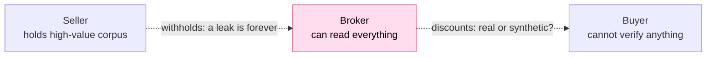
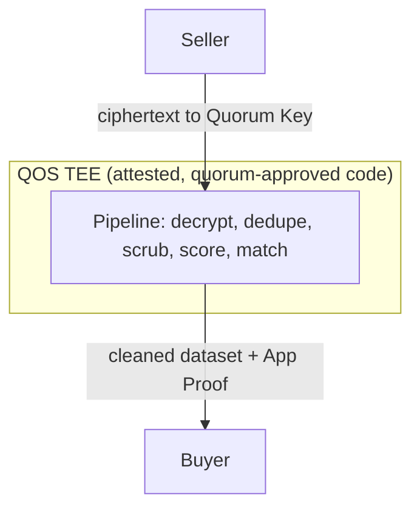
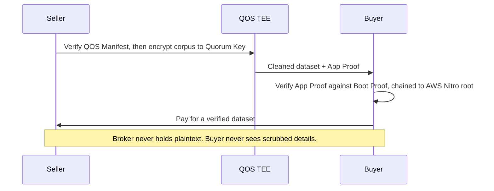

import { TvcBetaCallout } from "/snippets/tvc-beta-callout.mdx";

<TvcBetaCallout />

## The data your marketplace can't list yet

The most valuable training data never reaches the market. Personal emails, agent traces from internal systems, proprietary operational records: the corpora buyers pay the most for are the ones their owners fear to release.

A seller who hands you plaintext has no way to take it back, and an NDA cannot undo a leak. Agent traces are worse, because they carry credentials, internal URLs, and the operating IP of the company that produced them. So the seller withholds.

On the other side, buyers discount what they cannot verify. A folder of "authentic human emails" looks identical to scraped, duplicated, or synthetic filler, so the buyer pays less or walks.

Both fears shrink the same thing: the set of exchanges you can close. You end up trading only the data nobody minds losing, which is the least valuable data you have.

## How Turnkey Verifiable Cloud solves it

Turnkey Verifiable Cloud (TVC) runs your processing pipeline inside TEEs with [QuorumOS](https://github.com/tkhq/qos), with reproducible builds, quorum-approved code, and open-source verifiers. Built on TVC, your marketplace makes three claims a counterparty's security team can check instead of trust:

- **Prove the code does what you claim.** Your scrubbing and transform logic is pinned by digest in a signed [QOS Manifest](/features/verifiable-cloud/overview#manifests). Sellers and buyers verify the exact binary that touches plaintext, and any code upgrade requires a threshold of quorum approvals from a transparent set of operators.
- **Prove plaintext exists only inside the TEE.** Sellers encrypt to a Quorum Key that reconstructs only inside an approved TEE, and the secret is provably never reassembled anywhere else. Your engineers, your cloud provider, and Turnkey process the exchange without the ability to read the raw data.
- **Prove provenance without disclosure.** Every output is signed inside the TEE by a per-boot Ephemeral Key (an App Proof) that binds it to the exact pipeline that produced it. The buyer verifies the pipeline, the scrubbing, and the source of the dataset, and never sees the sensitive details that were scrubbed out.

On most platforms a TEE is only as trustworthy as the admin who controls it. On TVC, the Quorum Key reconstructs only inside a TEE running quorum-approved code, and code upgrades need fresh m-of-n approval. An AWS admin cannot change an IAM role to alter what releases the key or what code runs. For the most sensitive exchanges, the counterparties themselves hold key shares and code-upgrade approvals. The broker cannot release a key or change the pipeline unilaterally, which lets sellers give you their most sensitive data and buyers pay a premium for provenance.

## What runs in the TEE

The TEE holds the whole path from raw corpus to sellable dataset. A typical brokerage pipeline runs:

- **Ingest and decrypt.** Reconstruct the Quorum Key inside the TEE and decrypt the seller's corpus. Plaintext never exists outside of the TEE.
- **Dedupe.** Remove duplicate and near-duplicate records so the buyer pays for distinct data.
- **Scrub.** Strip PII, redact credentials, and remove critical IP, following the scrubbing rules fixed in the attested pipeline.
- **Score.** Compute quality and authenticity metrics the buyer relies on to price the dataset.
- **Match and evaluate.** Run the buyer's evaluation against the corpus without exposing either side to the other.
- **Emit and sign.** Output the cleaned dataset and an App Proof committing to the pipeline code digest and the metrics.

## What the seller client does

The seller never ships plaintext. Their client does three things:

- **Verify the pipeline before trusting it.** The seller checks the signed QOS Manifest to confirm which binary will touch the corpus and who can approve a change to it. For a sensitive corpus, the seller holds a code-upgrade approval key, so the pipeline cannot change without their signature.
- **Encrypt at the point of collection.** The corpus is encrypted to the Quorum Key before it leaves the seller. From that point, only an approved TEE can read it.
- **Confirm what gets stripped.** The seller verifies the exact scrubbing logic before encrypting a single record. The broker shares the pipeline code, and the QOS Manifest attestation guarantees that exact code runs. The seller can supply a policy and confirm the pipeline respects it, or read the pipeline and confirm it already encodes the right rules: PII, credentials, and named IP removed.

## What the buyer client does

The buyer never sees the scrubbed-out details. Their client verifies before it pays:

- **Verify the App Proof.** Check the TEE signature over the output payload, which commits to the pipeline code digest and the metrics.
- **Verify the Boot Proof.** Confirm the attestation chain that ends at the AWS Nitro root certificate, and confirm the QOS Manifest in that attestation is the pipeline the buyer reviewed.
- **Match the two.** Confirm the Ephemeral Key that signed the App Proof is the one the Boot Proof attests, which ties the dataset to that exact TEE and code.
- **Then pay.** The buyer relies on a checkable proof of pipeline and provenance instead of a claim.

Buyers can verify the provenance of the entire data pipeline, which lets you charge a premium for authenticity. A verifier needs only a few lines of open-source Rust, TypeScript, or Go.

## An exchange, end to end

Picture a marketplace for proprietary operational records. Sellers refuse to ship raw data, so today the broker pays to run clearing tools inside each seller's environment. On TVC the on-premise complexity goes away, and both sides of the exchange get indisputable cryptographic guarantees. One exchange runs like this:

1. The seller verifies the QOS Manifest for the clearing and anonymization pipeline, then encrypts their archive to the Quorum Key. Plaintext never leaves their control in readable form.
2. The TEE reconstructs the Quorum Key, decrypts the archive, and runs the pipeline: dedupe, scrub PII and credentials, remove critical IP, and compute quality and authenticity metrics.
3. The TEE emits the cleaned dataset and an App Proof committing to the pipeline code digest and the metrics.
4. The buyer verifies the App Proof against the Boot Proof, confirms the chain to the AWS Nitro root, and pays. They receive a verified dataset and never see what was scrubbed out.

## Get started

TVC is in Private Beta, and design partners work directly with our engineers. Bring the exchange your marketplace cannot close today: the seller who will not release plaintext, or the buyer who will not pay for unverified data. We will scope the pipeline, the proof payload, and the verifier both sides would accept.

[Contact us](https://www.turnkey.com/contact-us) to get onboarded and set up a free system design consultation with our TEE engineering team.

- Read [Why TVC](/features/verifiable-cloud/why-tvc) for how the process rolls up to the hardware root of trust.
- Read [Proofs and verification](/features/verifiable-cloud/proofs-and-verification) to design the App Proof your buyers will check.
- See the [quickstart](/features/verifiable-cloud/quickstart) to deploy your first app.
