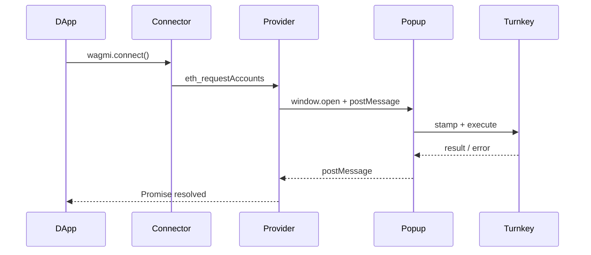

## Introduction

Turnkey lets you create passkey-secured cloud wallets.  
This guide shows how to package that wallet into a **pop-up approval flow** that any dApp can consume through a **standard Wagmi connector**.  
When you are done, other developers will be able to call `connect()` on your wallet just like they do with MetaMask—while all key material stays safely in Turnkey.

After completing the steps you will have:

- A hosted pop-up that signs requests with Turnkey after user approval.
- An **EIP-1193 provider** that routes read RPC calls to a public endpoint and write calls to the pop-up.
- A reusable **Wagmi connector** that dApps can drop into their React code.

## System Components

| Component | Responsibility |
| --------- | -------------- |
| **Pop-up Wallet (Hosted App)** | Authenticates the user (Passkey, OTP, etc.), **stamps** and sends Turnkey requests, then returns results to the opener with `postMessage`. |
| **EIP-1193 Provider** | Splits RPC traffic:<br/>• read-only → public RPC<br/>• signature/transaction → pop-up |
| **Wagmi Connector** | Wraps the provider so dApps can call `wagmi.connect({ connector: MyWalletConnector })`. |

## Architecture Flow



---

## Project Scaffolding

<Steps>
<Step title="Install Packages">

```bash
# Front-end / dApp
npm install wagmi viem @rainbow-me/rainbowkit

# Pop-up wallet
npm install @turnkey/sdk-browser
```

</Step>

<Step title="Folder Layout">

```
apps/
  dapp/
    lib/
      eip1193-provider.ts
      connector.ts
  wallet/            # hosted separately (e.g. Vercel, Netlify)
    app/
      page.tsx       # pop-up entry
    lib/
      turnkey.ts     # thin Turnkey helper
```

</Step>

<Step title="Environment Variables">

```bash
NEXT_PUBLIC_TURNKEY_ORGANIZATION_ID=org_...
NEXT_PUBLIC_TURNKEY_API_URL=https://api.turnkey.com
```

</Step>
</Steps>

---

## 1 · Create the EIP-1193 Provider

The provider owns **all RPC plumbing**.  A trimmed version is shown below; the reference implementation lives in the [`popup-wallet-demo`](https://github.com/tkhq/popup-wallet-demo) repo.

<CodeGroup>
```typescript title="eip1193-provider.ts" [expandable]
import { EIP1193Provider, RpcRequestError, EIP1193RequestFn } from "viem";
import { getHttpRpcClient } from "viem/utils";
import { holesky } from "viem/chains";
import EventEmitter from "events";

interface Store {
  accounts: string[];
  organizationId?: string;
}

export function createEIP1193Provider(): EIP1193Provider {
  let popup: Window | null = null;
  const events = new EventEmitter();
  const STORAGE_KEY = "MY_WALLET:store";

  /* ---------- helpers ---------- */
  const readStore = (): Store =>
    JSON.parse(localStorage.getItem(STORAGE_KEY) || "{\"accounts\":[]}");
  const writeStore = (u: Partial<Store>) =>
    localStorage.setItem(STORAGE_KEY, JSON.stringify({ ...readStore(), ...u }));

  /* ---------- core request fn ---------- */
  const request: EIP1193RequestFn = async ({ method, params }) => {
    // 1. Read-only methods → public RPC
    const PUBLIC = new Set([
      "eth_chainId",
      "eth_blockNumber",
      "eth_getBalance",
      "eth_call",
      // ...etc
    ]);
    if (PUBLIC.has(method)) {
      const rpc = getHttpRpcClient(holesky.rpcUrls.default.http[0]);
      const { result, error } = await rpc.request({
        body: { id: Date.now(), method, params },
      });
      if (error) throw new RpcRequestError({ body: { method, params }, error });
      return result;
    }

    // 2. Cached accounts → short-circuit
    if (method === "eth_accounts") {
      const { accounts } = readStore();
      return accounts.length ? accounts : request({ method: "eth_requestAccounts" });
    }

    // 3. All other methods → pop-up
    return new Promise((resolve, reject) => {
      const id = crypto.randomUUID();

      // open (or reuse) centered pop-up
      if (!popup || popup.closed) {
        const w = 420, h = 620;
        const y = window.top?.outerHeight ? (window.top.outerHeight - h) / 2 : 0;
        const x = window.top?.outerWidth ? (window.top.outerWidth - w) / 2 : 0;
        popup = window.open(
          `${process.env.NEXT_PUBLIC_WALLET_POPUP_URL}?method=${method}&id=${id}`,
          "TurnkeyWalletPopup",
          `popup,width=${w},height=${h},left=${x},top=${y}`
        );
      }

      const listener = (ev: MessageEvent) => {
        if (ev.data?.id !== id) return;
        window.removeEventListener("message", listener);
        ev.data.error ? reject(ev.data.error) : resolve(ev.data.result);
        if (method === "eth_requestAccounts") {
          writeStore(ev.data.result); // { accounts, organizationId }
          events.emit("accountsChanged", ev.data.result.accounts);
        }
      };
      window.addEventListener("message", listener);

      popup!.postMessage({ id, method, params }, "*");
    });
  };

  return {
    request,
    on: events.on.bind(events),
    removeListener: events.removeListener.bind(events),
  } as EIP1193Provider;
}
```
</CodeGroup>

Key points:

- **Read vs. Write**: Only write operations hit the pop-up; everything else uses public RPC—reducing latency and rate-limits.
- **Local cache**: Accounts are cached in `localStorage` so `eth_accounts` resolves instantly on page refresh.
- **Queueing**: Each pending request carries a unique `id` so the pop-up can respond to the right promise.

---

## 2 · Wrap with a Wagmi Connector

<CodeGroup>
```typescript title="connector.ts"
import { createConnector } from "wagmi";
import { createEIP1193Provider } from "./eip1193-provider";

export function myWalletConnector() {
  return createConnector((config) => ({
    id: "turnkey-wallet",
    name: "Turnkey Wallet",
    iconUrl: "https://turnkey.com/icon.svg", // optional
    provider: createEIP1193Provider(),
    async connect() {
      const accounts = (await this.provider.request({ method: "eth_requestAccounts" })) as string[];
      return { accounts, chainId: config.chains[0].id }; // single-chain example
    },
    async disconnect() {
      // no-op (cached store can be cleared if desired)
    },
    async getAccounts() {
      return (await this.provider.request({ method: "eth_accounts" })) as string[];
    },
  }));
}
```
</CodeGroup>

---

## 3 · Integrate into the dApp

```tsx title="_app.tsx"
import { WagmiConfig, createConfig } from "wagmi";
import { myWalletConnector } from "../lib/connector";

const wagmiConfig = createConfig({
  connectors: [myWalletConnector()],
});

export default function App({ Component, pageProps }) {
  return (
    <WagmiConfig config={wagmiConfig}>
      <Component {...pageProps} />
    </WagmiConfig>
  );
}
```

At this point **any** Wagmi hook (`useAccount`, `useSendTransaction`, etc.) will operate through your Turnkey wallet.

---

## 4 · Build the Pop-up Wallet UI

<Steps>
<Step title="Parse the RPC request">

```typescript title="app/page.tsx"
'use client';
import { useSearchParams } from "next/navigation";
import { Turnkey } from "@turnkey/sdk-browser";

export default function WalletPopup() {
  const params = useSearchParams();
  const method = params.get("method");
  const id = params.get("id");

  async function onApprove() {
    try {
      const tk = new Turnkey({
        defaultOrganizationId: process.env.NEXT_PUBLIC_TURNKEY_ORGANIZATION_ID!,
      });

      let result: unknown;
      if (method === "eth_requestAccounts") {
        const { address, organizationId } = await tk.stampCreateAccount({
          // simplified: real app checks existing sub-org, auth, etc.
        });
        result = { accounts: [address], organizationId };
      } else if (method === "eth_sign") {
        result = await tk.stampSignMessage({ /* ... */ });
      } else if (method === "eth_signTransaction") {
        result = await tk.stampSignTransaction({ /* ... */ });
      }

      window.opener.postMessage({ id, result }, "*");
      window.close();
    } catch (error) {
      window.opener.postMessage({ id, error }, "*");
      window.close();
    }
  }

  return (
    <main className="flex flex-col items-center gap-6 p-10">
      <h1 className="text-xl font-semibold">Approve {method}</h1>
      <button onClick={onApprove} className="btn-primary">Approve</button>
    </main>
  );
}
```

</Step>

<Step title="Host the Pop-up">
Deploy the `apps/wallet` project to any static host (e.g., Vercel).  
Set `NEXT_PUBLIC_WALLET_POPUP_URL` in your dApp to that URL.
</Step>
</Steps>

---

## 5 · Test the Flow

1. Run the dApp (`apps/dapp`) locally.  
2. Click **Connect Turnkey Wallet** (your RainbowKit UI will show it).  
3. The pop-up asks for approval; approve.  
4. Send a small transaction on Sepolia and confirm it appears on-chain.

---

## Optional Enhancements

- **Deep Linking**: Accept `redirect_uri` so mobile browsers can fallback into the same pop-up after auth.
- **Security**: Use `window.postMessage` target origin instead of `"*"` to whitelist your dApp domain.
- **Multi-chain**: Map `chainId` → RPC URL in the provider.

---

## Next Steps

Ship your connector to NPM so any partner dApp can `npm install @yourorg/turnkey-wallet` and start building!
