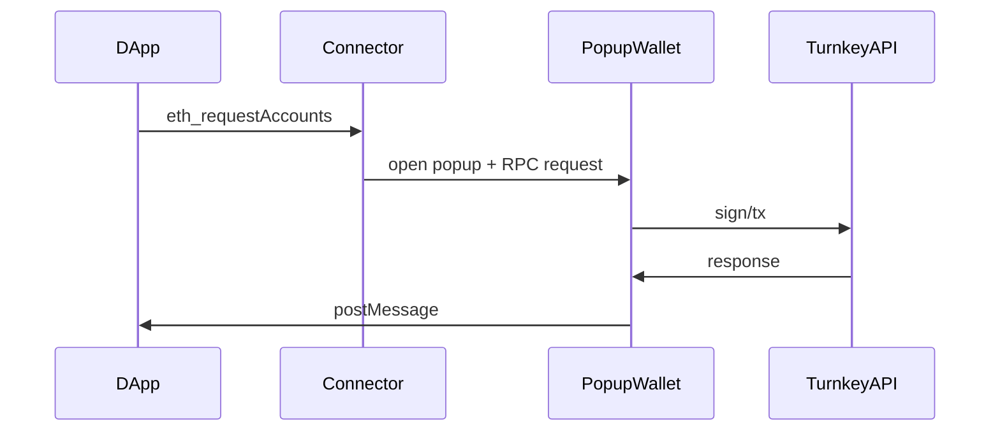

## Introduction

Turnkey lets you create passkey-secured wallets that live entirely in the cloud, while Wagmi provides a connector interface so any wallet can plug into Ethereum dApps.

In this guide you will:

1. Build a **custom Wagmi connector** that routes signing requests to Turnkey.
2. Implement an **EIP-1193 provider** that transparently splits _read_ RPC calls (→ public RPC) from _write_ calls (→ Turnkey via popup).
3. Create a minimal **popup wallet UI** that handles user approvals and communicates back to the dApp with `postMessage`.
4. See how the **same connector pattern** can be adapted **without a popup** (embedded flow) when your security/UX model allows it.

By the end, your dApp will display “Connect Berakin Wallet”, pop a Turnkey approval window, and complete transactions—all without users managing private keys.

---

## Architecture Overview



---

## Project Setup

<Steps>
<Step title="Install dependencies">
```bash
# Frontend (dApp) dependencies
npm install wagmi viem @rainbow-me/rainbowkit

# Turnkey SDK for browser signing
npm install @turnkey/sdk-browser
```
</Step>

<Step title="Create shared lib folder">
Organise your code under `apps/dapp/lib/` (or equivalent) so the provider and connector can be imported anywhere in your React tree.
</Step>

<Step title="Add environment variables">
Store your Turnkey Organization ID and API base URL:
```bash
NEXT_PUBLIC_TURNKEY_ORG_ID=org_123...
NEXT_PUBLIC_TURNKEY_API_URL=https://api.turnkey.com
```
</Step>
</Steps>

---

## DApp Side

### EIP-1193 Provider

Use a custom provider to route RPC calls via popup and sign with Turnkey:

<CodeGroup>
```typescript title="eip1193-provider.ts" [expandable]
// trimmed for brevity – full source in the popup-wallet-demo repo
export function createEIP1193Provider() {
  /* 1. Keep a request queue so each popup response resolves the right promise */
  /* 2. Persist connected accounts in localStorage for page refreshes */
  /* 3. For read-only methods we call a regular public RPC endpoint */
  /* 4. For write methods we open the popup and wait for window.message */
}
```
```typescript title="connector.ts" [expandable]
// Wrap provider in a Wagmi connector
export function berakinWalletConnector() {
  return createConnector(/* … */);
}
```
</CodeGroup>

### Popup Launcher & Events

- Manage popup lifecycle  
- Handle `connect`, `disconnect`, and `accountChange` events

---

## Wallet Side

### Entry Point (`apps/wallet/app/page.tsx`)

- Parse URL parameters  
- Render sign vs. tx UI

### Window Messenger

<CodeGroup>
```typescript
apps/wallet/lib/window-messenger.ts
// postMessage back to opener
```
</CodeGroup>

<Accordion title="Why split UI & messaging?">
Separating UI and messaging logic keeps components focused and testable, avoids tangled side-effects, and makes it easier to swap out UI without touching messaging code.
</Accordion>

---

## Step-by-Step Integration

<Steps>
<Step title="1 · Create the provider">
Implement `createEIP1193Provider` (see code above). Focus on:
- `eth_requestAccounts`: opens popup, receives `{ accounts, organizationId }`.
- `eth_sign`, `eth_signTransaction`: forwarded to popup for approval.
- Read-only calls → public RPC via `viem`.
</Step>

<Step title="2 · Create the connector">
Use `createConnector` from `wagmi` to expose `connect`, `disconnect`, and event handlers that listen to our provider’s `accountsChanged`, `chainChanged`, etc.
</Step>

<Step title="3 · Wire up Wagmi + RainbowKit">
```tsx title="_app.tsx"
import { WagmiConfig, createConfig } from 'wagmi';
import { berakinWalletConnector } from '../lib/connector';

const config = createConfig({
  connectors: [berakinWalletConnector()],
  autoConnect: true,
});

export default function App({ Component, pageProps }) {
  return (
    <WagmiConfig config={config}>
      <Component {...pageProps} />
    </WagmiConfig>
  );
}
```
</Step>

<Step title="4 · Build the popup wallet UI">
Your popup page (`apps/wallet/app/page.tsx`) should:
1. Parse the incoming `method` & `params` from the query-string.
2. Ask the user to approve.
3. Use `@turnkey/sdk-browser` to **stamp** and **send** the request.
4. `window.opener.postMessage({ method, result })` back to the dApp.
</Step>

<Step title="5 · Test the flow">
Run both apps, click “Connect Berakin Wallet”, sign a transaction on Sepolia, and confirm it lands on-chain.
</Step>
</Steps>

---

## Non-Popup Alternative

If your application does not require a dedicated approval window (e.g., it’s gated behind your own auth system), you can call Turnkey directly inside the connector without opening a popup:

```typescript title="embedded-provider.ts" [expandable]
import { Turnkey } from '@turnkey/sdk-browser';

const tk = new Turnkey({
  defaultOrganizationId: process.env.NEXT_PUBLIC_TURNKEY_ORG_ID!,
});

export async function signAndSend(tx: PreparedTransaction) {
  const stamped = await tk.stampSignTransaction({
    organizationId: tk.defaultOrganizationId,
    transaction: tx,
  });

  // send raw tx via viem/http
  await publicClient.request({
    method: 'eth_sendRawTransaction',
    params: [stamped],
  });
}
```

Use the same Wagmi connector pattern but skip the popup logic—ideal for server-side or embedded wallets.

---

## Customization

- Add multi-chain support by passing additional RPC URLs.  
- Theme the popup UI with your brand styling.  
- Extend the connector to support more RPC methods.

---

## Local Dev & Testing

<Accordion title="Common Pitfalls">
- **Popup blocked** → instruct users to allow popups.  
- **CORS errors** → ensure correct headers on wallet app.
</Accordion>

---

## Further Reading

- [Popup Wallet Demo source](https://github.com/tkhq/popup-wallet-demo)  
- [Turnkey SDK docs](https://docs.turnkey.com)  
- [RainbowKit examples](https://github.com/rainbow-me/rainbowkit)
