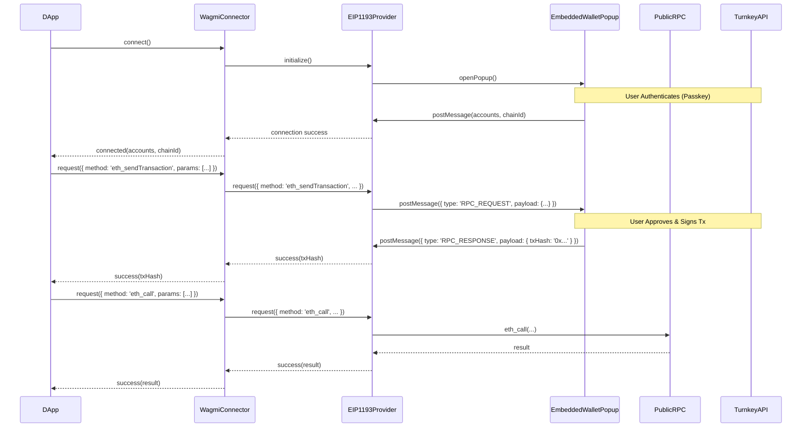

This guide walks you through creating a custom Wagmi connector and EIP-1193 provider for your Turnkey-powered embedded wallet. This allows dApps using Wagmi (or libraries built on it, like RainbowKit) to easily integrate with your wallet product.

**Goal:** Build a portable wallet solution where users can connect their Turnkey-backed wallet to various dApps across the ecosystem.

**Outcome:**

- A reusable Wagmi connector package.
- An EIP-1193 provider that intelligently routes blockchain requests.
- A foundation for a production-ready embedded wallet product.

## System Components Overview

Our system involves three key parts working together:

1.  **Embedded Wallet (Pop-up):** A web application (likely React/Next.js) hosted by you. This UI handles user authentication (passkeys via Turnkey), transaction signing, and communication with the dApp via `postMessage`. It securely interacts with the Turnkey API.

    - _Reference:_ The `popup-wallet-demo`'s `@/apps/wallet` provides a concrete example.

2.  **EIP-1193 Provider:** A JavaScript class implementing the [EIP-1193](https://eips.ethereum.org/EIPS/eip-1193) standard. It acts as the intermediary between the dApp and the blockchain/wallet.

    - Forwards read-only requests (e.g., `eth_call`, `eth_chainId`) to a public RPC endpoint.
    - Routes state-changing requests (e.g., `eth_sendTransaction`, `eth_accounts`, `personal_sign`) to the Embedded Wallet pop-up via `postMessage` for user approval and signing.
    - _Reference:_ The `popup-wallet-demo`'s `@/apps/dapp/lib/eip1193-provider.ts`.

3.  **Wagmi Connector:** A custom connector built using Wagmi's `createConnector` utility. It wraps our EIP-1193 provider, making the wallet compatible with the Wagmi ecosystem.
    - _Reference:_ The `popup-wallet-demo`'s `@/apps/dapp/lib/connector.ts` and `@/apps/dapp/lib/wagmi.ts`.

## Architecture Flow

The interaction sequence generally follows these steps:

1.  **Connection:**

    - A user on a dApp clicks "Connect Wallet" and selects your wallet.
    - The dApp calls the `connect` method on your Wagmi connector.
    - The connector initializes the EIP-1193 provider.
    - The provider opens your Embedded Wallet pop-up.
    - The user authenticates within the pop-up (e.g., using their passkey).
    - The pop-up sends the user's account address back to the provider via `postMessage`.
    - The provider resolves the connection promise, returning the account details to the dApp via the connector.

2.  **RPC Request (e.g., `eth_sendTransaction`):**

    - The dApp uses a Wagmi hook (e.g., `useSendTransaction`) which triggers a request.
    - Wagmi sends the `eth_sendTransaction` request to your connector.
    - The connector forwards the request to the EIP-1193 provider.
    - The provider identifies this as a signing request and opens the Embedded Wallet pop-up (if not already open), sending the transaction details via `postMessage`.
    - The user reviews and approves the transaction in the pop-up.
    - The pop-up uses Turnkey to sign the transaction and potentially broadcast it (or return the signed transaction).
    - The pop-up sends the transaction hash (or signed transaction) back to the provider via `postMessage`.
    - The provider resolves the request promise, returning the result to the dApp.

3.  **RPC Request (e.g., `eth_call`):**
    - The dApp triggers a read-only request.
    - Wagmi sends the `eth_call` request to your connector.
    - The connector forwards it to the EIP-1193 provider.
    - The provider identifies this as a read-only request and forwards it directly to a public RPC node.
    - The public RPC node returns the result.
    - The provider returns the result to the dApp.

## Flow Diagram



## Building the EIP-1193 Provider

The provider is the core logic handling request routing. It needs to manage communication with the pop-up and decide where to send different RPC methods.

We'll build the `CustomEip1193Provider` class step by step.

<Steps>

<Step title="1. Basic Structure & Constructor">
Initialize the class, extending `EventEmitter` for EIP-1193 events. The constructor takes essential URLs and the chain ID, and sets up initial state and the crucial `message` listener.

<CodeGroup>
```typescript title="eip1193-provider.ts (Initial)"
import { EventEmitter } from 'events';

// Define the structure of messages exchanged with the popup
// (We'll define specific types later)
interface Message<T = any> {
  type: string;
  payload?: T;
  error?: string;
  id?: number; // Optional request ID for tracking
}

export class CustomEip1193Provider extends EventEmitter {
  private popupWindow: Window | null = null;
  private popupUrl: string;
  private publicRpcUrl: string;
  private accounts: string[] = [];
  private chainId: number;
  // For tracking requests sent to the popup
  private pendingRequests: Map<number, { resolve: (value: any) => void; reject: (reason?: any) => void }> = new Map();
  private nextRequestId = 1;

  constructor(popupUrl: string, publicRpcUrl: string, chainId: number) {
    super();
    this.popupUrl = popupUrl;
    this.publicRpcUrl = publicRpcUrl;
    this.chainId = chainId;

    // Listen for messages from the popup
    // We'll implement handleMessage next
    window.addEventListener('message', this.handleMessage.bind(this));
    console.log('Provider initialized. Listening for messages...');
  }

  // Placeholder for the message handler
  private handleMessage(event: MessageEvent): void {
      console.log('Received message:', event.data);
      // Implementation in Step 4
  }

  // --- More methods to be added below ---
}
```
</CodeGroup>
</Step>

<Step title="2. Opening the Popup">
Add a method to open (or focus) the wallet popup window. This ensures a consistent way to interact with the UI.

<CodeGroup>
```typescript title="eip1193-provider.ts (+ openPopup)"
import { EventEmitter } from 'events';

interface Message<T = any> { /* ... */ }

export class CustomEip1193Provider extends EventEmitter {
  private popupWindow: Window | null = null;
  private popupUrl: string;
  private publicRpcUrl: string;
  private accounts: string[] = [];
  private chainId: number;
  private pendingRequests: Map<number, { /* ... */ }> = new Map();
  private nextRequestId = 1;

  constructor(popupUrl: string, publicRpcUrl: string, chainId: number) {
    // ... (constructor logic)
    window.addEventListener('message', this.handleMessage.bind(this));
  }

  private handleMessage(event: MessageEvent): void { /* ... */ }

  private openPopup(path: string = ''): Window | null {
    if (this.popupWindow && !this.popupWindow.closed) {
      this.popupWindow.focus();
      console.log('Popup focused.');
    } else {
      const width = 400;
      const height = 600;
      const left = window.screenX + (window.outerWidth - width) / 2;
      const top = window.screenY + (window.outerHeight - height) / 2;
      console.log('Opening new popup...');
      this.popupWindow = window.open(
        `${this.popupUrl}${path}`,
        'walletPopup',
        `width=${width},height=${height},left=${left},top=${top},resizable=yes,scrollbars=yes`
      );
    }

    if (!this.popupWindow) {
        console.error("Failed to open popup window. Check browser popup blocker settings.");
        return null;
    }
    console.log('Popup opened/focused successfully.');
    return this.popupWindow;
  }

  // --- More methods --- 
}
```
</CodeGroup>
</Step>

<Step title="3. Sending Messages to Popup">
Implement `sendMessageToPopup`. This method handles opening the popup, assigning a unique ID to the request for tracking, sending the message via `postMessage` (with crucial `targetOrigin` for security), and setting up a promise to wait for the response, including a timeout.

<CodeGroup>
```typescript title="eip1193-provider.ts (+ sendMessageToPopup)"
import { EventEmitter } from 'events';

interface Message<T = any> { /* ... */ }

export class CustomEip1193Provider extends EventEmitter {
  private popupWindow: Window | null = null;
  private popupUrl: string;
  private publicRpcUrl: string;
  private accounts: string[] = [];
  private chainId: number;
  private pendingRequests: Map<number, { resolve: (value: any) => void; reject: (reason?: any) => void }> = new Map();
  private nextRequestId = 1;

  constructor(/* ... */) { /* ... */ }
  private handleMessage(event: MessageEvent): void { /* ... */ }
  private openPopup(path?: string): Window | null { /* ... */ }

  private sendMessageToPopup(message: Message): Promise<any> {
    const popup = this.openPopup();
    if (!popup) {
      return Promise.reject(new Error('Popup could not be opened.'));
    }

    const requestId = this.nextRequestId++;
    const messageWithId = { ...message, id: requestId };

    console.log(`Sending message to popup (ID: ${requestId}):`, messageWithId);

    return new Promise((resolve, reject) => {
      this.pendingRequests.set(requestId, { resolve, reject });

      // Debounce or wait for popup readiness before sending
      // A simple timeout is used here; a handshake is more robust.
      const attemptSend = () => {
          try {
              const targetOrigin = new URL(this.popupUrl).origin;
              console.log(`Posting message to origin: ${targetOrigin}`);
              popup.postMessage(messageWithId, targetOrigin);
          } catch (error) {
              console.error('postMessage failed:', error);
              this.pendingRequests.delete(requestId);
              reject(new Error(`SecurityError: Failed to send message to popup. Check targetOrigin.`));
          }
      };

      // Simple delay; replace with handshake (e.g., popup sends 'READY')
      setTimeout(attemptSend, 300); 

       // Timeout for the request
      const timeoutDuration = 30000; // 30 seconds
      setTimeout(() => {
        if (this.pendingRequests.has(requestId)) {
            console.warn(`Request ID ${requestId} timed out after ${timeoutDuration}ms.`);
            this.pendingRequests.delete(requestId);
            reject(new Error(`Request timed out (ID: ${requestId})`));
        }
      }, timeoutDuration); 
    });
  }

  // --- More methods --- 
}
```
</CodeGroup>
</Step>

<Step title="4. Handling Messages from Popup">
Implement `handleMessage`. This verifies the message origin, checks if it's a response to a pending request (resolving/rejecting the corresponding promise), or handles general events emitted by the popup (like connection status, account changes) by emitting EIP-1193 standard events.

<CodeGroup>
```typescript title="eip1193-provider.ts (+ handleMessage impl)"
import { EventEmitter } from 'events';

interface Message<T = any> { /* ... */ }

// Define expected message types from your popup
const WALLET_CONNECTED = 'WALLET_CONNECTED';
const WALLET_ACCOUNTS_CHANGED = 'WALLET_ACCOUNTS_CHANGED';
const WALLET_CHAIN_CHANGED = 'WALLET_CHAIN_CHANGED';
const WALLET_DISCONNECTED = 'WALLET_DISCONNECTED';
const RPC_RESPONSE = 'RPC_RESPONSE'; // For responses to sendMessageToPopup

export class CustomEip1193Provider extends EventEmitter {
  // ... (properties: popupWindow, popupUrl, etc.)
  private pendingRequests: Map<number, { resolve: (value: any) => void; reject: (reason?: any) => void }> = new Map();
  private nextRequestId = 1;

  constructor(/* ... */) {
    // ... 
    window.addEventListener('message', this.handleMessage.bind(this));
  }

  private openPopup(path?: string): Window | null { /* ... */ }
  private sendMessageToPopup(message: Message): Promise<any> { /* ... */ }

  private handleMessage(event: MessageEvent): void {
    // *** CRITICAL SECURITY CHECK ***
    const expectedOrigin = new URL(this.popupUrl).origin;
    if (event.origin !== expectedOrigin) {
      console.warn(`Ignoring message from unexpected origin: ${event.origin}. Expected: ${expectedOrigin}`);
      return;
    }

    const message: Message = event.data;
    // Basic validation of the message structure
    if (!message || typeof message.type !== 'string') {
        console.warn('Ignoring malformed message:', message);
        return;
    }

    const { type, payload, error, id } = message;
    console.log(`Handling message from popup:`, message);

    // 1. Handle responses to specific requests sent via sendMessageToPopup
    if (id && this.pendingRequests.has(id)) {
      console.log(` Correlating message ID ${id} to a pending request.`);
      const { resolve, reject } = this.pendingRequests.get(id)!;
      this.pendingRequests.delete(id);
      if (type === RPC_RESPONSE) { // Check if it's the expected response type
          if (error) {
            console.error(` Request ID ${id} failed:`, error);
            reject(new Error(error));
          } else {
            console.log(` Request ID ${id} succeeded:`, payload);
            resolve(payload);
          }
      } else {
         console.warn(`Received unexpected type '${type}' for request ID ${id}. Expected '${RPC_RESPONSE}'.`);
         // Decide how to handle this - reject or ignore?
         reject(new Error(`Unexpected response type '${type}' for request ID ${id}`));
      }
      return; // Stop processing once correlated
    }

    // 2. Handle general broadcast events from the popup
    console.log(` Handling broadcast message type: ${type}`);
    switch (type) {
      case WALLET_CONNECTED:
        if (payload && Array.isArray(payload.accounts) && typeof payload.chainId === 'number') {
          this.accounts = payload.accounts;
          this.chainId = payload.chainId;
          this.emit('connect', { chainId: this.chainId });
          this.emit('accountsChanged', this.accounts);
          console.log('Emitted connect and accountsChanged:', this.accounts);
        } else {
          console.warn('Malformed WALLET_CONNECTED payload:', payload);
        }
        break;
      case WALLET_ACCOUNTS_CHANGED:
        if (payload && Array.isArray(payload.accounts)){
          this.accounts = payload.accounts;
          this.emit('accountsChanged', this.accounts);
          console.log('Emitted accountsChanged:', this.accounts);
        } else {
           console.warn('Malformed WALLET_ACCOUNTS_CHANGED payload:', payload);
        }
        break;
      case WALLET_CHAIN_CHANGED:
         if (payload && typeof payload.chainId === 'number') {
           this.chainId = payload.chainId;
           this.emit('chainChanged', this.chainId);
           console.log('Emitted chainChanged:', this.chainId);
         } else {
           console.warn('Malformed WALLET_CHAIN_CHANGED payload:', payload);
         }
         break;
      case WALLET_DISCONNECTED:
        this.accounts = [];
        this.emit('disconnect');
        if (this.popupWindow && !this.popupWindow.closed) this.popupWindow.close();
        console.log('Emitted disconnect.');
        break;
      default:
        console.log(` Received unhandled message type: ${type}`);
    }
  }
  
  // --- More methods ---
}
```
</CodeGroup>
</Step>

<Step title="5. Connection Status">
Add a simple helper to check if the provider considers itself connected (based on having accounts).

<CodeGroup>
```typescript title="eip1193-provider.ts (+ isConnected)"
import { EventEmitter } from 'events';
// ... other imports and interfaces ...

export class CustomEip1193Provider extends EventEmitter {
  // ... (properties)

  constructor(/* ... */) { /* ... */ }
  private handleMessage(event: MessageEvent): void { /* ... */ }
  private openPopup(path?: string): Window | null { /* ... */ }
  private sendMessageToPopup(message: Message): Promise<any> { /* ... */ }

  isConnected(): boolean {
    const connected = this.accounts.length > 0;
    console.log('isConnected check:', connected);
    return connected;
  }

  // --- More methods ---
}
```
</CodeGroup>
</Step>

<Step title="6. Implementing `request`">
This is the core EIP-1193 method. It inspects the `method` name. If it's a wallet action (signing, sending tx, getting accounts), it uses `sendMessageToPopup`. Otherwise, it forwards the request directly to the `publicRpcUrl`.

<CodeGroup>
```typescript title="eip1193-provider.ts (+ request impl)"
import { EventEmitter } from 'events';
// ... other imports and interfaces ...

// List of methods requiring interaction with the wallet popup
const WALLET_ACTION_METHODS = [
  'eth_requestAccounts', // Needs popup for auth
  'eth_accounts',       // Usually retrieved from popup's state
  'eth_sendTransaction',
  'personal_sign',
  'eth_signTypedData_v4',
  'wallet_switchEthereumChain', // Requires user interaction in popup
  // Add other signing/wallet methods as needed
];

export class CustomEip1193Provider extends EventEmitter {
  // ... (properties, constructor, other methods)
  private publicRpcUrl: string;
  private nextRequestId = 1; // Also used for public RPC requests

  isConnected(): boolean { /* ... */ }
  
  async request(args: { method: string; params?: Array<any> }): Promise<any> {
    const { method, params = [] } = args;
    console.log(`Provider received request: ${method}`, params);

    if (WALLET_ACTION_METHODS.includes(method)) {
      console.log(` Routing ${method} to popup...`);
      // These methods require the user's wallet interaction via the popup.
      // We assume the popup handles the logic for connection checks internally for most methods.
      // 'eth_requestAccounts' specifically initiates the connection flow.
      try {
        const result = await this.sendMessageToPopup({
          type: 'RPC_REQUEST', // Generic type for popup to handle
          payload: { method, params },
        });
        console.log(` Received result for ${method} from popup:`, result);
        // The popup should return data in the format expected by the RPC method.
        return result;
      } catch (error: any) {
        console.error(` Error handling ${method} via popup:`, error);
        // Convert popup errors (e.g., user rejection) into appropriate JSON-RPC errors if possible
        // Example: throw { code: 4001, message: 'User rejected the request.' };
        throw error; // Re-throw the caught error
      }
    } else {
      // For read-only methods or methods not requiring popup interaction,
      // forward directly to the public RPC endpoint.
      console.log(` Routing ${method} to public RPC: ${this.publicRpcUrl}`);
      try {
        const response = await fetch(this.publicRpcUrl, {
          method: 'POST',
          headers: {
            'Content-Type': 'application/json',
          },
          body: JSON.stringify({
            jsonrpc: '2.0',
            id: `public-${this.nextRequestId++}`, // Use a unique ID
            method: method,
            params: params,
          }),
        });

        if (!response.ok) {
           const errorBody = await response.text();
           console.error(`Public RPC HTTP error! Status: ${response.status}`, errorBody);
           throw new Error(`Public RPC HTTP error! Status: ${response.status}`);
        }

        const json = await response.json();
        if (json.error) {
          console.error(`Public RPC Error for ${method}:`, json.error);
          throw new Error(`RPC Error: ${json.error.message} (Code: ${json.error.code})`);
        }
        console.log(` Received result for ${method} from public RPC:`, json.result);
        return json.result;
      } catch (error: any) {
        console.error(` Error handling ${method} via public RPC:`, error);
        throw error;
      }
    }
  }

  // --- Connect/Disconnect methods next ---
}
```
</CodeGroup>
</Step>

<Step title="7. Implementing `connect` & `disconnect`">
Add explicit `connect` and `disconnect` methods. `connect` typically triggers `eth_requestAccounts` via the `request` method to start the popup flow. `disconnect` tells the popup to clear state and closes the window.

<CodeGroup>
```typescript title="eip1193-provider.ts (+ connect/disconnect)"
import { EventEmitter } from 'events';
// ... other imports, interfaces, constants ...

export class CustomEip1193Provider extends EventEmitter {
  // ... (properties, constructor, other methods) ...
  private popupWindow: Window | null = null;
  private accounts: string[] = [];
  
  isConnected(): boolean { /* ... */ }
  async request(args: { method: string; params?: Array<any> }): Promise<any> { /* ... */ }

  // Connect initiates the process; actual connection state is updated
  // via the WALLET_CONNECTED message handled in handleMessage.
  async connect(): Promise<void> {
    console.log('Connect method called.');
    if (this.isConnected()) {
      console.log(' Already connected.');
      return;
    }

    return new Promise(async (resolve, reject) => {
      // Setup temporary listeners for the outcome of this specific connect attempt
      const onConnect = (payload: { chainId: number }) => {
        console.log('Connect listener: Received connect event', payload);
        cleanupListeners();
        resolve();
      };
      const onDisconnect = () => {
        console.log('Connect listener: Received disconnect event during connect attempt');
        cleanupListeners();
        reject(new Error('Connection rejected or popup closed.'));
      };
      const cleanupListeners = () => {
         this.removeListener('connect', onConnect);
         this.removeListener('disconnect', onDisconnect);
      };

      // Listen for 'connect' or 'disconnect' emitted by handleMessage
      this.once('connect', onConnect);
      this.once('disconnect', onDisconnect);

      // Trigger the popup to request accounts via the main request method
      try {
         console.log(' Triggering eth_requestAccounts via request method...');
         // The request method will send the message to the popup.
         // The result isn't directly used here; we rely on the event listeners.
         await this.request({ method: 'eth_requestAccounts' });
         // Resolution/rejection happens via the listeners above.
      } catch (err) {
         console.error(' Error triggering eth_requestAccounts:', err);
         cleanupListeners(); // Clean up if the initial request fails
         reject(err);
      }
    });
  }

  async disconnect(): Promise<void> {
    console.log('Disconnect method called.');
    // Tell the popup to clean up its state (optional, depends on popup implementation)
    try {
       await this.sendMessageToPopup({ type: 'DISCONNECT_WALLET' }); // Custom message for popup
    } catch (err) {
        console.warn('Failed to send DISCONNECT_WALLET message to popup, might already be closed.', err);
    }

    // Clear local state
    this.accounts = [];
    if (this.popupWindow && !this.popupWindow.closed) {
      this.popupWindow.close();
      this.popupWindow = null;
    }
    // Emit disconnect *after* cleanup
    this.emit('disconnect');
    console.log('Provider disconnected.');
  }
}
```
</CodeGroup>

**Note:** This `connect` method relies heavily on the `handleMessage` correctly receiving `WALLET_CONNECTED` or `WALLET_DISCONNECTED` from the popup after the `eth_requestAccounts` call.

</Step>

</Steps>

This completes the core implementation of the `CustomEip1193Provider`. We've built it incrementally, focusing on each part:
*   Initialization and state
*   Popup management
*   Message passing (sending and handling)
*   RPC request routing
*   Connection lifecycle (`connect`/`disconnect`)

You can view the complete, integrated example in the `popup-wallet-demo` repository for reference: [https://github.com/tkhq/popup-wallet-demo/blob/main/apps/dapp/lib/eip1193-provider.ts](https://github.com/tkhq/popup-wallet-demo/blob/main/apps/dapp/lib/eip1193-provider.ts)

Next, we'll wrap this provider in a Wagmi connector.

## Building the Wagmi Connector

Wagmi's `createConnector` makes this straightforward. It wraps our EIP-1193 provider.

```typescript title="connector.ts"
import { createConnector } from 'wagmi';
import { CustomEip1193Provider } from './eip1193-provider';

const customEip1193Provider = new CustomEip1193Provider(
  'https://your-wallet-popup-url.com', // Replace with your popup URL
  'https://your-public-rpc-url.com', // Replace with your public RPC URL
  1 // Chain ID (e.g., 1 for Ethereum Mainnet)
);

export const customConnector = createConnector({
  id: 'custom-wallet',
  name: 'Custom Wallet',
  client: customEip1193Provider,
});
```

This `customConnector` is now ready to be used with Wagmi in your dApp.

```typescript title="wagmi.ts"
import { createClient } from 'wagmi';
import { customConnector } from './connector';

const client = createClient({
  connectors: [customConnector],
});

export default client;
```

With this setup, your dApp can now use the `customConnector` to connect to your custom wallet solution, leveraging the EIP-1193 provider for secure and seamless interactions.

```typescript title="App.tsx"
import { WagmiConfig, createClient, chain } from 'wagmi';
import { client } from './wagmi';

function App() {
  return (
    <WagmiConfig client={client}>
      {/* Your app components here */}
    </WagmiConfig>
  );
}

```

## Building the Wagmi Connector

Wagmi's `createConnector` utility simplifies wrapping our `CustomEip1193Provider`. It requires us to provide implementations for standard connector methods.

<Steps>

<Step title="1. Connector Options & Types">
Define an interface for configuration options (like popup URL, RPC URL) and a type for the connector, potentially including a reference to our provider instance.

<CodeGroup>
```typescript title="my-wallet-connector.ts (Setup)"
import { Connector } from 'wagmi';
import { CustomEip1193Provider } from './eip1193-provider'; // Adjust path

// Configuration options for your connector
interface MyWalletOptions {
  popupUrl: string;        // URL where your wallet UI is hosted
  publicRpcUrl: string;    // Public RPC endpoint for read-only requests
  chainId: number;         // The default/initial chain ID
  name?: string;           // Optional display name for the wallet
  icon?: string;           // Optional URL for the wallet icon
}

// Type for the connector's properties and internal state
type MyWalletConnector = Connector & { 
  // Optional: Keep a reference if needed, but often managed within createConnector scope
  // providerInstance?: CustomEip1193Provider 
};

// Connector factory function (implementation in next step)
export function myWalletConnector(options: MyWalletOptions): MyWalletConnector {
  // ... createConnector logic goes here
}
```
</CodeGroup>
</Step>

<Step title="2. Using `createConnector`">
Call `createConnector` within a factory function. This function takes a configuration object (`options`) and returns the connector instance. Inside `createConnector`, provide basic metadata like `id`, `name`, and `icon`.

<CodeGroup>
```typescript title="my-wallet-connector.ts (Factory)"
import { createConnector, Connector } from 'wagmi';
import { CustomEip1193Provider } from './eip1193-provider'; 

interface MyWalletOptions { /* ... */ }
type MyWalletConnector = Connector & { /* ... */ };

export function myWalletConnector(options: MyWalletOptions): MyWalletConnector {
  const { 
    popupUrl, 
    publicRpcUrl, 
    chainId, 
    name = 'My Embedded Wallet', // Default name
    icon 
  } = options;
  
  // Provider instance will be managed within the connector's scope
  let provider: CustomEip1193Provider | undefined;

  return createConnector<CustomEip1193Provider, MyWalletOptions>((config) => ({
    // --- Basic Metadata ---
    id: 'myEmbeddedWallet', // Unique identifier
    name: name,             // Display name in dApp UIs
    icon: icon,             // Wallet icon URL
    ready: true,            // Assume ready; more complex checks possible

    // --- Core Method Implementations (Next Steps) ---
    async getProvider() { /* ... */ },
    async connect(connectOptions = {}) { /* ... */ },
    async disconnect() { /* ... */ },
    async getAccounts() { /* ... */ },
    async getChainId() { /* ... */ },
    async isAuthorized() { /* ... */ },

    // --- Event Handlers (Handled via Provider) ---
    onAccountsChanged(accounts) { /* Defined in connect */ },
    onChainChanged(chainId) { /* Defined in connect */ },
    onDisconnect(error) { /* Defined in connect */ },
  }));
}
```
</CodeGroup>
</Step>

<Step title="3. Implement `getProvider`">
Instantiate (or return the existing instance of) your `CustomEip1193Provider` when requested.

<CodeGroup>
```typescript title="my-wallet-connector.ts (+ getProvider)"
// ... (imports, interfaces, factory setup)

export function myWalletConnector(options: MyWalletOptions): MyWalletConnector {
  // ... (options destructuring)
  let provider: CustomEip1193Provider | undefined;

  return createConnector<CustomEip1193Provider, MyWalletOptions>((config) => ({
    // ... (id, name, icon, ready)

    async getProvider() {
      if (!provider) {
        console.log('Connector: Creating new EIP-1193 provider instance...');
        provider = new CustomEip1193Provider(popupUrl, publicRpcUrl, chainId);
      } else {
        console.log('Connector: Returning existing provider instance.');
      }
      return provider;
    },

    // ... (other methods)
  }));
}
```
</CodeGroup>
</Step>

<Step title="4. Implement `connect`">
This method orchestrates the connection:
1. Gets the provider instance.
2. Emits a 'connecting' message.
3. Calls the provider's `connect` method.
4. Retrieves accounts and chain ID from the provider.
5. **Crucially:** Sets up listeners on the provider (`accountsChanged`, `chainChanged`, `disconnect`) and forwards these events to Wagmi using `config.emitter.emit('change', ...)` and `config.emitter.emit('disconnect')`.
6. Returns the connected accounts and chain ID.

<CodeGroup>
```typescript title="my-wallet-connector.ts (+ connect)"
// ... (imports, interfaces, factory setup)
import { getAddress } from 'viem'; // For checksumming addresses

export function myWalletConnector(options: MyWalletOptions): MyWalletConnector {
  // ... (options destructuring)
  let provider: CustomEip1193Provider | undefined;

  return createConnector<CustomEip1193Provider, MyWalletOptions>((config) => ({
    // ... (id, name, icon, ready, getProvider)

    async connect(connectOptions = {}) {
      console.log('Connector: connect method called.');
      const currentProvider = await this.getProvider();
      config.emitter.emit('message', { type: 'connecting' });

      try {
        // 1. Initiate connection via the provider
        console.log('Connector: Calling provider.connect()...');
        await currentProvider.connect(); 
        console.log('Connector: Provider connection successful.');

        // 2. Get initial state after connection
        const accounts = (await this.getAccounts()).map(getAddress); // Wagmi expects checksummed
        const currentChainId = await this.getChainId();
        console.log('Connector: Got initial accounts:', accounts, 'Chain ID:', currentChainId);

        // 3. Setup event listeners (only after successful connect)
        // Ensure listeners are not added multiple times if connect is called again
        currentProvider.removeAllListeners(); // Clear previous listeners first

        currentProvider.on('accountsChanged', (accounts) => {
          console.log('Connector: Detected accountsChanged event from provider:', accounts);
          config.emitter.emit('change', { accounts: accounts.map(getAddress) });
        });
        currentProvider.on('chainChanged', (newChainId) => {
          console.log('Connector: Detected chainChanged event from provider:', newChainId);
          config.emitter.emit('change', { chainId: newChainId });
        });
        currentProvider.on('disconnect', () => {
          console.log('Connector: Detected disconnect event from provider.');
          config.emitter.emit('disconnect');
          provider?.removeAllListeners(); // Clean up listeners
          provider = undefined; // Clean up provider instance on disconnect
        });
        console.log('Connector: Event listeners attached to provider.');

        // 4. Return connected state
        return { accounts, chainId: currentChainId };

      } catch (error) {
        console.error('Connector: Connection failed:', error);
        // Ensure cleanup on failure
        await this.disconnect().catch(console.error); // Attempt to cleanup provider state
        throw error; // Re-throw for Wagmi/dApp to handle
      }
    },
    
    // ... (other methods)
  }));
}
```
</CodeGroup>
</Step>

<Step title="5. Implement `disconnect`">
Calls the provider's `disconnect` method and cleans up the local provider instance reference.

<CodeGroup>
```typescript title="my-wallet-connector.ts (+ disconnect)"
// ... (imports, interfaces, factory setup)

export function myWalletConnector(options: MyWalletOptions): MyWalletConnector {
  // ... (options destructuring)
  let provider: CustomEip1193Provider | undefined;

  return createConnector<CustomEip1193Provider, MyWalletOptions>((config) => ({
    // ... (id, name, icon, ready, getProvider, connect)

    async disconnect() {
      console.log('Connector: disconnect method called.');
      const currentProvider = await this.getProvider(); // Get instance
      try {
        await currentProvider.disconnect();
      } catch (error) {
          console.error('Connector: Error during provider disconnect:', error);
      } finally {
         // Cleanup regardless of provider disconnect success/failure
         currentProvider.removeAllListeners();
         provider = undefined; // Reset provider instance
         console.log('Connector: Provider instance cleaned up.');
         // The disconnect event is emitted via the listener set up in 'connect'
      }
    },

    // ... (other methods)
  }));
}
```
</CodeGroup>
</Step>

<Step title="6. Implement `getAccounts`, `getChainId`, `isAuthorized`">
These methods usually delegate directly to the provider's `request` method or internal state (`isConnected`).

<CodeGroup>
```typescript title="my-wallet-connector.ts (+ state methods)"
// ... (imports, interfaces, factory setup)

export function myWalletConnector(options: MyWalletOptions): MyWalletConnector {
  // ... (options destructuring)
  let provider: CustomEip1193Provider | undefined;

  return createConnector<CustomEip1193Provider, MyWalletOptions>((config) => ({
    // ... (id, name, icon, ready, getProvider, connect, disconnect)

    async getAccounts() {
      console.log('Connector: getAccounts called.');
      const currentProvider = await this.getProvider();
      // Delegate to provider's request method
      const accounts = await currentProvider.request({ method: 'eth_accounts' });
      return accounts.map(getAddress); // Return checksummed
    },

    async getChainId() {
      console.log('Connector: getChainId called.');
      const currentProvider = await this.getProvider();
      // Delegate to provider's request method
      return await currentProvider.request({ method: 'eth_chainId' });
    },

    async isAuthorized() {
      console.log('Connector: isAuthorized called.');
      try {
          const currentProvider = await this.getProvider();
          // Use the provider's internal state check
          const connected = currentProvider.isConnected();
          console.log('Connector: Provider isConnected:', connected);
          // Optimization: Check if accounts exist from a previous connection
          // const accounts = await this.getAccounts();
          // return !!accounts.length;
          return connected;
      } catch (error){
          console.log('Connector: isAuthorized check failed:', error);
          return false;
      }
    },
    
    // --- Event Handlers --- 
    // The actual on... methods are implicitly handled by the listeners 
    // set up in the `connect` method that emit events via `config.emitter`.
    onAccountsChanged(accounts) {
      // Listener in `connect` handles this
    },
    onChainChanged(chainId) {
      // Listener in `connect` handles this
    },
    onDisconnect(error) {
      // Listener in `connect` handles this
    },
  }));
}
```
</CodeGroup>

**Note:** A production connector might include `switchChain` implementation, more robust `ready` checks, and handle storage persistence if needed.

</Step>

</Steps>

## Integrating into a dApp

With the `myWalletConnector` factory function created, integrating it into a Wagmi dApp involves configuring it and adding it to the `createConfig` call.

<CodeGroup>
```tsx title="_app.tsx (or wagmi setup file)"
import { WagmiProvider, createConfig, http } from 'wagmi';
import { mainnet, sepolia } from 'wagmi/chains'; // Example chains
import { QueryClient, QueryClientProvider } from '@tanstack/react-query'; // Required for Wagmi v2+

// 1. Import your connector factory
import { myWalletConnector } from '../lib/my-wallet-connector'; // Adjust path

// 2. Configure an instance of your connector
const myCustomWallet = myWalletConnector({
  popupUrl: 'https://your-wallet-popup.com', // Replace with your hosted popup URL
  publicRpcUrl: `https://eth-mainnet.g.alchemy.com/v2/${process.env.NEXT_PUBLIC_ALCHEMY_ID}`, // Example: Alchemy
  chainId: mainnet.id,
  name: 'My Awesome Wallet',             // Name shown in connect UIs
  icon: '/icons/my-wallet-icon.png',    // Path to your wallet icon
});

// 3. Create Wagmi config, including your connector
const config = createConfig({
  chains: [mainnet, sepolia],
  connectors: [
    myCustomWallet,                       // Add your custom connector
    // Optionally add others like injected(), walletConnect(), etc.
  ],
  transports: {
    // Define transport (e.g., HTTP RPC) for each chain
    [mainnet.id]: http(),
    [sepolia.id]: http(`https://eth-sepolia.g.alchemy.com/v2/${process.env.NEXT_PUBLIC_ALCHEMY_ID}`),
  },
  // ssr: true, // Enable if using SSR/Next.js App Router
});

// 4. Set up React Query client (required by Wagmi)
const queryClient = new QueryClient();

// 5. Wrap your application
export default function App({ Component, pageProps }) {
  return (
    <WagmiProvider config={config}>
      <QueryClientProvider client={queryClient}>
        <Component {...pageProps} />
      </QueryClientProvider>
    </WagmiProvider>
  );
}
```
</CodeGroup>

Now, dApps using this configuration will see "My Awesome Wallet" as a connection option, and all Wagmi hooks will function through your custom provider and popup.

## Developer Deliverables Summary

To enable seamless integration for dApp developers, you need to provide:
*   **The hosted URL** for your wallet popup/iframe (`popupUrl`).
*   **The connector factory function** (`myWalletConnector` in our example) packaged for easy import.
*   **Clear documentation** on how to instantiate and configure the connector (like this guide!).
*   **(Optional) An icon** for your wallet (`icon`).

## Optional Add-Ons & Considerations

*   **`switchChain` Implementation:** Handle chain switching requests from the dApp.
*   **Error Handling:** More granular error types and messages from the provider/connector.
*   **Persistence:** Store connection status or session details (e.g., in `localStorage`) if needed.
*   **Security:** Rigorous validation of origins and messages between the dApp and popup.
*   **UI/UX:** Loading states, clear error messages in the popup, smooth transitions.
*   **Testing:** Robust unit and integration tests for both the provider and connector.

This guide provides a solid foundation. Adapt and extend it based on your specific wallet's features and requirements!
