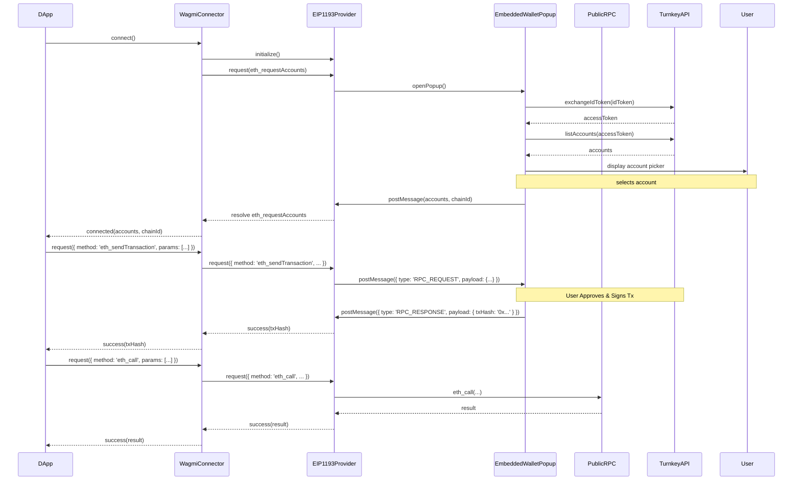

# Introduction

Turnkey wallets are embedded, web-based wallets that differ from injected wallets (like MetaMask).
While injected wallets store private keys locally and decrypt them using a password to sign transactions,
embedded wallets rely on UI-based authentication to access private keys that are securely stored and
managed by Turnkey.

With this concept in mind, we're going to build a custom Wagmi connector that communicates
with an embedded wallet rendered in a popup, enabling integration across multiple dApps.

## System components overview

Our system involves three key parts working together:

**Embedded Wallet (Pop-up):** A web application (likely React/Next.js) hosted by you.
This UI handles user authentication (passkeys via Turnkey), transaction signing, and communication with the dApp via `postMessage`.
It securely interacts with the Turnkey API. Reference the `popup-wallet-demo`'s [`@/apps/wallet`](https://github.com/tkhq/popup-wallet-demo/blob/6eb0b732d6a57dad229a39120299a1762040e0ad/apps/wallet) provides a concrete example.

**EIP-1193 Provider:** A JavaScript class implementing the [EIP-1193](https://eips.ethereum.org/EIPS/eip-1193) standard.
It acts as the intermediary between the dApp and the popup embedded wallet. Reference the `popup-wallet-demo`'s [`@/apps/dapp/lib/eip1193-provider.ts`](https://github.com/tkhq/popup-wallet-demo/blob/6eb0b732d6a57dad229a39120299a1762040e0ad/apps/dapp/lib/eip1193-provider.ts) provides a concrete example.

**Wagmi Connector:** A custom connector built using Wagmi's `createConnector` utility. It wraps our EIP-1193 provider, making the wallet compatible with the Wagmi ecosystem. Reference the `popup-wallet-demo`'s [`@/apps/dapp/lib/connector.ts`](https://github.com/tkhq/popup-wallet-demo/blob/6eb0b732d6a57dad229a39120299a1762040e0ad/apps/dapp/lib/connector.ts) and [`@/apps/dapp/lib/wagmi.ts`](https://github.com/tkhq/popup-wallet-demo/blob/6eb0b732d6a57dad229a39120299a1762040e0ad/apps/dapp/lib/wagmi.ts) provide concrete examples.

## Architecture flow

The interaction sequence generally follows these steps:

**Connection:**

- A user on a dApp clicks "Connect Wallet" and selects your wallet.
- The dApp calls the `connect` method on your Wagmi connector.
- The connector initializes the EIP-1193 provider.
- The connector calls `provider.request({ method: 'eth_requestAccounts' })`, which opens your Embedded Wallet pop-up.
- The user authenticates in the pop-up and chooses which wallet account to connect.
- The pop-up returns the selected account(s) and `chainId` to the provider via `postMessage`.
- The provider resolves `eth_requestAccounts`, and the connector returns the account(s) and `chainId` to the dApp.

**RPC Request (e.g., `eth_sendTransaction`):**

- The dApp uses a Wagmi hook (e.g., `useSendTransaction`) which triggers a request.
- Wagmi sends the `eth_sendTransaction` request to your connector.
- The connector forwards the request to the EIP-1193 provider.
- The provider identifies this as a signing request and opens the Embedded Wallet pop-up (if not already open), sending the transaction details via `postMessage`.
- The user reviews and approves the transaction in the pop-up.
- The pop-up uses Turnkey to sign the transaction and potentially broadcast it (or return the signed transaction).
- The pop-up sends the transaction hash (or signed transaction) back to the provider via `postMessage`.
- The provider resolves the request promise, returning the result to the dApp via the connector.

**RPC Request (e.g., `eth_blockNumber`):**

- The dApp triggers a read-only request.
- Wagmi sends the `eth_blockNumber` request to your connector.
- The connector forwards it to the EIP-1193 provider.
- The provider identifies this as a read-only request and forwards it directly to a public RPC node.
- The public RPC node returns the result.
- The provider returns the result to the dApp via the connector.

## Flow diagram



### Connect flow demo

<video
  src="/assets/files/popup-auth-flow.mp4"
  autoplay
  loop
  muted
  playsinline
  controls
  class="rounded-md my-4 w-full max-w-2xl mx-auto"
/>

## Building the embedded wallet (pop-up)

The embedded wallet is a standalone web app (often a separate Next.js project)
that is opened in a pop-up when the provider executes `eth_requestAccounts`.

### Create the wallet page

Below is a minimal wallet UI plus a stubbed authentication button, shown side-by-side with Mintlify's `<CodeGroup>` component so you can copy either file.

<CodeGroup>

```tsx app/page.tsx
import { AuthButton } from "@/components/auth";

// A minimal wallet UI that only handles `eth_requestAccounts`
export default function Page({
  searchParams,
}: {
  searchParams: { request?: string };
}) {
  // Decode the JSON-RPC request that the provider placed in the URL
  const rpcRequest = searchParams.request
    ? JSON.parse(decodeURIComponent(searchParams.request))
    : null;

  // Support connection only
  if (rpcRequest?.method !== "eth_requestAccounts") {
    return (
      <main className="flex min-h-screen items-center justify-center">
        <p>Unsupported method</p>
      </main>
    );
  }

  return (
    <main className="flex min-h-screen flex-col items-center justify-center gap-4">
      <h1 className="text-xl font-semibold">Connect Wallet</h1>
      <AuthButton />
    </main>
  );
}
```

```tsx components/auth.tsx
"use client";

import { useState } from "react";
import { authenticateWithTurnkey } from "@/lib/turnkey";

export function AuthButton() {
  const [loading, setLoading] = useState(false);

  const handleConnect = async () => {
    setLoading(true);
    try {
      // Call your Turnkey helper to perform real auth & fetch accounts
      const { accounts, chainId } = await authenticateWithTurnkey();
      window.opener?.postMessage(
        { type: "ETH_ACCOUNTS", accounts, chainId },
        "*"
      );
      window.close();
    } finally {
      setLoading(false);
    }
  };

  return (
    <button
      className="rounded bg-indigo-600 px-4 py-2 text-white disabled:opacity-50"
      onClick={handleConnect}
      disabled={loading}
    >
      {loading ? "Connecting…" : "Sign In"}
    </button>
  );
}
```

```ts lib/turnkey.ts
import type { Address } from "viem";

// Minimal placeholder – replace with full Turnkey SDK logic
export async function authenticateWithTurnkey(): Promise<{
  accounts: readonly Address[];
  chainId: number;
}> {
  /*
    Here you would:
      1. Invoke Turnkey passkey/OAuth flows.
      2. Retrieve the user's wallet address(es).
      3. Optionally create a sub-org if user is new.
  */

  return {
    accounts: ["0xAbc…"] as const,
    chainId: 17000,
  };
}
```

</CodeGroup>

**How it works**

1. The provider opens the pop-up at `https://<your-wallet-host>/?request=<encoded-json-rpc>`.
2. The page decodes the `request` query parameter.  
   For the connection flow this will look like:
   ```json
   {
     "method": "eth_requestAccounts",
     "params": []
   }
   ```
3. When the user clicks **Connect Wallet** the `AuthButton` performs your authentication logic (Turnkey passkey, email-magic-link, etc.).
4. Once authenticated, the wallet sends a `postMessage` back to the opener containing the selected account(s) and `chainId`.  
   We will wire up that message handling in the next section.

With this single page in place you now have a functional authentication UI that the provider can open, fulfilling the first half of the connection flow:

```
DApp → Connector → Provider → (opens) Wallet UI → user authenticates → …
```

Next we will implement the message bridge in the provider and then expand the wallet to handle transaction and message signing.

### Post the account back to the opener

Inside your `AuthButton` (or wherever your auth logic resolves) send a message with the newly authenticated account:

```tsx components/auth.tsx
// ...after you have the accounts array and chainId
window.opener?.postMessage(
  {
    type: "ETH_ACCOUNTS",
    accounts, // e.g. ["0xAbc…"]
    chainId, // e.g. 17000 (Holesky)
  },
  "*"
);
// Optionally close the popup or show a success screen
```

> This keeps the wallet UI decoupled from the provider implementation—any parent window that understands the `ETH_ACCOUNTS` message can integrate.

## Implement a minimal EIP-1193 provider

Create `eip1193-provider.ts` in your dApp project. For the connection flow we only need to implement `eth_requestAccounts` and `eth_accounts`:

```ts eip1193-provider.ts [expandable]
import type { EIP1193RequestFn, EIP1193Provider } from "viem";

export function createEIP1193Provider(): EIP1193Provider {
  let popup: Window | null = null;
  let cachedAccounts: readonly `0x${string}`[] = [];

  const request: EIP1193RequestFn = async ({ method, params }) => {
    // Return cache immediately
    if (method === "eth_accounts") return cachedAccounts;

    if (method === "eth_requestAccounts") {
      return new Promise((resolve, reject) => {
        // 1. Listen for postMessage from wallet
        const handleMessage = (event: MessageEvent) => {
          const { type, accounts, chainId } = event.data || {};
          if (type !== "ETH_ACCOUNTS") return;
          window.removeEventListener("message", handleMessage);
          cachedAccounts = accounts;
          resolve(accounts);
        };
        window.addEventListener("message", handleMessage);

        // 2. Open wallet popup (centered)
        const w = 360,
          h = 600,
          left = window.screenX + (window.outerWidth - w) / 2,
          top = window.screenY + (window.outerHeight - h) / 2;
        popup = window.open(
          `http://localhost:3001?request=${encodeURIComponent(
            JSON.stringify({ method, params })
          )}`,
          "Berakin Wallet",
          `width=${w},height=${h},left=${left},top=${top}`
        );
        if (!popup) reject(new Error("Popup blocked"));
      });
    }

    throw new Error(`${method} not implemented in minimal provider`);
  };

  // Very small subset of the provider interface we need for Wagmi
  return {
    request,
    // no-ops for event listeners for now; Wagmi expects them to exist
    on: () => {},
    removeListener: () => {},
  } as EIP1193Provider;
}
```

This provider:

1. Caches accounts after the first successful connection.
2. Opens the wallet pop-up and waits for a `postMessage` containing `ETH_ACCOUNTS`.
3. Resolves the `eth_requestAccounts` promise and lets Wagmi continue.

## Wire it up in a Wagmi connector

Your minimal connector only needs the `connect` method to use the provider you just built. The full version from `popup-wallet-demo` already includes this; here's the shortened core for reference:

```ts connector.ts
export function berakinWalletConnector() {
  let provider: EIP1193Provider | null = null;

  return createConnector((config) => ({
    id: "berakinWallet",
    name: "Berakin Wallet",

    async connect() {
      provider = provider ?? createEIP1193Provider();
      const accounts = (await provider.request({
        method: "eth_requestAccounts",
      })) as readonly `0x${string}`[];
      return { accounts, chainId: 17000 };
    },

    async getProvider() {
      return provider ?? (provider = createEIP1193Provider());
    },
  }));
}
```

At this point you can:

1. Run your wallet project on `localhost:3001`.
2. Integrate the minimal provider + connector in a dApp.
3. Click **Connect Wallet** in the dApp → the pop-up opens → authenticate → dApp receives the account.

🎉 You now have a working end-to-end connection flow! Next we'll extend both the wallet UI and the provider to support signing transactions and messages.

## Add transaction and message signing

Connection works. Next, implement signing so the dApp can call `useSendTransaction`, `useSignMessage`, and related Wagmi hooks.

### Wallet-side components

<CodeGroup>

```tsx components/sign-transaction.tsx [expandable]
"use client";

import { useState } from "react";
import type { Address } from "viem";
import { signAndSend } from "@/lib/turnkey";

interface Props {
  transaction: Record<string, unknown>; // raw tx params
  organizationId: string;
}

export function SignTransaction({ transaction, organizationId }: Props) {
  const [submitting, setSubmitting] = useState(false);
  const [error, setError] = useState<string | null>(null);

  const handleApprove = async () => {
    setSubmitting(true);
    try {
      const txHash = await signAndSend(transaction, organizationId);
      window.opener?.postMessage(
        { type: "RPC_RESPONSE", method: "eth_signTransaction", result: txHash },
        "*"
      );
      window.close();
    } catch (err: unknown) {
      setError(String(err));
    } finally {
      setSubmitting(false);
    }
  };

  return (
    <div className="space-y-4">
      <h2 className="text-lg font-semibold">Review Transaction</h2>
      <pre className="max-h-60 overflow-auto rounded bg-zinc-900 p-2 text-sm">
        {JSON.stringify(transaction, null, 2)}
      </pre>
      {error && <p className="text-red-500">{error}</p>}
      <button
        className="rounded bg-indigo-600 px-4 py-2 text-white"
        onClick={handleApprove}
        disabled={submitting}
      >
        {submitting ? "Signing…" : "Approve & Sign"}
      </button>
    </div>
  );
}
```

```tsx components/sign-message.tsx [expandable]
"use client";

import { useState } from "react";
import type { Address } from "viem";
import { signMessage } from "@/lib/turnkey";

interface Props {
  method: "personal_sign" | "eth_sign";
  message: string;
  signWith: Address;
  organizationId: string;
}

export function SignMessage({
  method,
  message,
  signWith,
  organizationId,
}: Props) {
  const [submitting, setSubmitting] = useState(false);
  const [error, setError] = useState<string | null>(null);

  const handleApprove = async () => {
    setSubmitting(true);
    try {
      const signature = await signMessage({
        message,
        method,
        signWith,
        organizationId,
      });
      window.opener?.postMessage(
        { type: "RPC_RESPONSE", method, result: signature },
        "*"
      );
      window.close();
    } catch (err: unknown) {
      setError(String(err));
    } finally {
      setSubmitting(false);
    }
  };

  return (
    <div className="space-y-4">
      <h2 className="text-lg font-semibold">Sign Message</h2>
      <pre className="rounded bg-zinc-900 p-2 text-sm break-words whitespace-pre-wrap">
        {message}
      </pre>
      {error && <p className="text-red-500">{error}</p>}
      <button
        className="rounded bg-indigo-600 px-4 py-2 text-white"
        onClick={handleApprove}
        disabled={submitting}
      >
        {submitting ? "Signing…" : "Sign & Return"}
      </button>
    </div>
  );
}
```

```ts lib/turnkey.ts (additional helpers) [expandable]
// ...existing authenticateWithTurnkey above

export async function signAndSend(
  tx: unknown,
  organizationId: string
): Promise<string> {
  /*
    1. Stamp the transaction with Turnkey.
    2. Broadcast via JSON-RPC.
  */
  return "0xdeadbeef";
}

export async function signMessage(args: {
  message: string;
  method: "personal_sign" | "eth_sign";
  signWith: Address;
  organizationId: string;
}): Promise<string> {
  /*
    1. Create a Turnkey signing job.
    2. Return hex signature.
  */
  return "0xsignature";
}
```

</CodeGroup>

### Provider extensions

Augment the provider so signing requests are routed through the popup.

```ts eip1193-provider.ts (diff) [expandable]
// inside createEIP1193Provider.request
if (
  method === "eth_signTransaction" ||
  method === "eth_sign" ||
  method === "personal_sign"
) {
  return popupRequest({ method, params });
}

// Convenience: wrap eth_sendTransaction to auto-sign & send raw tx
if (method === "eth_sendTransaction") {
  const [tx] = params as any[];
  const signed = await request({ method: "eth_signTransaction", params: [tx] });
  return request({ method: "eth_sendRawTransaction", params: [signed] });
}
```

`popupRequest` is the existing helper that opens/targets the window and resolves the corresponding `RPC_RESPONSE`.

### Summary

You now handle:

• Connection (`eth_requestAccounts`).  
• Transaction signing (`eth_signTransaction` / `eth_sendTransaction`).  
• Message signing (`personal_sign` / `eth_sign`).

From here you can layer additional EIP-1193 methods (chain switching, asset watch, etc.) as needed.

### Production considerations

The code samples target a minimal, easy-to-understand prototype. When moving to production, address the following:

• **Request IDs & queueing** – generate a unique `id` per RPC call, store promises by `id`, include it in every `postMessage` so concurrent requests cannot collide.  
• **Session persistence** – cache `accounts` and `chainId` in `localStorage` and return them on subsequent `eth_accounts` calls without re-authenticating.  
• **Popup cancellation & timeouts** – reject pending promises if the user closes the window or after a reasonable timeout.  
• **Network switching** – implement `wallet_switchEthereumChain`, update `store.chainId`, and emit `chainChanged`.  
• **Security** – validate `event.origin`, allow-list dApp domains, move hard-coded URLs (`localhost:3001`, RPC endpoints) into environment variables.  
• **Additional EIPs** – support `wallet_watchAsset`, `eth_addEthereumChain`, etc., if dApps require them.

Addressing these items will bring the prototype to production-ready quality without altering the core architecture documented above.
